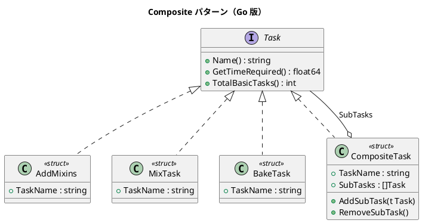

# 第 7 章: Composite

## はじめに

ケーキを作る工程を考えます。「材料を加える」「混ぜる」「焼く」といった個々のタスクと、「ケーキを作る」という複合タスクを同じように扱いたいとします。

Composite パターンは、個々のオブジェクトとその集合を同一のインターフェースで扱えるようにするパターンです。Go ではインターフェースと struct で部分-全体の階層を表現します。

---

## パターンの構造



---

## TDD で作る

### Red: テストを書く

```go
func TestCompositeTaskTotalTime(t *testing.T) {
    cake := NewMakeCakeTask()
    expected := 34.5
    if cake.GetTimeRequired() != expected {
        t.Errorf("期待値 %f, 実際 %f", expected, cake.GetTimeRequired())
    }
}
```

### Green: 実装する

```go
type Task interface {
    Name() string
    GetTimeRequired() float64
    TotalBasicTasks() int
}

type CompositeTask struct {
    TaskName string
    SubTasks []Task
}

func (c *CompositeTask) GetTimeRequired() float64 {
    total := 0.0
    for _, t := range c.SubTasks {
        total += t.GetTimeRequired()
    }
    return total
}
```

### Refactor: 振り返り

- Go のインターフェースは暗黙的に実装されるため、`Task` を満たす新しい struct を追加するだけで拡張できます
- `CompositeTask` は `[]Task` スライスで子を管理し、再帰的に集計します

---

## Ruby / Java / Python / JavaScript との比較

| 観点 | Ruby | Java | Python | JavaScript | Go |
|------|------|------|--------|------------|-----|
| コンポーネント | クラス | interface | ABC | Duck Typing | interface |
| 複合オブジェクト | クラス継承 | extends | 継承 | extends | struct + []interface |
| 子の管理 | 配列 | List | リスト | 配列 | スライス |
| 型チェック | Duck Typing | コンパイル時 | 実行時 | 実行時 | コンパイル時 |

---

## まとめ

| 観点 | 内容 |
|------|------|
| **意図** | 個々のオブジェクトとその集合を同一のインターフェースで扱う |
| **Go での実現** | interface + struct、スライスで子を管理 |
| **メリット** | 再帰的な構造を統一的に操作できる |
| **注意点** | 循環参照に注意 |
| **関連パターン** | Iterator（子の列挙）、Visitor（操作の追加） |

