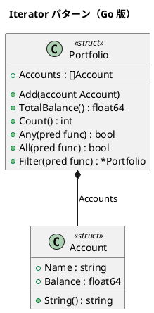

# 第 8 章: Iterator

## はじめに

ポートフォリオ内の複数の口座を順番に処理したいとします。Iterator パターンは、集合の内部構造を公開せずに要素を順番にアクセスする方法を提供します。

Go では `range` キーワードとスライスが組み込みの反復メカニズムを提供するため、独立した Iterator オブジェクトを作る必要はほとんどありません。代わりに、コレクション型にメソッドを追加するアプローチを取ります。

---

## パターンの構造



---

## TDD で作る

### Red: テストを書く

```go
func TestTotalBalance(t *testing.T) {
    p := newSamplePortfolio()
    expected := 900000.0
    if p.TotalBalance() != expected {
        t.Errorf("期待値 %f, 実際 %f", expected, p.TotalBalance())
    }
}

func TestFilter(t *testing.T) {
    p := newSamplePortfolio()
    large := p.Filter(func(a Account) bool { return a.Balance >= 300000 })
    if large.Count() != 2 {
        t.Errorf("期待値 2, 実際 %d", large.Count())
    }
}
```

### Green: 実装する

```go
func (p *Portfolio) TotalBalance() float64 {
    total := 0.0
    for _, a := range p.Accounts {
        total += a.Balance
    }
    return total
}

func (p *Portfolio) Filter(pred func(Account) bool) *Portfolio {
    result := NewPortfolio()
    for _, a := range p.Accounts {
        if pred(a) { result.Add(a) }
    }
    return result
}
```

### Refactor: 振り返り

- Go の `range` が Iterator の役割を果たします
- 高階関数（`Any`, `All`, `Filter`）で外部 Iterator を不要にしています
- Go 1.23 以降では range over function を使った Iterator も可能です

---

## Ruby / Java / Python / JavaScript との比較

| 観点 | Ruby | Java | Python | JavaScript | Go |
|------|------|------|--------|------------|-----|
| 組み込み反復 | `each` | `for-each` | `for-in` | `for-of` | `range` |
| Iterator 型 | Enumerator | Iterator | `__iter__` | Symbol.iterator | range / メソッド |
| 遅延評価 | lazy | Stream | ジェネレータ | ジェネレータ | channel / iter |
| 高階関数 | map/select | Stream API | map/filter | map/filter | メソッドで実装 |

---

## まとめ

| 観点 | 内容 |
|------|------|
| **意図** | 集合の内部構造を公開せずに要素を順番にアクセスする |
| **Go での実現** | `range` + コレクションメソッド + 高階関数 |
| **メリット** | 組み込みの `range` でシンプルに実現 |
| **注意点** | 大きなコレクションではチャネルやジェネレータで遅延評価を検討 |
| **関連パターン** | Composite（木構造の走査）、Visitor（操作の分離） |

