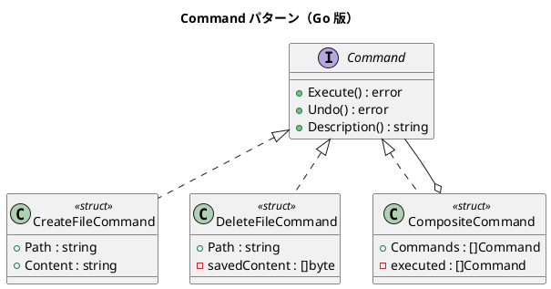

# 第 9 章: Command

## はじめに

ファイルの作成と削除を行い、それを取り消し可能にしたいとします。Command パターンは、操作をオブジェクトとしてカプセル化し、実行と取り消しを統一的に扱えるようにするパターンです。

Go ではインターフェースでコマンドを定義し、各操作を struct として実装します。

---

## パターンの構造



---

## TDD で作る

### Red: テストを書く

```go
func TestCreateFileCommand(t *testing.T) {
    path := tempPath(t, "test.txt")
    cmd := &CreateFileCommand{Path: path, Content: "hello"}
    if err := cmd.Execute(); err != nil {
        t.Fatalf("Execute 失敗: %v", err)
    }
    data, _ := os.ReadFile(path)
    if string(data) != "hello" {
        t.Errorf("期待値 'hello', 実際 %q", string(data))
    }
}
```

### Green: 実装する

```go
type Command interface {
    Execute() error
    Undo() error
    Description() string
}

type CreateFileCommand struct {
    Path    string
    Content string
}

func (c *CreateFileCommand) Execute() error {
    return os.WriteFile(c.Path, []byte(c.Content), 0644)
}

func (c *CreateFileCommand) Undo() error {
    return os.Remove(c.Path)
}
```

### Refactor: 振り返り

- Go の `error` 返却パターンが、コマンドの成功/失敗を自然に表現します
- `CompositeCommand` は失敗時に実行済みコマンドを逆順で Undo します
- `t.TempDir()` でテスト用の一時ディレクトリを自動管理しています

---

## Ruby / Java / Python / JavaScript との比較

| 観点 | Ruby | Java | Python | JavaScript | Go |
|------|------|------|--------|------------|-----|
| コマンドの型 | クラス | interface | ABC | クラス/関数 | interface |
| エラー処理 | 例外 | 例外 | 例外 | 例外/Promise | error 返却 |
| 複合コマンド | 配列 | List | リスト | 配列 | スライス |
| Undo | メソッド | メソッド | メソッド | メソッド | メソッド |

---

## まとめ

| 観点 | 内容 |
|------|------|
| **意図** | 操作をオブジェクトとしてカプセル化し、実行・取り消しを統一的に扱う |
| **Go での実現** | Command interface + struct 実装 |
| **メリット** | error 返却で失敗処理が明示的、CompositeCommand でバッチ処理 |
| **注意点** | Undo の状態保存が複雑になりうる |
| **関連パターン** | Composite（複合コマンド）、Strategy（実行戦略） |

