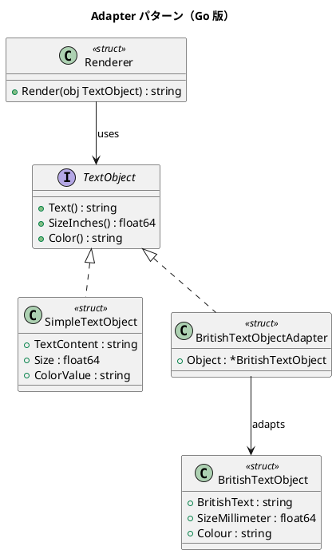

# 第 10 章: Adapter

## はじめに

既存のシステムがインチ単位の `TextObject` インターフェースを期待しているところに、ミリメートル単位の英国式テキストオブジェクトを接続したいとします。Adapter パターンは、互換性のないインターフェースを変換するパターンです。

Go のインターフェースは暗黙的に実装されるため、アダプタの作成が特にスムーズです。

---

## パターンの構造



---

## TDD で作る

### Red: テストを書く

```go
func TestMillimeterToInchConversion(t *testing.T) {
    british := &BritishTextObject{SizeMillimeter: 50.8, ...}
    adapted := &BritishTextObjectAdapter{Object: british}
    expected := 2.0
    if math.Abs(adapted.SizeInches()-expected) > 0.001 {
        t.Errorf("期待値 %f, 実際 %f", expected, adapted.SizeInches())
    }
}
```

### Green: 実装する

```go
type BritishTextObjectAdapter struct {
    Object *BritishTextObject
}

func (a *BritishTextObjectAdapter) Text() string       { return a.Object.BritishText }
func (a *BritishTextObjectAdapter) SizeInches() float64 { return a.Object.SizeMillimeter / 25.4 }
func (a *BritishTextObjectAdapter) Color() string       { return a.Object.Colour }
```

### Green: SimpleTextObject と Renderer

`SimpleTextObject` は `TextObject` インターフェースを直接実装する struct です。アダプタを介さずにそのまま利用できる標準的なテキストオブジェクトです。

```go
type SimpleTextObject struct {
    TextContent string
    Size        float64
    ColorValue  string
}

func (s *SimpleTextObject) Text() string        { return s.TextContent }
func (s *SimpleTextObject) SizeInches() float64  { return s.Size }
func (s *SimpleTextObject) Color() string        { return s.ColorValue }
```

`Renderer` は `TextObject` インターフェースを受け取ってフォーマット済み文字列を生成します。`SimpleTextObject` でも `BritishTextObjectAdapter` でも、同じ `Render()` メソッドで処理できます。

```go
type Renderer struct{}

func (r *Renderer) Render(obj TextObject) string {
    return fmt.Sprintf("[%s] size=%.2fin color=%s", obj.Text(), obj.SizeInches(), obj.Color())
}
```

これにより、`Renderer` はアダプタの存在を意識せずに、統一されたインターフェースでテキストオブジェクトを扱えます。

### Refactor: 振り返り

- Go のインターフェースは暗黙的なので、`BritishTextObjectAdapter` は `TextObject` を明示的に宣言する必要がありません
- コンパイル時の型チェック `var _ TextObject = &BritishTextObjectAdapter{}` で確認できます
- `Renderer` は `TextObject` インターフェースだけに依存するため、新しいアダプタを追加しても変更不要です

---

## Ruby / Java / Python / JavaScript との比較

| 観点 | Ruby | Java | Python | JavaScript | Go |
|------|------|------|--------|------------|-----|
| インターフェース宣言 | なし（Duck Typing） | `implements` | ABC | なし | 暗黙的 |
| アダプタの実装 | メソッド定義 | implements + 委譲 | 委譲 | オブジェクトラッパー | struct + メソッド |
| 型安全性 | 実行時 | コンパイル時 | 実行時 | 実行時 | コンパイル時 |

**Go の特徴**: 暗黙的インターフェース実装（structural typing）により、アダプタが `TextObject` のメソッドを実装するだけで自動的に型が合致します。

---

## まとめ

| 観点 | 内容 |
|------|------|
| **意図** | 互換性のないインターフェースを変換する |
| **Go での実現** | ラッパー struct で変換メソッドを提供 |
| **メリット** | 暗黙的インターフェースで宣言不要、コンパイル時型安全 |
| **注意点** | 変換ロジックが複雑な場合はアダプタが肥大化しうる |
| **関連パターン** | Proxy（同一インターフェースの制御）、Decorator（機能追加） |

