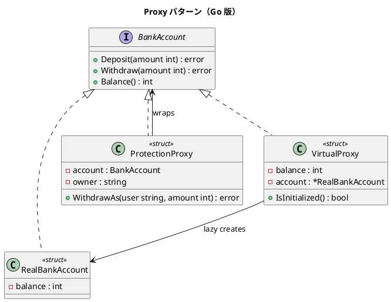

# 第 11 章: Proxy

## はじめに

銀行口座へのアクセスを制御したいとします。所有者以外は出金できないようにしたり（Protection Proxy）、口座オブジェクトの生成を実際に使うまで遅延させたり（Virtual Proxy）できます。

Proxy パターンは、対象オブジェクトへのアクセスを制御する代理オブジェクトを提供するパターンです。

---

## パターンの構造



---

## TDD で作る

### Red: テストを書く

```go
func TestProtectionProxyBlocksNonOwner(t *testing.T) {
    account := NewRealBankAccount(1000)
    proxy := NewProtectionProxy(account, "田中")
    err := proxy.WithdrawAs("佐藤", 500)
    if err == nil {
        t.Error("非所有者の出金でエラーが返るべき")
    }
}

func TestVirtualProxyDelaysCreation(t *testing.T) {
    vp := NewVirtualProxy(1000)
    if vp.IsInitialized() {
        t.Error("使用前に初期化されるべきではない")
    }
}
```

### Green: 実装する

```go
type ProtectionProxy struct {
    account BankAccount
    owner   string
}

func (p *ProtectionProxy) WithdrawAs(user string, amount int) error {
    if user != p.owner {
        return fmt.Errorf("アクセス拒否: %s は口座所有者ではありません", user)
    }
    return p.account.Withdraw(amount)
}

type VirtualProxy struct {
    balance int
    account *RealBankAccount
}

func (v *VirtualProxy) ensureAccount() {
    if v.account == nil {
        v.account = NewRealBankAccount(v.balance)
    }
}
```

### Refactor: 振り返り

- Go の `error` 返却でアクセス拒否を自然に表現できます
- `VirtualProxy` は `ensureAccount()` で遅延初期化を実現します
- インターフェースを満たすことで、Real / Proxy を透過的に扱えます

---

## Ruby / Java / Python / JavaScript との比較

| 観点 | Ruby | Java | Python | JavaScript | Go |
|------|------|------|--------|------------|-----|
| Proxy の実装 | method_missing | InvocationHandler | __getattr__ | ES6 Proxy API | interface ラッピング |
| アクセス制御 | 例外 | 例外 | 例外 | throw | error 返却 |
| 遅延初期化 | lazy | LazyHolder | property | getter | ensureAccount |

**Go の特徴**: ES6 Proxy のような汎用的なメタプログラミング機構はありませんが、interface を使った明示的なラッピングでプロキシを実現します。

---

## まとめ

| 観点 | 内容 |
|------|------|
| **意図** | 対象オブジェクトへのアクセスを制御する代理を提供する |
| **Go での実現** | 同じ interface を満たす struct でラッピング |
| **メリット** | 型安全、error 返却でアクセス制御が明示的 |
| **注意点** | Proxy のメソッドが増えるとボイラープレートが多くなる |
| **関連パターン** | Adapter（インターフェース変換）、Decorator（機能追加） |

