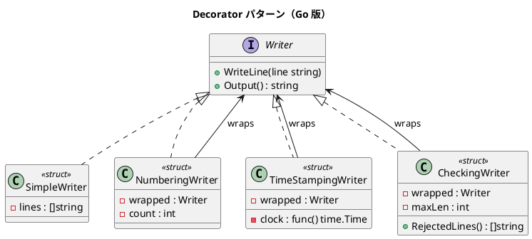

# 第 12 章: Decorator

## はじめに

テキスト出力に行番号やタイムスタンプを動的に追加したいとします。Decorator パターンは、既存のオブジェクトに新しい機能を動的に追加するパターンです。

Go では Proxy と同様にインターフェースラッピングで実現しますが、Decorator は「機能の追加」に焦点を当てます。

---

## パターンの構造



---

## TDD で作る

### Red: テストを書く

```go
func TestStackedDecorators(t *testing.T) {
    fixedTime := time.Date(2024, 1, 15, 10, 30, 0, 0, time.UTC)
    clock := func() time.Time { return fixedTime }

    w := NewSimpleWriter()
    nw := NewNumberingWriter(w)
    tsw := NewTimeStampingWriter(nw, clock)
    tsw.WriteLine("hello")

    output := tsw.Output()
    if !strings.Contains(output, "1:") { t.Error("行番号が含まれていない") }
    if !strings.Contains(output, "2024-01-15") { t.Error("タイムスタンプが含まれていない") }
}
```

### Green: 実装する

```go
type NumberingWriter struct {
    wrapped Writer
    count   int
}

func (n *NumberingWriter) WriteLine(line string) {
    n.count++
    n.wrapped.WriteLine(fmt.Sprintf("%d: %s", n.count, line))
}

type TimeStampingWriter struct {
    wrapped Writer
    clock   func() time.Time
}

func (ts *TimeStampingWriter) WriteLine(line string) {
    ts.wrapped.WriteLine(fmt.Sprintf("%s %s", ts.clock().Format("2006-01-02 15:04:05"), line))
}
```

### Refactor: 振り返り

- デコレータを積み重ねることで複合的な機能を実現します
- `clock` を関数フィールドにすることで、テスト時にフェイク時計を注入できます
- `CheckingWriter` のように、書き込みをフィルタリングするデコレータも実現できます

---

## Ruby / Java / Python / JavaScript との比較

| 観点 | Ruby | Java | Python | JavaScript | Go |
|------|------|------|--------|------------|-----|
| Decorator の実装 | モジュール mixin | 継承 / 委譲 | デコレータ構文 | 高階関数 | interface ラッピング |
| 積み重ね | extend | コンストラクタ | @decorator | 関数合成 | ラッパーのネスト |
| テスト時の注入 | スタブ | モック | パッチ | jest.fn() | 関数フィールド |

**Go の特徴**: Proxy と同じ手法（interface ラッピング）ですが、意図が「アクセス制御」ではなく「機能追加」である点が異なります。

---

## まとめ

| 観点 | 内容 |
|------|------|
| **意図** | 既存オブジェクトに新しい機能を動的に追加する |
| **Go での実現** | interface ラッピング + 処理の前後に機能を挿入 |
| **メリット** | デコレータの積み重ねで柔軟な機能合成が可能 |
| **注意点** | ラッピングが深くなるとデバッグが難しくなる |
| **関連パターン** | Proxy（アクセス制御）、Strategy（アルゴリズム差し替え） |

