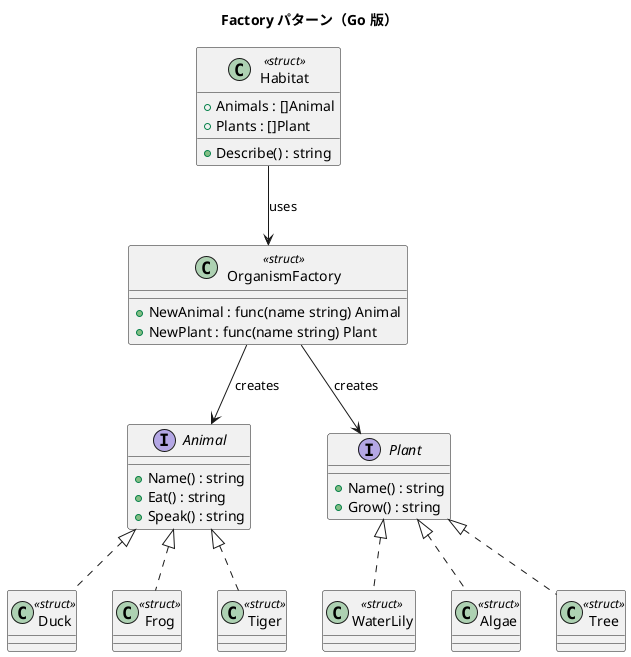

# 第 14 章: Factory

## はじめに

池（Pond）にはアヒルとスイレンが、ジャングルにはトラと木が住んでいます。生息地の種類に応じて適切な生物を生成したいとします。Factory パターンは、オブジェクト生成のロジックを分離するパターンです。

Go では interface + ファクトリ関数で実現します。

---

## パターンの構造



---

## TDD で作る

### Red: テストを書く

```go
func TestPondFactory(t *testing.T) {
    f := PondFactory()
    animal := f.NewAnimal("テストアヒル")
    if _, ok := animal.(*Duck); !ok {
        t.Error("PondFactory は Duck を作成するべき")
    }
}

func TestHabitatDescribe(t *testing.T) {
    habitat := NewHabitat(PondFactory(), []string{"アヒル"}, []string{"スイレン"})
    desc := habitat.Describe()
    if !strings.Contains(desc, "ガーガー") {
        t.Error("説明にアヒルの鳴き声が含まれるべき")
    }
}
```

### Green: 実装する

```go
type OrganismFactory struct {
    NewAnimal func(name string) Animal
    NewPlant  func(name string) Plant
}

func PondFactory() *OrganismFactory {
    return &OrganismFactory{
        NewAnimal: func(name string) Animal { return &Duck{DuckName: name} },
        NewPlant:  func(name string) Plant { return &WaterLily{LilyName: name} },
    }
}
```

### Green: 追加の具体プロダクトと Habitat

`Frog` は `Animal` インターフェースを実装するもう 1 つの具体プロダクトです。

```go
type Frog struct{ FrogName string }

func (f *Frog) Name() string  { return f.FrogName }
func (f *Frog) Eat() string   { return f.FrogName + " は虫を食べる" }
func (f *Frog) Speak() string { return "ケロケロ" }
```

`Algae` は `Plant` インターフェースを実装する具体プロダクトです。

```go
type Algae struct{ AlgaeName string }

func (a *Algae) Name() string { return a.AlgaeName }
func (a *Algae) Grow() string { return a.AlgaeName + " は水中で増殖する" }
```

`NewHabitat()` は、ファクトリと名前リストを受け取り、生物を一括生成して `Habitat` を組み立てるコンストラクタです。

```go
func NewHabitat(factory *OrganismFactory, animalNames, plantNames []string) *Habitat {
    h := &Habitat{factory: factory}
    for _, name := range animalNames {
        h.Animals = append(h.Animals, factory.NewAnimal(name))
    }
    for _, name := range plantNames {
        h.Plants = append(h.Plants, factory.NewPlant(name))
    }
    return h
}
```

`Habitat.Describe()` は、生息地内の全生物の情報をまとめて返します。

```go
func (h *Habitat) Describe() string {
    result := ""
    for _, a := range h.Animals {
        result += fmt.Sprintf("%s says %s\n", a.Name(), a.Speak())
    }
    for _, p := range h.Plants {
        result += fmt.Sprintf("%s\n", p.Grow())
    }
    return result
}
```

### Refactor: 振り返り

- ファクトリ関数フィールドを使うことで、abstract class なしにファクトリパターンを実現しています
- 新しい生息地は `OrganismFactory` を返す関数を追加するだけで拡張できます
- `NewHabitat()` がファクトリを引数として受け取ることで、生息地の種類と生物の生成ロジックが完全に分離されています

---

## Ruby / Java / Python / JavaScript との比較

| 観点 | Ruby | Java | Python | JavaScript | Go |
|------|------|------|--------|------------|-----|
| Factory の型 | クラス | abstract class | ABC | クラス | struct + 関数フィールド |
| 生成メソッド | メソッド | abstract method | メソッド | メソッド | 関数フィールド |
| 生成物の型 | Duck Typing | interface | ABC | Duck Typing | interface |
| 拡張方法 | サブクラス | extends | 継承 | extends | 新しいファクトリ関数 |

---

## まとめ

| 観点 | 内容 |
|------|------|
| **意図** | オブジェクト生成のロジックを分離し、生成物の型を差し替え可能にする |
| **Go での実現** | 関数フィールドを持つ struct + interface |
| **メリット** | 継承なしで拡張可能、型安全 |
| **注意点** | ファクトリの種類が増えると管理が必要 |
| **関連パターン** | Builder（複雑な生成）、Singleton（単一インスタンス） |


