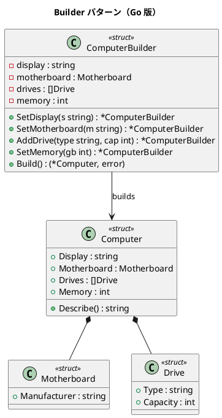

# 第 15 章: Builder

## はじめに

コンピュータを組み立てるには、ディスプレイ、マザーボード、メモリ、ドライブなど多くのパーツを設定する必要があります。Builder パターンは、複雑なオブジェクトの構築過程を段階的に行うパターンです。

Go ではメソッドチェーン + `Build() (T, error)` のパターンで実現します。

---

## パターンの構造



---

## TDD で作る

### Red: テストを書く

```go
func TestBuildDesktop(t *testing.T) {
    pc, err := DesktopBuilder().Build()
    if err != nil {
        t.Fatalf("Build 失敗: %v", err)
    }
    if pc.Memory != 32 {
        t.Errorf("期待値 32, 実際 %d", pc.Memory)
    }
}

func TestBuildValidationMissingDisplay(t *testing.T) {
    _, err := NewComputerBuilder().SetMotherboard("ASUS").SetMemory(16).Build()
    if err == nil {
        t.Error("ディスプレイなしでエラーが返るべき")
    }
}
```

### Green: 実装する

```go
func (b *ComputerBuilder) SetDisplay(display string) *ComputerBuilder {
    b.display = display
    return b
}

func (b *ComputerBuilder) Build() (*Computer, error) {
    if b.display == "" {
        return nil, errors.New("ディスプレイは必須です")
    }
    // バリデーション ...
    return &Computer{Display: b.display, ...}, nil
}
```

### Refactor: 振り返り

- メソッドチェーンで流暢な API を提供します
- `Build()` が `(value, error)` を返す Go らしいエラーハンドリングです
- `DesktopBuilder()` / `LaptopBuilder()` のようなプリセットで利便性を高めています

---

## Ruby / Java / Python / JavaScript との比較

| 観点 | Ruby | Java | Python | JavaScript | Go |
|------|------|------|--------|------------|-----|
| チェーン方式 | self 返却 | this 返却 | self 返却 | this 返却 | *Builder 返却 |
| バリデーション | 例外 | 例外 | 例外 | 例外 | (value, error) |
| 不変性 | freeze | final | @dataclass | Object.freeze | 値渡し |
| プリセット | クラスメソッド | static factory | classmethod | static method | ファクトリ関数 |

**Go の特徴**: `Build()` が error を返すことで、必須フィールドのバリデーションを型安全に行えます。

---

## まとめ

| 観点 | 内容 |
|------|------|
| **意図** | 複雑なオブジェクトの構築過程を段階的に行う |
| **Go での実現** | メソッドチェーン + Build() (T, error) |
| **メリット** | 流暢な API、エラー返却でバリデーション、プリセット |
| **注意点** | Builder 自体が mutable なので並行利用には注意 |
| **関連パターン** | Factory（生成の分離）、Composite（構造の構築） |

