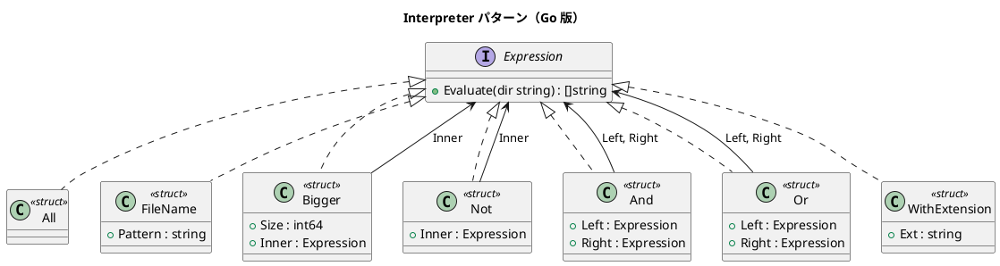

# 第 16 章: Interpreter

## はじめに

ディレクトリ内のファイルを「.txt ファイルで 10 バイトより大きいもの」「.go ファイルまたは .md ファイル」のように、条件を組み合わせて検索したいとします。

Interpreter パターンは、言語の文法を表現するクラス階層を定義し、その文法に沿った式を解釈・評価するパターンです。Go ではインターフェースと再帰的な struct で AST（抽象構文木）を構築します。

---

## パターンの構造



---

## TDD で作る

### Red: テストを書く

```go
func TestFileNameExpression(t *testing.T) {
    dir := setupTestDir(t)
    expr := &FileName{Pattern: "*.txt"}
    result := expr.Evaluate(dir)
    if len(result) != 2 {
        t.Errorf("期待値 2 ファイル, 実際 %d", len(result))
    }
}

func TestComplexExpression(t *testing.T) {
    dir := setupTestDir(t)
    expr := &And{
        Left: &Or{
            Left:  &FileName{Pattern: "*.txt"},
            Right: &FileName{Pattern: "*.md"},
        },
        Right: &Not{Inner: &Bigger{Size: 10, Inner: &All{}}},
    }
    result := expr.Evaluate(dir)
    // (.txt OR .md) AND NOT bigger than 10 bytes
}
```

### Green: 実装する

```go
type Expression interface {
    Evaluate(dir string) []string
}

type FileName struct{ Pattern string }

func (f *FileName) Evaluate(dir string) []string {
    all := (&All{}).Evaluate(dir)
    var result []string
    for _, name := range all {
        matched, _ := filepath.Match(f.Pattern, name)
        if matched { result = append(result, name) }
    }
    return result
}

type And struct{ Left, Right Expression }

func (a *And) Evaluate(dir string) []string {
    left := toSet(a.Left.Evaluate(dir))
    var result []string
    for _, name := range a.Right.Evaluate(dir) {
        if left[name] { result = append(result, name) }
    }
    return result
}
```

### Green: WithExtension 式

`WithExtension` は、指定した拡張子を持つファイルを検索する便利な Expression です。`FileName` でグロブパターンを書く代わりに、拡張子だけを指定できます。

```go
type WithExtension struct {
    Ext string
}

func (w *WithExtension) Evaluate(dir string) []string {
    all := (&All{}).Evaluate(dir)
    var result []string
    ext := w.Ext
    if !strings.HasPrefix(ext, ".") {
        ext = "." + ext
    }
    for _, name := range all {
        if strings.HasSuffix(name, ext) {
            result = append(result, name)
        }
    }
    return result
}
```

`Ext` フィールドにはドット付き（`.txt`）でもドットなし（`txt`）でも指定でき、内部で正規化されます。`FileName{Pattern: "*.txt"}` と `WithExtension{Ext: "txt"}` は同等の結果を返しますが、`WithExtension` のほうが意図が明確です。

### Refactor: 振り返り

- 各 Expression は `Evaluate(dir string) []string` を実装するだけです
- `And`, `Or`, `Not` で論理演算を表現し、再帰的に評価します
- `t.TempDir()` でテスト用のファイルシステムを構築しています
- `filepath.Match` を使ってグロブパターンマッチングを実現しています
- `WithExtension` のように、よく使うパターンを専用の Expression として提供することで、利用者の意図がより明確になります

---

## Ruby / Java / Python / JavaScript との比較

| 観点 | Ruby | Java | Python | JavaScript | Go |
|------|------|------|--------|------------|-----|
| Expression の型 | クラス | interface | ABC | クラス | interface |
| 評価メソッド | `evaluate` | `evaluate()` | `evaluate()` | `evaluate()` | `Evaluate()` |
| 集合演算 | Set | HashSet | set | Set | map[string]bool |
| ファイル操作 | Dir.glob | Files.walk | os.listdir | fs.readdir | os.ReadDir |

**Go の特徴**: `filepath.Match` と `os.ReadDir` で標準ライブラリだけでファイル検索の DSL を構築できます。

---

## まとめ

| 観点 | 内容 |
|------|------|
| **意図** | 言語の文法を表現し、式を解釈・評価する |
| **Go での実現** | interface + 再帰的な struct で AST を構築 |
| **メリット** | 新しい Expression を追加するだけで文法を拡張できる |
| **注意点** | 複雑な文法にはパーサジェネレータを検討する |
| **関連パターン** | Composite（再帰構造）、Visitor（操作の追加） |

---

## シリーズのまとめ

本シリーズでは Go の 3 つの特性を活かして 13 のデザインパターンを実装しました。

| Go の特性 | 活用したパターン |
|-----------|----------------|
| 関数が第一級 | Template Method, Strategy, Observer, Factory |
| 暗黙的インターフェース | Composite, Command, Adapter, Proxy, Decorator, Interpreter |
| sync.Once + error | Singleton, Builder |

継承のない Go で GoF パターンを実現する過程で、パターンの「本質」が見えてきたはずです。パターンとは特定の言語機能ではなく、設計上の問題に対する普遍的な解決策なのです。


