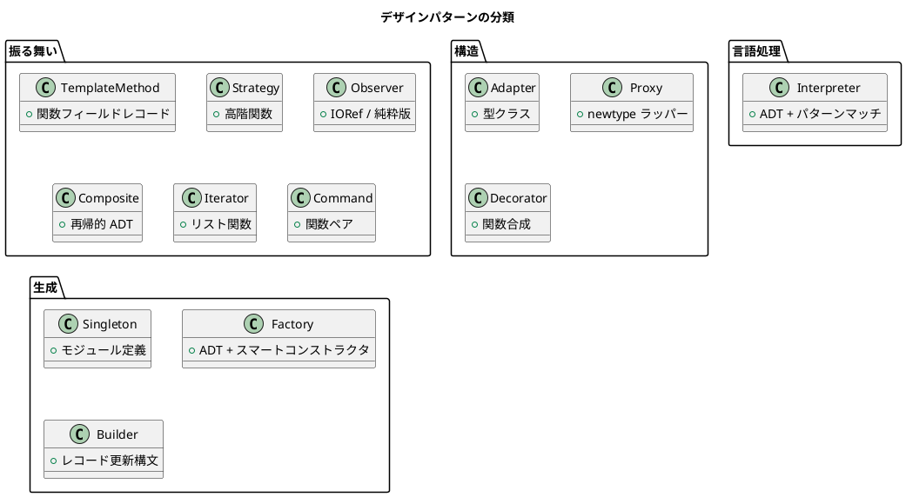

# 第 1 章: デザインパターンとパターン思考

## はじめに

デザインパターンとは、ソフトウェア設計で繰り返し現れる問題に対する再利用可能な解決策のカタログです。GoF（Gang of Four）が 1994 年に体系化した 23 のパターンは、オブジェクト指向設計の共通言語となりました。

本シリーズでは、これらのパターンのうち 13 パターンを **Haskell** の視点で再解釈します。

---

## なぜ Haskell でデザインパターンを学ぶのか

Haskell は純粋関数型言語です。オブジェクト指向言語のために生まれたデザインパターンを、なぜ Haskell で学ぶのでしょうか。

1. **パターンの本質が見える** -- OOP の「儀式」を取り除くと、パターンの核心が浮かび上がる
2. **Haskell のイディオムとの対応** -- 多くのパターンは Haskell の基本機能（高階関数、ADT、型クラス）で自然に表現できる
3. **型安全性** -- Haskell の型システムが設計の正しさをコンパイル時に保証する

---

## パターンの分類

---

## OOP パターンと関数型の対応

| OOP の概念 | Haskell の対応 |
|-----------|---------------|
| インターフェース | 型クラス |
| 継承 | ADT / 型クラスのデフォルト実装 |
| ポリモーフィズム | パラメトリック多相 / アドホック多相 |
| カプセル化 | モジュールのエクスポートリスト |
| 状態変更 | IORef / State モナド / 純粋関数 |
| デザインパターン | 高階関数 / ADT / 型クラス |

---

## この記事シリーズの進め方

各章では以下の流れで進めます。

1. **パターンの動機** -- どんな問題を解決するのか
2. **パターンの構造** -- UML 図で構造を示す
3. **TDD で作る** -- Red-Green-Refactor サイクルで実装
4. **Haskell イディオム** -- 関数型ならではの表現を解説
5. **まとめ** -- パターンの本質を振り返る

---

## まとめ

デザインパターンは言語に依存しない設計の知恵です。Haskell で実装することで、パターンの本質をより深く理解できます。次章では、これらのパターンを支える基本原則を学びます。
