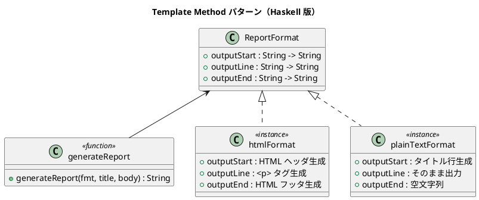

# 第 4 章: Template Method

## はじめに

レポートを HTML とプレーンテキストの 2 つの形式で出力したいとします。出力の「骨格」は同じ（タイトル → 本文 → フッター）ですが、各ステップの具体的な処理は形式ごとに異なります。

**Template Method パターン**は、アルゴリズムの骨格を固定し、具体的なステップをサブクラスに委ねるパターンです。

---

## パターンの構造



**登場人物**:

- **ReportFormat（レコード）**: 各ステップを関数フィールドで表現する
- **generateReport（テンプレートメソッド）**: 骨格を固定し、レコードの関数に委譲する
- **htmlFormat / plainTextFormat（具体フォーマット）**: 各ステップの実装を提供する

---

## Haskell イディオム: 関数フィールドレコード

OOP では抽象クラスのサブクラス化でテンプレートメソッドを実現しますが、Haskell では**関数をフィールドに持つレコード**を使います。

```haskell
data ReportFormat = ReportFormat
  { outputStart :: String -> String
  , outputLine  :: String -> String
  , outputEnd   :: String -> String
  }
```

レコードの値を差し替えるだけで振る舞いを変更できます。継承ツリーは不要です。

---

## TDD で作る

### Red: テストを書く

```haskell
testHtmlFormat :: Test
testHtmlFormat = TestCase $ do
  let result = generateReport htmlFormat "月次報告" ["順調", "問題なし"]
  assertBool "HTML タグを含む" ("<html>" `isInfixOf'` result)
  assertBool "タイトルを含む" ("月次報告" `isInfixOf'` result)
  assertBool "閉じタグを含む" ("</html>" `isInfixOf'` result)
```

### Green: 最小の実装

```haskell
generateReport :: ReportFormat -> String -> [String] -> String
generateReport fmt title body =
  outputStart fmt title
  ++ concatMap (outputLine fmt) body
  ++ outputEnd fmt title

htmlFormat :: ReportFormat
htmlFormat = ReportFormat
  { outputStart = \t -> "<html><head><title>" ++ t ++ "</title></head><body>\n"
  , outputLine  = \l -> "  <p>" ++ l ++ "</p>\n"
  , outputEnd   = \_ -> "</body></html>\n"
  }
```

### Refactor: カスタムフォーマットの追加

テストを通した後、CSV 形式など新しいフォーマットを追加してみます。

```haskell
testCustomFormat :: Test
testCustomFormat = TestCase $ do
  let csvFormat = ReportFormat
        { outputStart = \t -> t ++ "\n"
        , outputLine  = \l -> l ++ ","
        , outputEnd   = \_ -> "\n"
        }
  let result = generateReport csvFormat "レポート" ["A", "B", "C"]
  assertEqual "CSV 形式" "レポート\nA,B,C,\n" result
```

新しいフォーマットを追加するのに、既存のコードを一切変更する必要がありません。

---

## まとめ

| 観点 | OOP | Haskell |
|------|-----|---------|
| 骨格の定義 | 抽象クラス | 関数 |
| ステップの差し替え | サブクラス | レコードの値 |
| 拡張方法 | 新しいサブクラス | 新しいレコード値 |
| 型安全性 | 実行時エラーの可能性 | コンパイル時に保証 |

Haskell では Template Method パターンは「関数をデータとして渡す」という、関数型プログラミングの基本操作に帰着します。
