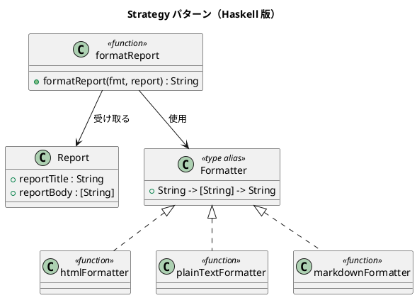

# 第 5 章: Strategy

## はじめに

レポートのフォーマット戦略を実行時に切り替えたいとします。HTML、プレーンテキスト、Markdown のいずれかで出力できるようにしたい。

**Strategy パターン**は、アルゴリズムをカプセル化し、実行時に差し替え可能にするパターンです。

---

## パターンの構造



---

## Haskell イディオム: 高階関数

Haskell では Strategy パターンは**高階関数**そのものです。関数が第一級値なので、戦略の切り替えは単なる引数の変更です。

```haskell
type Formatter = String -> [String] -> String

formatReport :: Formatter -> Report -> String
formatReport fmt r = fmt (reportTitle r) (reportBody r)
```

---

## TDD で作る

### Red: テストを書く

```haskell
testSwitchStrategy :: Test
testSwitchStrategy = TestCase $ do
  let strategies = [htmlFormatter, plainTextFormatter, markdownFormatter]
      results = map (\s -> formatReport s report) strategies
  assertEqual "3 つの戦略" 3 (length results)
  assertBool "それぞれ異なる" (allDifferent results)
```

### Green: 実装

```haskell
htmlFormatter :: Formatter
htmlFormatter title body =
  "<html><head><title>" ++ title ++ "</title></head><body>\n"
  ++ concatMap (\l -> "  <p>" ++ l ++ "</p>\n") body
  ++ "</body></html>\n"

markdownFormatter :: Formatter
markdownFormatter title body =
  "# " ++ title ++ "\n\n"
  ++ concatMap (\l -> "- " ++ l ++ "\n") body
```

---

## Template Method との違い

| 観点 | Template Method | Strategy |
|------|----------------|----------|
| 骨格 | 固定 | なし |
| 差し替え単位 | 各ステップ | アルゴリズム全体 |
| Haskell 表現 | 関数フィールドレコード | 関数（型エイリアス） |

Haskell では両者の境界は曖昧です。関数が第一級値である以上、どちらも「関数を渡す」操作に帰着します。

---

## まとめ

Strategy パターンは Haskell において最も自然なパターンです。`type Formatter = String -> [String] -> String` という型エイリアスひとつで、OOP の Strategy インターフェース + 具象クラス群を表現できます。
