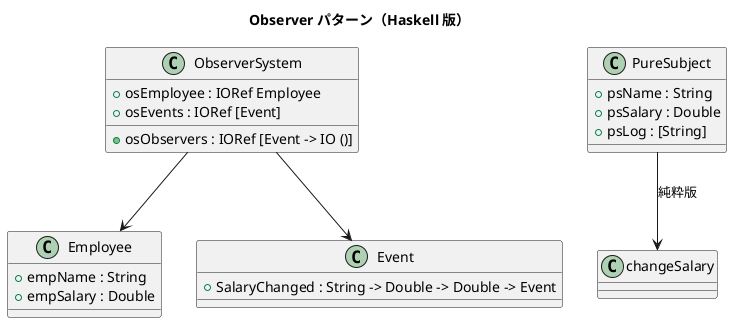

# 第 6 章: Observer

## はじめに

従業員の給与が変更されたとき、複数のシステム（税金計算、通知、ログ）に自動的に通知したいとします。

**Observer パターン**は、オブジェクトの状態変化を他のオブジェクトに自動通知するパターンです。

---

## パターンの構造



---

## 2 つのアプローチ

### IO 版: IORef + コールバック

```haskell
updateSalary :: ObserverSystem -> Double -> IO ()
updateSalary sys newSal = do
  emp <- readIORef (osEmployee sys)
  let event = SalaryChanged (empName emp) (empSalary emp) newSal
  writeIORef (osEmployee sys) emp { empSalary = newSal }
  observers <- readIORef (osObservers sys)
  mapM_ (\obs -> obs event) observers
```

### 純粋版: 状態遷移関数

```haskell
changeSalary :: Double -> PureSubject -> PureSubject
changeSalary newSal subj =
  let msg = psName subj ++ " の給与が変更されました"
  in notify (subj { psSalary = newSal }) msg
```

---

## TDD で作る

### Red

```haskell
testPureObserver :: Test
testPureObserver = TestCase $ do
  let subj = PureSubject "山田" 40000.0 []
      updated = changeSalary 50000.0 subj
  assertEqual "給与更新" 50000.0 (psSalary updated)
  assertEqual "ログ 1 件" 1 (length (psLog updated))
```

### Green

純粋版は `PureSubject` のレコード更新で実装できます。

---

## まとめ

Haskell では Observer パターンに 2 つのアプローチがあります。IO が必要な場合は IORef + コールバック、純粋な計算で済む場合は状態遷移関数が適しています。純粋版はテストが容易で推論しやすいため、可能な限り純粋版を選びましょう。
