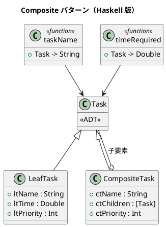

# 第 7 章: Composite

## はじめに

プロジェクト管理で、個別のタスクとタスクグループを同じように扱いたいとします。タスクグループはさらにタスクグループを含むことができます。

**Composite パターン**は、部分-全体の階層構造を表現し、個別要素と複合要素を統一的に扱うパターンです。

---

## パターンの構造



---

## Haskell イディオム: 再帰的 ADT

Haskell の代数的データ型は再帰的な定義を自然にサポートします。

```haskell
data Task
  = LeafTask     { ltName :: String, ltTime :: Double, ltPriority :: Int }
  | CompositeTask { ctName :: String, ctChildren :: [Task], ctPriority :: Int }
```

パターンマッチで統一的に処理できます。

```haskell
timeRequired :: Task -> Double
timeRequired (LeafTask _ t _)       = t
timeRequired (CompositeTask _ cs _) = sum (map timeRequired cs)
```

---

## TDD で作る

### Red

```haskell
testNestedComposite :: Test
testNestedComposite = TestCase $ do
  let backend = CompositeTask "バックエンド"
        [LeafTask "DB設計" 2.0 1, LeafTask "API設計" 3.0 2] 1
      frontend = CompositeTask "フロントエンド"
        [LeafTask "UI設計" 2.0 1] 2
      project = CompositeTask "全体" [backend, frontend] 1
  assertEqual "合計時間" 7.0 (timeRequired project)
```

### Green

```haskell
taskName :: Task -> String
taskName (LeafTask name _ _)        = name
taskName (CompositeTask name _ _)   = name

timeRequired :: Task -> Double
timeRequired (LeafTask _ t _)       = t
timeRequired (CompositeTask _ cs _) = sum (map timeRequired cs)

totalTasks :: Task -> Int
totalTasks (LeafTask _ _ _)         = 1
totalTasks (CompositeTask _ cs _)   = sum (map totalTasks cs)
```

`timeRequired` と `totalTasks` を同じ再帰パターンでそろえると、Composite の意図が見えやすくなります。

---

## まとめ

Haskell の再帰的 ADT は Composite パターンと完璧に合致します。パターンマッチによる場合分けは、OOP の仮想メソッドディスパッチに相当しますが、すべての場合を網羅しているかどうかをコンパイラがチェックしてくれます。
