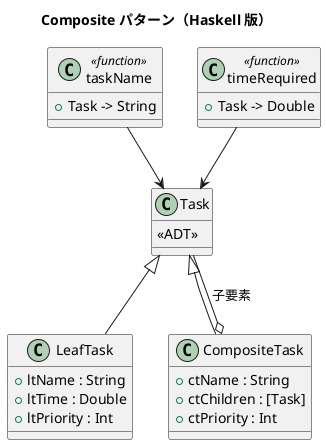

# 第 7 章: Composite

## はじめに

プロジェクト管理で、個別のタスクとタスクグループを同じように扱いたいとします。タスクグループはさらにタスクグループを含むことができます。

**Composite パターン**は、部分-全体の階層構造を表現し、個別要素と複合要素を統一的に扱うパターンです。

---

## パターンの構造



---

## Haskell イディオム: 再帰的 ADT

Haskell の代数的データ型は再帰的な定義を自然にサポートします。

```haskell
data Task
  = LeafTask     { ltName :: String, ltTime :: Double, ltPriority :: Int }
  | CompositeTask { ctName :: String, ctChildren :: [Task], ctPriority :: Int }
```

パターンマッチで統一的に処理できます。

```haskell
timeRequired :: Task -> Double
timeRequired (LeafTask _ t _)       = t
timeRequired (CompositeTask _ cs _) = sum (map timeRequired cs)
```

---

## TDD で作る

### Red

```haskell
testNestedComposite :: Test
testNestedComposite = TestCase $ do
  let backend = CompositeTask "バックエンド"
        [LeafTask "DB設計" 2.0 1, LeafTask "API設計" 3.0 2] 1
      frontend = CompositeTask "フロントエンド"
        [LeafTask "UI設計" 2.0 1] 2
      project = CompositeTask "全体" [backend, frontend] 1
  assertEqual "合計時間" 7.0 (timeRequired project)
```

### Green

```haskell
taskName :: Task -> String
taskName (LeafTask name _ _)        = name
taskName (CompositeTask name _ _)   = name

timeRequired :: Task -> Double
timeRequired (LeafTask _ t _)       = t
timeRequired (CompositeTask _ cs _) = sum (map timeRequired cs)

totalTasks :: Task -> Int
totalTasks (LeafTask _ _ _)         = 1
totalTasks (CompositeTask _ cs _)   = sum (map totalTasks cs)
```

`timeRequired` と `totalTasks` を同じ再帰パターンでそろえると、Composite の意図が見えやすくなります。

---

## サブタスクの追加と属性アクセス

### addSubTask: コンポジットにサブタスクを追加

`addSubTask` は `CompositeTask` に子タスクを追加します。`LeafTask` に対して呼んだ場合はそのまま返します。

```haskell
addSubTask :: Task -> Task -> Task
addSubTask child (CompositeTask n cs p) = CompositeTask n (cs ++ [child]) p
addSubTask _     leaf                   = leaf  -- リーフには追加できない
```

```haskell
-- 使用例
let group = CompositeTask "開発" [] 1
    task1 = LeafTask "設計" 2.0 1
    task2 = LeafTask "実装" 4.0 2
    updated = addSubTask task2 (addSubTask task1 group)
-- subTasks updated == [task1, task2]
```

### subTasks: サブタスクの取得

`subTasks` はコンポジットの子要素リストを返します。リーフの場合は空リストです。

```haskell
subTasks :: Task -> [Task]
subTasks (LeafTask _ _ _)       = []
subTasks (CompositeTask _ cs _) = cs
```

### priority: 優先度の取得

`priority` はタスクの優先度を返します。リーフとコンポジットの両方に対して統一的に使えます。

```haskell
priority :: Task -> Int
priority (LeafTask _ _ p)       = p
priority (CompositeTask _ _ p)  = p
```

```haskell
-- 使用例
let task = LeafTask "テスト" 1.0 3
-- priority task == 3
```

---

## まとめ

Haskell の再帰的 ADT は Composite パターンと完璧に合致します。パターンマッチによる場合分けは、OOP の仮想メソッドディスパッチに相当しますが、すべての場合を網羅しているかどうかをコンパイラがチェックしてくれます。
