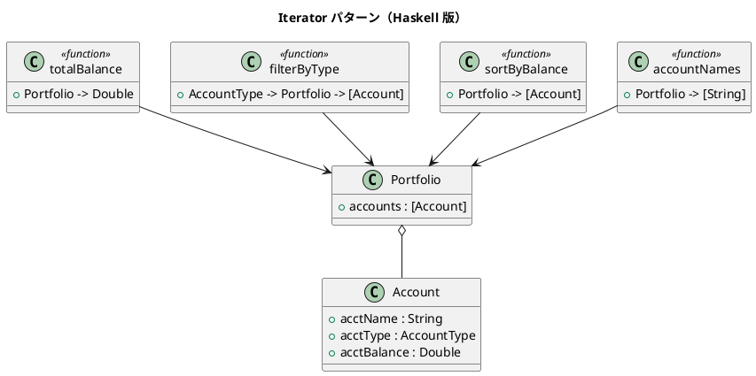

# 第 8 章: Iterator

## はじめに

ポートフォリオ内の口座を様々な方法で走査したいとします。残高順、種別ごと、名前一覧など。

**Iterator パターン**は、コレクションの内部構造を隠しつつ、要素を順に処理する方法を提供するパターンです。

---

## パターンの構造



---

## Haskell イディオム: リスト関数

Haskell ではリストが標準のイテレータです。`map`、`filter`、`fold`、`sort` などの高階関数が Iterator パターンの役割を果たします。

```haskell
-- map: 各要素を変換
accountNames :: Portfolio -> [String]
accountNames = map acctName . accounts

-- filter: 条件で絞り込み
filterByType :: AccountType -> Portfolio -> [Account]
filterByType t = filter (\a -> acctType a == t) . accounts

-- fold: 畳み込み
totalBalance :: Portfolio -> Double
totalBalance = sum . map acctBalance . accounts
```

---

## TDD で作る

### Red

```haskell
testSortByBalance :: Test
testSortByBalance = TestCase $ do
  let sorted = sortByBalance portfolio
  assertEqual "最小残高" 50000.0 (acctBalance (head sorted))
  assertEqual "最大残高" 200000.0 (acctBalance (last sorted))
```

### Green

```haskell
sortByBalance :: Portfolio -> [Account]
sortByBalance = sortBy (comparing acctBalance) . accounts
```

---

## まとめ

Haskell では Iterator パターンは言語に組み込まれています。リストと高階関数（`map`、`filter`、`fold`、`sort`）がそのまま Iterator の抽象化です。OOP で必要な Iterator インターフェースと具象クラスは不要です。
