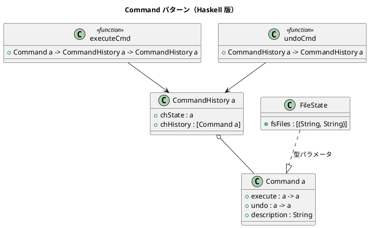

# 第 9 章: Command

## はじめに

ファイル操作（作成、削除、書き込み）を実行し、必要に応じて取り消したいとします。操作の履歴も管理したい。

**Command パターン**は、操作をオブジェクトとしてカプセル化し、実行、取り消し、履歴管理を可能にするパターンです。

---

## パターンの構造



---

## Haskell イディオム: 関数ペア

コマンドは「実行」と「取り消し」の関数ペアです。型パラメータ `a` により、どんな状態にも適用できます。

```haskell
data Command a = Command
  { execute     :: a -> a
  , undo        :: a -> a
  , description :: String
  }
```

---

## TDD で作る

### Red

```haskell
testUndo :: Test
testUndo = TestCase $ do
  let initial = FileState []
      hist = newHistory initial
      cmd = createFileCmd "test.txt" "hello"
      hist' = executeCmd cmd hist
      hist'' = undoCmd hist'
  assertEqual "undo 後" [] (fsFiles (chState hist''))
```

### Green

```haskell
createFileCmd :: String -> String -> Command FileState
createFileCmd name content = Command
  { execute = \fs -> fs { fsFiles = fsFiles fs ++ [(name, content)] }
  , undo    = \fs -> fs { fsFiles = filter (\(n, _) -> n /= name) (fsFiles fs) }
  , description = "ファイル作成: " ++ name
  }
```

---

## 追加のファイル操作コマンド

### deleteFileCmd: ファイル削除コマンド

指定したファイル名のエントリをファイルリストから除去します。簡易実装のため、`undo` では元のファイルを復元しません。

```haskell
deleteFileCmd :: String -> Command FileState
deleteFileCmd name = Command
  { execute     = \fs -> fs { fsFiles = filter (\(n, _) -> n /= name) (fsFiles fs) }
  , undo        = id  -- 簡易実装: 削除の undo は復元しない
  , description = "ファイル削除: " ++ name
  }
```

### writeFileCmd: ファイル書き込みコマンド

既存ファイルの内容を新しい内容に書き換えます。`undo` で元の内容に戻すため、旧内容と新内容の両方を引数に取ります。

```haskell
writeFileCmd :: String -> String -> String -> Command FileState
writeFileCmd name oldContent newContent = Command
  { execute     = \fs -> fs { fsFiles = map (\(n, c) -> if n == name then (n, newContent) else (n, c)) (fsFiles fs) }
  , undo        = \fs -> fs { fsFiles = map (\(n, c) -> if n == name then (n, oldContent) else (n, c)) (fsFiles fs) }
  , description = "ファイル書き込み: " ++ name
  }
```

### historyDescriptions: コマンド履歴の説明一覧

実行済みコマンドの説明を新しい順に取得します。デバッグや監査ログに有用です。

```haskell
historyDescriptions :: CommandHistory a -> [String]
historyDescriptions = map description . chHistory
```

```haskell
-- 使用例
let hist = executeCmd (createFileCmd "b.txt" "world")
         . executeCmd (createFileCmd "a.txt" "hello")
         $ newHistory (FileState [])
-- historyDescriptions hist == ["ファイル作成: b.txt", "ファイル作成: a.txt"]
```

---

## まとめ

Haskell では Command パターンは「状態遷移関数のペア」として表現されます。`execute` と `undo` を逆関数として定義することで、型安全な undo/redo が実現できます。
