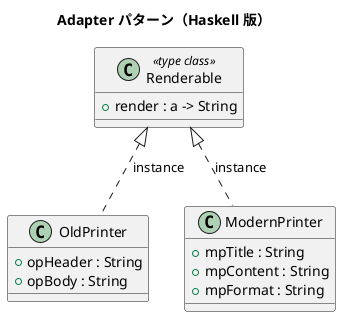

# 第 10 章: Adapter

## はじめに

旧式プリンタとモダンプリンタという、異なるインターフェースを持つ 2 つのシステムを統一的に扱いたいとします。

**Adapter パターン**は、互換性のないインターフェースを変換し、既存のコードを再利用可能にするパターンです。

---

## パターンの構造



---

## Haskell イディオム: 型クラス

型クラスが「ターゲットインターフェース」の役割を果たし、各データ型の `instance` 宣言がアダプタとして機能します。

```haskell
class Renderable a where
  render :: a -> String

instance Renderable OldPrinter where
  render p = "=== " ++ opHeader p ++ " ===\n" ++ opBody p ++ "\n"

instance Renderable ModernPrinter where
  render p = case mpFormat p of
    "html" -> "<div><h1>" ++ mpTitle p ++ "</h1>..."
    _      -> "[" ++ mpTitle p ++ "] " ++ mpContent p
```

---

## TDD で作る

### Red

```haskell
testOldPrinter :: Test
testOldPrinter = TestCase $ do
  let p = OldPrinter "報告書" "本日は晴天なり"
      result = render p
  assertBool "ヘッダを含む" ("報告書" `isIn` result)
```

### Green

型クラスのインスタンスを定義するだけです。

---

## まとめ

Haskell の型クラスは、OOP の Adapter パターンをゼロコストで実現します。新しい型を `Renderable` のインスタンスにするだけで、既存のコード（`renderAll` など）がそのまま使えます。
