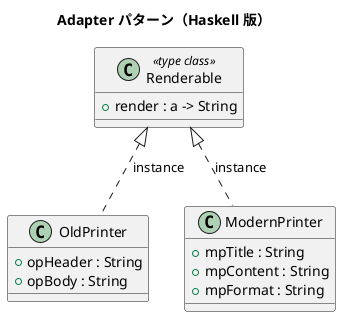

# 第 10 章: Adapter

## はじめに

旧式プリンタとモダンプリンタという、異なるインターフェースを持つ 2 つのシステムを統一的に扱いたいとします。

**Adapter パターン**は、互換性のないインターフェースを変換し、既存のコードを再利用可能にするパターンです。

---

## パターンの構造



---

## Haskell イディオム: 型クラス

型クラスが「ターゲットインターフェース」の役割を果たし、各データ型の `instance` 宣言がアダプタとして機能します。

```haskell
class Renderable a where
  render :: a -> String

instance Renderable OldPrinter where
  render p = "=== " ++ opHeader p ++ " ===\n" ++ opBody p ++ "\n"

instance Renderable ModernPrinter where
  render p = case mpFormat p of
    "html" -> "<div><h1>" ++ mpTitle p ++ "</h1>..."
    _      -> "[" ++ mpTitle p ++ "] " ++ mpContent p
```

---

## TDD で作る

### Red

```haskell
testOldPrinter :: Test
testOldPrinter = TestCase $ do
  let p = OldPrinter "報告書" "本日は晴天なり"
      result = render p
  assertBool "ヘッダを含む" ("報告書" `isIn` result)
```

### Green

```haskell
data OldPrinter = OldPrinter
  { opHeader :: String
  , opBody   :: String
  }

data ModernPrinter = ModernPrinter
  { mpTitle   :: String
  , mpContent :: String
  , mpFormat  :: String
  }

class Renderable a where
  render :: a -> String

instance Renderable OldPrinter where
  render p =
    "=== " ++ opHeader p ++ " ===\n"
      ++ opBody p ++ "\n"

instance Renderable ModernPrinter where
  render p
    | mpFormat p == "html" =
        "<article><h1>" ++ mpTitle p ++ "</h1><p>" ++ mpContent p ++ "</p></article>"
    | otherwise =
        "[" ++ mpTitle p ++ "] " ++ mpContent p
```

テストを通す段階では、旧式とモダンの両方を `render` にそろえるところまで実装すれば十分です。

---

## renderAll: 複数の Renderable をまとめて出力

`renderAll` は型クラス制約 `Renderable a =>` を持つ多相関数で、同じ型の `Renderable` インスタンスのリストをまとめて描画します。

```haskell
renderAll :: Renderable a => [a] -> String
renderAll = concatMap render
```

```haskell
-- 使用例: 旧式プリンタのリストをまとめて出力
let printers = [ OldPrinter "報告書1" "内容A"
               , OldPrinter "報告書2" "内容B" ]
    result = renderAll printers
-- result == "=== 報告書1 ===\n内容A\n=== 報告書2 ===\n内容B\n"

-- モダンプリンタのリストも同様
let mps = [ ModernPrinter "記事1" "本文1" "text"
           , ModernPrinter "記事2" "本文2" "html" ]
    result2 = renderAll mps
-- result2 == "[記事1] 本文1<div><h1>記事2</h1><p>本文2</p></div>"
```

`renderAll` は型クラス制約による多相性を持つため、`Renderable` インスタンスであればどの型のリストにも適用できます。ただし Haskell のリストは同一型なので、`OldPrinter` と `ModernPrinter` を同じリストに混在させることはできません。異なる型を混在させたい場合は存在型やラッパーを使います。

---

## まとめ

Haskell の型クラスは、OOP の Adapter パターンをゼロコストで実現します。新しい型を `Renderable` のインスタンスにするだけで、既存のコード（`renderAll` など）がそのまま使えます。
