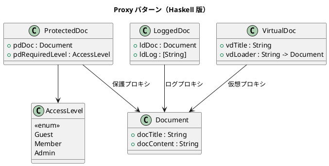

# 第 11 章: Proxy

## はじめに

機密文書へのアクセスを制御したい。ユーザーの権限レベルに応じてアクセスを許可/拒否したい。また、アクセスログも記録したい。

**Proxy パターン**は、対象オブジェクトへのアクセスを制御するための代理を提供するパターンです。

---

## パターンの構造



---

## 3 種類のプロキシ

### 保護プロキシ: アクセス制御

```haskell
accessDocument :: AccessLevel -> ProtectedDoc -> Either String Document
accessDocument userLevel pd
  | userLevel >= pdRequiredLevel pd = Right (pdDoc pd)
  | otherwise = Left "アクセス拒否"
```

### 仮想プロキシ: 遅延ロード

Haskell の遅延評価は本質的に仮想プロキシです。明示的にも表現できます。

```haskell
data VirtualDoc = VirtualDoc
  { vdTitle  :: String
  , vdLoader :: String -> Document
  }
```

### ログプロキシ: アクセス記録

```haskell
accessWithLog :: String -> LoggedDoc -> (Document, LoggedDoc)
accessWithLog user ld =
  let msg = user ++ " が " ++ docTitle (ldDoc ld) ++ " にアクセスしました"
  in (ldDoc ld, ld { ldLog = ldLog ld ++ [msg] })
```

---

## TDD で作る

### Red

```haskell
testAccessDenied :: Test
testAccessDenied = TestCase $ do
  let pd = ProtectedDoc doc Admin
  case accessDocument Guest pd of
    Right _  -> assertFailure "アクセスは拒否されるべき"
    Left err -> assertBool "エラーメッセージ" ("アクセス拒否" `isIn` err)
```

### Green

`Either` 型でアクセスの成功/失敗を型安全に表現します。

---

## まとめ

Haskell では Proxy の 3 つのバリエーションがそれぞれ異なるイディオムで表現されます。`Either` によるエラーハンドリング、遅延評価による仮想プロキシ、レコード更新によるログプロキシ。特に遅延評価は Haskell の言語仕様そのものがプロキシです。
