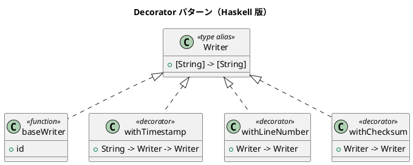

# 第 12 章: Decorator

## はじめに

テキスト出力にタイムスタンプ、行番号、チェックサムなどの機能を動的に追加したいとします。機能の組み合わせは自由に変更できるようにしたい。

**Decorator パターン**は、既存のオブジェクトに動的に新しい機能を追加するパターンです。

---

## パターンの構造



---

## Haskell イディオム: 関数合成

Decorator パターンは Haskell では**関数合成 (.)** そのものです。

```haskell
type Writer = [String] -> [String]

-- デコレータを合成
decorated :: Writer
decorated = withChecksum . withLineNumber . withTimestamp "2024-01-01" $ baseWriter
```

各デコレータは `Writer -> Writer` 型の関数です。

```haskell
withTimestamp :: String -> Writer -> Writer
withTimestamp ts base = map (\l -> "[" ++ ts ++ "] " ++ l) . base

withLineNumber :: Writer -> Writer
withLineNumber base = zipWith (\n l -> show n ++ ": " ++ l) [1..] . base
```

---

## TDD で作る

### Red

```haskell
testComposed :: Test
testComposed = TestCase $ do
  let result = decorated sampleLines
  assertBool "行番号 + タイムスタンプ" ("1: [2024-01-01]" `isIn` head result)
  assertBool "チェックサム" ("[checksum:" `isIn` last result)
```

### Green

関数合成の順序に注意して実装します。右から左に適用されます。

---

## 動的なデコレータリスト

```haskell
applyDecorators :: [Writer -> Writer] -> Writer -> Writer
applyDecorators decorators base = foldr ($) base decorators
```

---

## まとめ

Haskell では Decorator パターンは関数合成 `(.)` に帰着します。OOP で必要なラッパークラスの階層は不要です。`Writer -> Writer` という型が、デコレータのインターフェースと実装を同時に表現しています。
