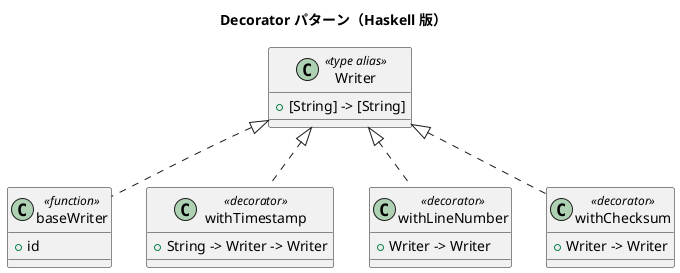

# 第 12 章: Decorator

## はじめに

テキスト出力にタイムスタンプ、行番号、チェックサムなどの機能を動的に追加したいとします。機能の組み合わせは自由に変更できるようにしたい。

**Decorator パターン**は、既存のオブジェクトに動的に新しい機能を追加するパターンです。

---

## パターンの構造



---

## Haskell イディオム: 関数合成

Decorator パターンは Haskell では**関数合成 (.)** そのものです。

```haskell
type Writer = [String] -> [String]

-- デコレータを合成
decorated :: Writer
decorated = withChecksum . withLineNumber . withTimestamp "2024-01-01" $ baseWriter
```

各デコレータは `Writer -> Writer` 型の関数です。

```haskell
withTimestamp :: String -> Writer -> Writer
withTimestamp ts base = map (\l -> "[" ++ ts ++ "] " ++ l) . base

withLineNumber :: Writer -> Writer
withLineNumber base = zipWith (\n l -> show n ++ ": " ++ l) [1..] . base
```

---

## TDD で作る

### Red

```haskell
testComposed :: Test
testComposed = TestCase $ do
  let result = decorated sampleLines
  assertBool "行番号 + タイムスタンプ" ("1: [2024-01-01]" `isIn` head result)
  assertBool "チェックサム" ("[checksum:" `isIn` last result)
```

### Green

```haskell
type Writer = [String] -> [String]

baseWriter :: Writer
baseWriter = id

withTimestamp :: String -> Writer -> Writer
withTimestamp ts base =
  map (\line -> "[" ++ ts ++ "] " ++ line) . base

withLineNumber :: Writer -> Writer
withLineNumber base =
  zipWith (\n line -> show n ++ ": " ++ line) [1 :: Int ..] . base

withChecksum :: Writer -> Writer
withChecksum base lines0 =
  let rendered = base lines0
      checksum = sum (map length rendered)
  in rendered ++ ["[checksum:" ++ show checksum ++ "]"]
```

関数合成の順序だけでなく、各デコレータが `Writer -> Writer` を保ったまま責務を追加しているところまで実装します。

---

## applyDecorators: デコレータリストの動的適用

`applyDecorators` は `Writer -> Writer` 型のデコレータのリストを受け取り、`foldr` で右から順に適用します。

```haskell
applyDecorators :: [Writer -> Writer] -> Writer -> Writer
applyDecorators decorators base = foldr ($) base decorators
```

```haskell
-- 使用例
let writer = applyDecorators [withChecksum, withLineNumber] baseWriter
    result = writer ["hello", "world"]
-- result == ["1: hello", "2: world", "[checksum: 18]"]
```

## decorated: 事前合成されたデコレータ

`decorated` はタイムスタンプ、行番号、チェックサムを事前に合成した `Writer` です。よく使う組み合わせをモジュールから直接エクスポートしています。

```haskell
decorated :: Writer
decorated = withChecksum . withLineNumber . withTimestamp "2024-01-01" $ baseWriter
```

### デコレータの適用順序

デコレータの適用順序は結果に影響します。関数合成 `(.)` は右から左に適用されるため、`decorated` では以下の順序で処理されます。

1. `withTimestamp "2024-01-01"` -- まずタイムスタンプを付与
2. `withLineNumber` -- タイムスタンプ付きの行に番号を付与
3. `withChecksum` -- 最後にチェックサムを追加

順序を変えると出力が変わります。例えば `withLineNumber . withTimestamp` とすると、行番号の後にタイムスタンプが付きます。目的に応じて適切な順序を選んでください。

---

## まとめ

Haskell では Decorator パターンは関数合成 `(.)` に帰着します。OOP で必要なラッパークラスの階層は不要です。`Writer -> Writer` という型が、デコレータのインターフェースと実装を同時に表現しています。
