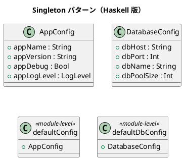

# 第 13 章: Singleton

## はじめに

アプリケーション全体で共有される設定（アプリ名、バージョン、ログレベル）を一元管理したいとします。

**Singleton パターン**は、クラスのインスタンスが 1 つだけであることを保証し、グローバルなアクセスポイントを提供するパターンです。

---

## パターンの構造



---

## Haskell イディオム: モジュールレベル定義（CAF）

Haskell にはミュータブルなグローバル状態がないため、Singleton パターンの問題（スレッド安全性、テストの困難さ）が発生しません。

モジュールのトップレベル値は **CAF（Constant Applicative Form）** として一度だけ評価されます。

```haskell
-- モジュールレベルの値 = 自然なシングルトン
defaultConfig :: AppConfig
defaultConfig = AppConfig
  { appName    = "DesignPatternApp"
  , appVersion = "1.0.0"
  , appDebug   = False
  , appLogLevel = INFO
  }
```

---

## TDD で作る

### Red

```haskell
testDefaultConfig :: Test
testDefaultConfig = TestCase $ do
  assertEqual "アプリ名" "DesignPatternApp" (appName defaultConfig)
  assertEqual "バージョン" "1.0.0" (appVersion defaultConfig)
```

### Green

```haskell
data LogLevel = DEBUG | INFO | WARN
  deriving (Eq, Show)

data AppConfig = AppConfig
  { appName     :: String
  , appVersion  :: String
  , appDebug    :: Bool
  , appLogLevel :: LogLevel
  }

defaultConfig :: AppConfig
defaultConfig = AppConfig
  { appName     = "DesignPatternApp"
  , appVersion  = "1.0.0"
  , appDebug    = False
  , appLogLevel = INFO
  }

enableDebug :: AppConfig -> AppConfig
enableDebug cfg = cfg { appDebug = True, appLogLevel = DEBUG }
```

共有値そのものはトップレベル定義で持ち、テストでは必要に応じてレコード更新版を作る形にします。

---

## LogLevel とログ機能

### LogLevel 列挙型

`LogLevel` は `DEBUG`、`INFO`、`WARN`、`ERROR` の 4 段階のログレベルを表します。`Ord` を derive しているため、レベルの大小比較ができます。

```haskell
data LogLevel = DEBUG | INFO | WARN | ERROR
  deriving (Show, Eq, Ord)
```

### logMessage: ログレベルに応じたメッセージフォーマット

`logMessage` は設定されたログレベル以上のメッセージのみをフォーマットして返します。レベルが足りない場合は空文字列を返します。

```haskell
logMessage :: AppConfig -> LogLevel -> String -> String
logMessage cfg level msg
  | level >= appLogLevel cfg = "[" ++ show level ++ "] " ++ appName cfg ++ ": " ++ msg
  | otherwise = ""
```

```haskell
-- 使用例（defaultConfig の appLogLevel は INFO）
logMessage defaultConfig INFO "起動しました"
-- "[INFO] DesignPatternApp: 起動しました"

logMessage defaultConfig DEBUG "デバッグ情報"
-- ""（DEBUG < INFO なのでフィルタされる）

logMessage defaultConfig ERROR "エラー発生"
-- "[ERROR] DesignPatternApp: エラー発生"
```

### configSummary: 設定のサマリ表示

`configSummary` はアプリケーション設定の概要を 1 行の文字列で返します。

```haskell
configSummary :: AppConfig -> String
configSummary cfg =
  appName cfg ++ " v" ++ appVersion cfg
  ++ " (debug=" ++ show (appDebug cfg)
  ++ ", logLevel=" ++ show (appLogLevel cfg) ++ ")"
```

```haskell
-- 使用例
configSummary defaultConfig
-- "DesignPatternApp v1.0.0 (debug=False, logLevel=INFO)"
```

## defaultDbConfig: データベース設定

`defaultDbConfig` はデータベース接続のデフォルト設定をモジュールレベルのシングルトンとして提供します。

```haskell
defaultDbConfig :: DatabaseConfig
defaultDbConfig = DatabaseConfig
  { dbHost     = "localhost"
  , dbPort     = 5432
  , dbName     = "design_pattern"
  , dbPoolSize = 10
  }
```

---

## まとめ

| 観点 | OOP | Haskell |
|------|-----|---------|
| インスタンス制御 | private コンストラクタ | 不要（イミュータブル） |
| スレッド安全性 | synchronized / lock | 不要（純粋関数） |
| テスタビリティ | モック / DI | そのまま（引数で渡す） |

Haskell ではモジュールのトップレベル値がシングルトンの役割を果たします。OOP の Singleton に付随する複雑さ（スレッド安全性、テストの困難さ）は存在しません。
