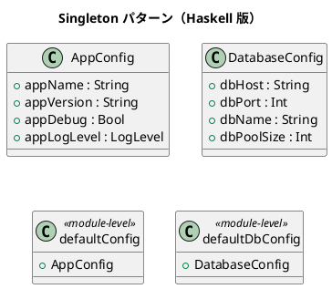

# 第 13 章: Singleton

## はじめに

アプリケーション全体で共有される設定（アプリ名、バージョン、ログレベル）を一元管理したいとします。

**Singleton パターン**は、クラスのインスタンスが 1 つだけであることを保証し、グローバルなアクセスポイントを提供するパターンです。

---

## パターンの構造



---

## Haskell イディオム: モジュールレベル定義（CAF）

Haskell にはミュータブルなグローバル状態がないため、Singleton パターンの問題（スレッド安全性、テストの困難さ）が発生しません。

モジュールのトップレベル値は **CAF（Constant Applicative Form）** として一度だけ評価されます。

```haskell
-- モジュールレベルの値 = 自然なシングルトン
defaultConfig :: AppConfig
defaultConfig = AppConfig
  { appName    = "DesignPatternApp"
  , appVersion = "1.0.0"
  , appDebug   = False
  , appLogLevel = INFO
  }
```

---

## TDD で作る

### Red

```haskell
testDefaultConfig :: Test
testDefaultConfig = TestCase $ do
  assertEqual "アプリ名" "DesignPatternApp" (appName defaultConfig)
  assertEqual "バージョン" "1.0.0" (appVersion defaultConfig)
```

### Green

レコード値を定義するだけです。Haskell では Singleton のための特別な仕組みは不要です。

---

## まとめ

| 観点 | OOP | Haskell |
|------|-----|---------|
| インスタンス制御 | private コンストラクタ | 不要（イミュータブル） |
| スレッド安全性 | synchronized / lock | 不要（純粋関数） |
| テスタビリティ | モック / DI | そのまま（引数で渡す） |

Haskell ではモジュールのトップレベル値がシングルトンの役割を果たします。OOP の Singleton に付随する複雑さ（スレッド安全性、テストの困難さ）は存在しません。
