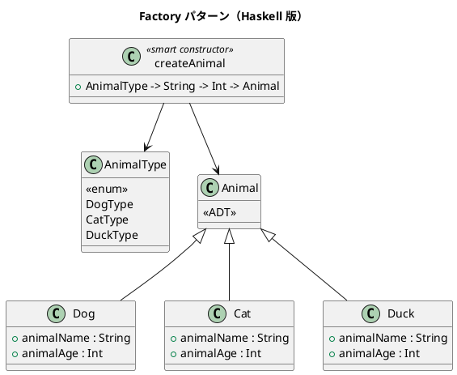

# 第 14 章: Factory

## はじめに

動物の種類（犬、猫、鴨）に応じて適切なオブジェクトを生成したいとします。生成ロジックをクライアントから分離したい。

**Factory パターン**は、オブジェクトの生成をファクトリメソッドに委譲し、生成ロジックをカプセル化するパターンです。

---

## パターンの構造



---

## Haskell イディオム: ADT + スマートコンストラクタ

```haskell
data Animal
  = Dog  { animalName :: String, animalAge :: Int }
  | Cat  { animalName :: String, animalAge :: Int }
  | Duck { animalName :: String, animalAge :: Int }

-- スマートコンストラクタ
createAnimal :: AnimalType -> String -> Int -> Animal
createAnimal DogType  = Dog
createAnimal CatType  = Cat
createAnimal DuckType = Duck
```

パターンマッチで振る舞いを分岐させます。

```haskell
speak :: Animal -> String
speak (Dog name _)  = name ++ " says: ワンワン!"
speak (Cat name _)  = name ++ " says: ニャー!"
speak (Duck name _) = name ++ " says: ガーガー!"
```

---

## TDD で作る

### Red

```haskell
testSpeak :: Test
testSpeak = TestCase $ do
  let dog = createAnimal DogType "ポチ" 3
  assertBool "犬の鳴き声" ("ワンワン" `isIn` speak dog)
```

### Green

```haskell
data AnimalType = DogType | CatType | DuckType
  deriving (Eq, Show)

data Animal
  = Dog  { animalName :: String, animalAge :: Int }
  | Cat  { animalName :: String, animalAge :: Int }
  | Duck { animalName :: String, animalAge :: Int }

createAnimal :: AnimalType -> String -> Int -> Animal
createAnimal DogType  name age = Dog name age
createAnimal CatType  name age = Cat name age
createAnimal DuckType name age = Duck name age

speak :: Animal -> String
speak (Dog name _)  = name ++ " says: ワンワン!"
speak (Cat name _)  = name ++ " says: ニャー!"
speak (Duck name _) = name ++ " says: ガーガー!"
```

Factory の責務は `AnimalType` から適切なコンストラクタを選ぶところに閉じ込めます。

---

## まとめ

Haskell では Factory パターンは ADT + スマートコンストラクタに帰着します。`AnimalType` の enum 値をパターンマッチで分岐させるだけで、型安全なファクトリが完成します。新しい動物を追加すると、パターンマッチの網羅性チェックが対応漏れを教えてくれます。
