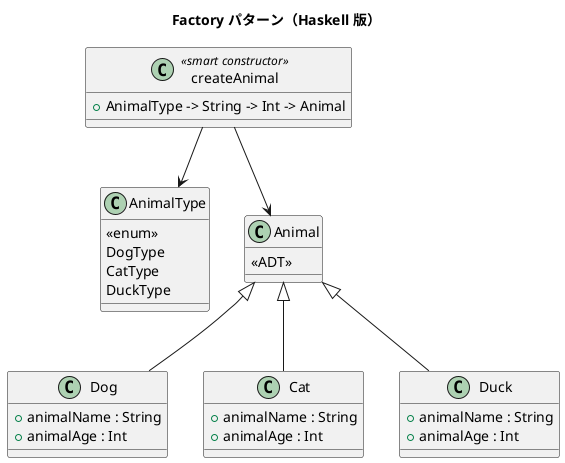

# 第 14 章: Factory

## はじめに

動物の種類（犬、猫、鴨）に応じて適切なオブジェクトを生成したいとします。生成ロジックをクライアントから分離したい。

**Factory パターン**は、オブジェクトの生成をファクトリメソッドに委譲し、生成ロジックをカプセル化するパターンです。

---

## パターンの構造



---

## Haskell イディオム: ADT + スマートコンストラクタ

```haskell
data Animal
  = Dog  { animalName :: String, animalAge :: Int }
  | Cat  { animalName :: String, animalAge :: Int }
  | Duck { animalName :: String, animalAge :: Int }

-- スマートコンストラクタ
createAnimal :: AnimalType -> String -> Int -> Animal
createAnimal DogType  = Dog
createAnimal CatType  = Cat
createAnimal DuckType = Duck
```

パターンマッチで振る舞いを分岐させます。

```haskell
speak :: Animal -> String
speak (Dog name _)  = name ++ " says: ワンワン!"
speak (Cat name _)  = name ++ " says: ニャー!"
speak (Duck name _) = name ++ " says: ガーガー!"
```

---

## TDD で作る

### Red

```haskell
testSpeak :: Test
testSpeak = TestCase $ do
  let dog = createAnimal DogType "ポチ" 3
  assertBool "犬の鳴き声" ("ワンワン" `isIn` speak dog)
```

### Green

```haskell
data AnimalType = DogType | CatType | DuckType
  deriving (Eq, Show)

data Animal
  = Dog  { animalName :: String, animalAge :: Int }
  | Cat  { animalName :: String, animalAge :: Int }
  | Duck { animalName :: String, animalAge :: Int }

createAnimal :: AnimalType -> String -> Int -> Animal
createAnimal DogType  name age = Dog name age
createAnimal CatType  name age = Cat name age
createAnimal DuckType name age = Duck name age

speak :: Animal -> String
speak (Dog name _)  = name ++ " says: ワンワン!"
speak (Cat name _)  = name ++ " says: ニャー!"
speak (Duck name _) = name ++ " says: ガーガー!"
```

Factory の責務は `AnimalType` から適切なコンストラクタを選ぶところに閉じ込めます。

---

## habitat: 生息地の取得

`habitat` はパターンマッチで動物ごとの生息地を返します。`speak` と同じ構造で、振る舞いの追加が容易です。

```haskell
habitat :: Animal -> String
habitat (Dog _ _)  = "家"
habitat (Cat _ _)  = "家 / 外"
habitat (Duck _ _) = "池"
```

```haskell
-- 使用例
let duck = createAnimal DuckType "ドナルド" 5
-- habitat duck == "池"
```

## AnimalFactory 型エイリアスとカスタムファクトリ

### AnimalFactory 型エイリアス

`AnimalFactory` は `String -> Int -> Animal` の型エイリアスです。ファクトリ関数を第一級の値として扱えます。

```haskell
type AnimalFactory = String -> Int -> Animal
```

### defaultFactory: デフォルトファクトリ

`defaultFactory` は常に `Dog` を生成するファクトリです。

```haskell
defaultFactory :: AnimalFactory
defaultFactory = Dog
```

```haskell
-- 使用例
let pet = defaultFactory "タロウ" 2
-- pet == Dog "タロウ" 2
```

### customFactory: カスタムファクトリ

`customFactory` は `AnimalType` を受け取り、対応するファクトリを返します。`createAnimal` の部分適用として実装されています。

```haskell
customFactory :: AnimalType -> AnimalFactory
customFactory = createAnimal
```

```haskell
-- 使用例: 猫ファクトリを作って使う
let catFactory = customFactory CatType
    cat = catFactory "ミケ" 3
-- speak cat == "ミケ says: ニャー!"
```

ファクトリ関数を型エイリアスで名前をつけることで、ファクトリを引数として渡したり、変数に束縛したりする際にコードの意図が明確になります。

---

## まとめ

Haskell では Factory パターンは ADT + スマートコンストラクタに帰着します。`AnimalType` の enum 値をパターンマッチで分岐させるだけで、型安全なファクトリが完成します。新しい動物を追加すると、パターンマッチの網羅性チェックが対応漏れを教えてくれます。
