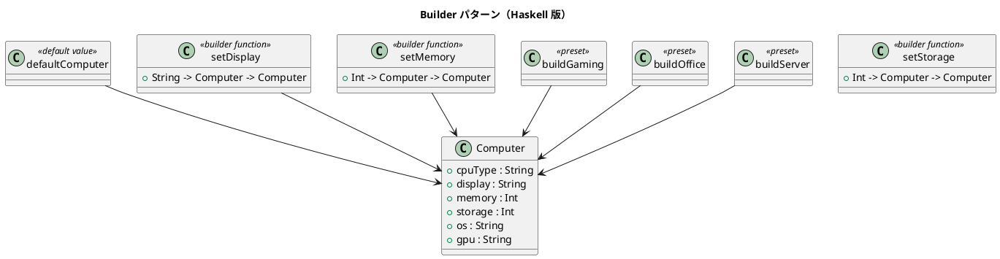

# 第 15 章: Builder

## はじめに

コンピュータの構成をカスタマイズして構築したいとします。CPU、メモリ、ストレージ、OS などの設定を段階的に行い、最終的にコンピュータオブジェクトを生成したい。

**Builder パターン**は、複雑なオブジェクトの構築を段階的に行うパターンです。

---

## パターンの構造



---

## Haskell イディオム: レコード更新構文 + 関数チェーン

Haskell のレコード更新構文がビルダーの役割を果たします。

```haskell
-- デフォルト値
defaultComputer :: Computer
defaultComputer = Computer
  { cpuType = "Intel i5", display = "15.6 inch"
  , memory = 8, storage = 256, os = "Linux", gpu = "Integrated"
  }

-- ビルダー関数
setMemory :: Int -> Computer -> Computer
setMemory m c = c { memory = m }

-- 関数チェーンで構築
custom = setOS "macOS" . setMemory 32 . setDisplay "14 inch" $ defaultComputer
```

---

## TDD で作る

### Red

```haskell
testChainedBuilding :: Test
testChainedBuilding = TestCase $ do
  let custom = setOS "macOS"
             . setMemory 32
             . setDisplay "14 inch Retina"
             $ defaultComputer
  assertEqual "OS" "macOS" (os custom)
  assertEqual "メモリ" 32 (memory custom)
```

### Green

```haskell
data Computer = Computer
  { cpuType :: String
  , display :: String
  , memory  :: Int
  , storage :: Int
  , os      :: String
  , gpu     :: String
  }

defaultComputer :: Computer
defaultComputer = Computer
  { cpuType = "Intel i5"
  , display = "15.6 inch"
  , memory  = 8
  , storage = 256
  , os      = "Linux"
  , gpu     = "Integrated"
  }

setDisplay :: String -> Computer -> Computer
setDisplay value computer = computer { display = value }

setMemory :: Int -> Computer -> Computer
setMemory value computer = computer { memory = value }

setOS :: String -> Computer -> Computer
setOS value computer = computer { os = value }
```

まずはデフォルト構成と更新関数を定義し、レコード更新をチェーンできる状態まで持っていきます。

---

## setStorage: ストレージ設定

`setStorage` はストレージ容量（GB）を設定するビルダー関数です。他の `set*` 関数と同様に `Computer -> Computer` 型で、関数チェーンに組み込めます。

```haskell
setStorage :: Int -> Computer -> Computer
setStorage s c = c { storage = s }
```

```haskell
-- 使用例
let custom = setStorage 1000 . setMemory 32 $ defaultComputer
-- storage custom == 1000
```

---

## プリセットビルダー

よく使う構成をプリセットとして用意します。

### buildGaming: ゲーミング PC

```haskell
buildGaming :: Computer
buildGaming = defaultComputer
  { cpuType = "Intel i9", display = "27 inch 4K"
  , memory = 64, storage = 2000
  , os = "Windows", gpu = "NVIDIA RTX 4090"
  }
```

### buildOffice: オフィス PC

```haskell
buildOffice :: Computer
buildOffice = defaultComputer
  { cpuType = "Intel i3", display = "24 inch"
  , memory = 16, storage = 512
  , os = "Windows", gpu = "Integrated"
  }
```

### buildServer: サーバ

```haskell
buildServer :: Computer
buildServer = defaultComputer
  { cpuType = "AMD EPYC", display = "None"
  , memory = 256, storage = 8000
  , os = "Linux", gpu = "None"
  }
```

## computerSummary: 構成サマリ

`computerSummary` はコンピュータの構成を 1 行の文字列で返します。構築結果の確認やデバッグに便利です。

```haskell
computerSummary :: Computer -> String
computerSummary c =
  cpuType c ++ " / " ++ display c
  ++ " / " ++ show (memory c) ++ "GB RAM"
  ++ " / " ++ show (storage c) ++ "GB SSD"
  ++ " / " ++ os c
  ++ " / GPU: " ++ gpu c
```

```haskell
-- 使用例
computerSummary buildGaming
-- "Intel i9 / 27 inch 4K / 64GB RAM / 2000GB SSD / Windows / GPU: NVIDIA RTX 4090"
```

---

## まとめ

Haskell ではレコード更新構文 `c { field = value }` がビルダーパターンを自然に表現します。関数合成 `(.)` でビルダー関数をチェーンすることで、流暢な API が実現できます。イミュータブルなので、構築途中の状態を安全に共有できます。
