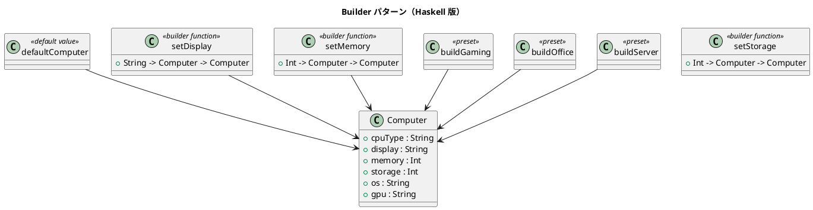

# 第 15 章: Builder

## はじめに

コンピュータの構成をカスタマイズして構築したいとします。CPU、メモリ、ストレージ、OS などの設定を段階的に行い、最終的にコンピュータオブジェクトを生成したい。

**Builder パターン**は、複雑なオブジェクトの構築を段階的に行うパターンです。

---

## パターンの構造



---

## Haskell イディオム: レコード更新構文 + 関数チェーン

Haskell のレコード更新構文がビルダーの役割を果たします。

```haskell
-- デフォルト値
defaultComputer :: Computer
defaultComputer = Computer
  { cpuType = "Intel i5", display = "15.6 inch"
  , memory = 8, storage = 256, os = "Linux", gpu = "Integrated"
  }

-- ビルダー関数
setMemory :: Int -> Computer -> Computer
setMemory m c = c { memory = m }

-- 関数チェーンで構築
custom = setOS "macOS" . setMemory 32 . setDisplay "14 inch" $ defaultComputer
```

---

## TDD で作る

### Red

```haskell
testChainedBuilding :: Test
testChainedBuilding = TestCase $ do
  let custom = setOS "macOS"
             . setMemory 32
             . setDisplay "14 inch Retina"
             $ defaultComputer
  assertEqual "OS" "macOS" (os custom)
  assertEqual "メモリ" 32 (memory custom)
```

### Green

```haskell
data Computer = Computer
  { cpuType :: String
  , display :: String
  , memory  :: Int
  , storage :: Int
  , os      :: String
  , gpu     :: String
  }

defaultComputer :: Computer
defaultComputer = Computer
  { cpuType = "Intel i5"
  , display = "15.6 inch"
  , memory  = 8
  , storage = 256
  , os      = "Linux"
  , gpu     = "Integrated"
  }

setDisplay :: String -> Computer -> Computer
setDisplay value computer = computer { display = value }

setMemory :: Int -> Computer -> Computer
setMemory value computer = computer { memory = value }

setOS :: String -> Computer -> Computer
setOS value computer = computer { os = value }
```

まずはデフォルト構成と更新関数を定義し、レコード更新をチェーンできる状態まで持っていきます。

---

## プリセットビルダー

よく使う構成をプリセットとして用意します。

```haskell
buildGaming :: Computer
buildGaming = defaultComputer
  { cpuType = "Intel i9", memory = 64
  , gpu = "NVIDIA RTX 4090", os = "Windows"
  }
```

---

## まとめ

Haskell ではレコード更新構文 `c { field = value }` がビルダーパターンを自然に表現します。関数合成 `(.)` でビルダー関数をチェーンすることで、流暢な API が実現できます。イミュータブルなので、構築途中の状態を安全に共有できます。
