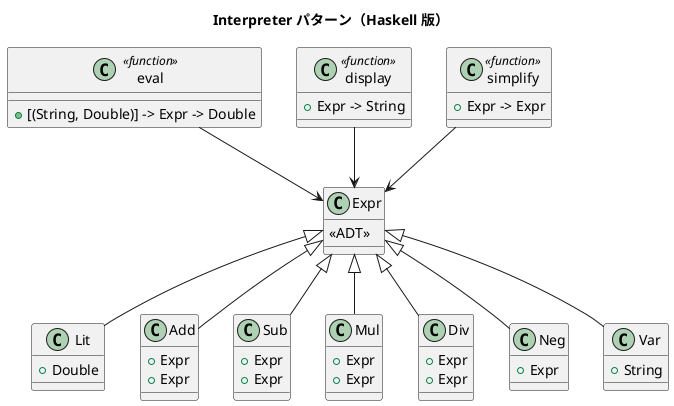

# 第 16 章: Interpreter

## はじめに

算術式やブール式を解析し、評価したいとします。式は変数を含むことができ、環境（変数束縛）に基づいて評価されます。

**Interpreter パターン**は、言語の文法を定義し、その文法に従って文を解釈するパターンです。

---

## パターンの構造



---

## Haskell イディオム: ADT + パターンマッチ

Haskell の ADT とパターンマッチは Interpreter パターンと完璧に合致します。AST を ADT で定義し、パターンマッチで再帰的に評価します。

```haskell
data Expr
  = Lit Double
  | Add Expr Expr
  | Sub Expr Expr
  | Mul Expr Expr
  | Div Expr Expr
  | Neg Expr
  | Var String

eval :: [(String, Double)] -> Expr -> Double
eval _   (Lit n)     = n
eval env (Add a b)   = eval env a + eval env b
eval env (Var name)  = case lookup name env of
                         Just v  -> v
                         Nothing -> 0
```

---

## TDD で作る

### Red

```haskell
testComplex :: Test
testComplex = TestCase $ do
  let expr = Mul (Add (Lit 2.0) (Lit 3.0)) (Lit 4.0)
  assertEqual "複合式" 20.0 (eval [] expr)
```

### Green

```haskell
eval :: [(String, Double)] -> Expr -> Double
eval _   (Lit n)     = n
eval env (Add a b)   = eval env a + eval env b
eval env (Sub a b)   = eval env a - eval env b
eval env (Mul a b)   = eval env a * eval env b
eval env (Div a b)   = eval env a / eval env b
eval env (Neg a)     = negate (eval env a)
eval env (Var name)  = case lookup name env of
  Just v  -> v
  Nothing -> 0

display :: Expr -> String
display (Lit n)     = show n
display (Add a b)   = "(" ++ display a ++ " + " ++ display b ++ ")"
display (Sub a b)   = "(" ++ display a ++ " - " ++ display b ++ ")"
display (Mul a b)   = "(" ++ display a ++ " * " ++ display b ++ ")"
display (Div a b)   = "(" ++ display a ++ " / " ++ display b ++ ")"
display (Neg a)     = "-(" ++ display a ++ ")"
display (Var name)  = name
```

まずは評価と表示をそろえ、AST の各コンストラクタに対する再帰処理を一通り実装します。

### Refactor: 式の単純化

```haskell
simplify :: Expr -> Expr
simplify (Add a (Lit 0)) = simplify a    -- x + 0 = x
simplify (Mul _ (Lit 0)) = Lit 0          -- x * 0 = 0
simplify (Mul (Lit 1) b) = simplify b    -- 1 * x = x
simplify (Neg (Neg a))   = simplify a    -- --x = x
```

---

## ブール式インタプリタ

同じアプローチでブール式も実装できます。

```haskell
data BoolExpr
  = BoolLit Bool
  | And BoolExpr BoolExpr
  | Or  BoolExpr BoolExpr
  | Not BoolExpr

evalBool :: BoolExpr -> Bool
evalBool (BoolLit b) = b
evalBool (And a b)   = evalBool a && evalBool b
```

---

## まとめ

| 観点 | OOP | Haskell |
|------|-----|---------|
| AST 表現 | クラス階層 | ADT |
| 評価 | accept/visit | パターンマッチ |
| 拡張 | 新しいクラス | 新しいコンストラクタ |
| 型安全性 | キャスト | コンパイル時チェック |

Haskell は Interpreter パターンの実装に最も適した言語の一つです。ADT が AST の定義を、パターンマッチが評価ロジックを、型システムが正しさの検証を、それぞれ担当します。これは Haskell のコンパイラ自身も同じ手法で構築されています。
