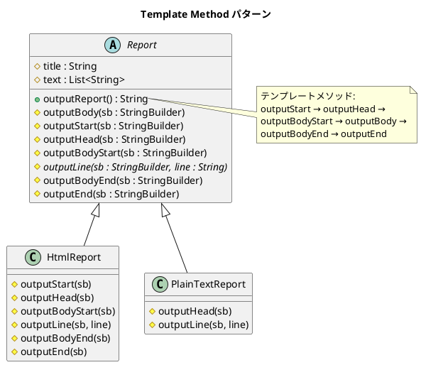

# 第 4 章: Template Method

## はじめに

レポートを HTML とプレーンテキストの 2 つの形式で出力したいとします。出力の「骨格」は同じ（タイトル → 本文 → フッター）ですが、各ステップの具体的な処理は形式ごとに異なります。

**Template Method パターン**は、アルゴリズムの骨格を基底クラスで定義し、具体的なステップをサブクラスに委ねるパターンです。Java では `abstract` クラスと `abstract` メソッドにより、言語レベルでこのパターンを自然に表現できます。

---

## パターンの構造



**登場人物**:

- **AbstractClass（Report）**: テンプレートメソッド `outputReport()` でアルゴリズムの骨格を定義する
- **ConcreteClass（HtmlReport / PlainTextReport）**: 各ステップ（フックメソッド）をオーバーライドする

---

## TDD で作る

### Red: テストを書く

まず、HTML レポートとプレーンテキストレポートの期待出力をテストで定義します。

```java
class TemplateMethodTest {

    @Test
    void htmlReportOutputsValidHtml() {
        Report report = new HtmlReport();
        String output = report.outputReport();

        assertTrue(output.startsWith("<html>"));
        assertTrue(output.endsWith("</html>\n"));
        assertTrue(output.contains("<title>月次報告</title>"));
        assertTrue(output.contains("<p>順調</p>"));
        assertTrue(output.contains("<p>最高の調子</p>"));
    }

    @Test
    void plainTextReportOutputsFormattedText() {
        Report report = new PlainTextReport();
        String output = report.outputReport();

        assertTrue(output.startsWith("**** 月次報告 ****"));
        assertTrue(output.contains("順調"));
        assertTrue(output.contains("最高の調子"));
        assertFalse(output.contains("<html>"));
    }
}
```

### Green: 実装する

**基底クラス Report** --- テンプレートメソッドを定義します。

```java
public abstract class Report {

    protected final String title = "月次報告";
    protected final List<String> text = List.of("順調", "最高の調子");

    /** テンプレートメソッド: レポート出力の骨格 */
    public String outputReport() {
        StringBuilder sb = new StringBuilder();
        outputStart(sb);
        outputHead(sb);
        outputBodyStart(sb);
        outputBody(sb);
        outputBodyEnd(sb);
        outputEnd(sb);
        return sb.toString();
    }

    protected void outputBody(StringBuilder sb) {
        for (String line : text) {
            outputLine(sb, line);
        }
    }

    // フックメソッド（デフォルトは何もしない）
    protected void outputStart(StringBuilder sb) {}
    protected void outputHead(StringBuilder sb) { outputLine(sb, title); }
    protected void outputBodyStart(StringBuilder sb) {}

    /** 抽象メソッド: サブクラスでオーバーライド必須 */
    protected abstract void outputLine(StringBuilder sb, String line);

    protected void outputBodyEnd(StringBuilder sb) {}
    protected void outputEnd(StringBuilder sb) {}
}
```

**サブクラス HtmlReport** --- HTML 固有の出力を実装します。

```java
public class HtmlReport extends Report {

    @Override
    protected void outputStart(StringBuilder sb) { sb.append("<html>\n"); }

    @Override
    protected void outputHead(StringBuilder sb) {
        sb.append(" <head>\n");
        sb.append(" <title>").append(title).append("</title>\n");
        sb.append(" </head>\n");
    }

    @Override
    protected void outputBodyStart(StringBuilder sb) { sb.append("<body>\n"); }

    @Override
    protected void outputLine(StringBuilder sb, String line) {
        sb.append(" <p>").append(line).append("</p>\n");
    }

    @Override
    protected void outputBodyEnd(StringBuilder sb) { sb.append("</body>\n"); }

    @Override
    protected void outputEnd(StringBuilder sb) { sb.append("</html>\n"); }
}
```

**サブクラス PlainTextReport** --- 必要なメソッドだけオーバーライドします。

```java
public class PlainTextReport extends Report {

    @Override
    protected void outputHead(StringBuilder sb) {
        sb.append("**** ").append(title).append(" ****\n");
        sb.append("\n");
    }

    @Override
    protected void outputLine(StringBuilder sb, String line) {
        sb.append(line).append("\n");
    }
}
```

### Refactor: 振り返り

- `abstract` キーワードにより、`outputLine` の実装を忘れるとコンパイルエラーになります。Ruby の `raise NotImplementedError` とは異なり、実行前にミスを検出できます。
- `PlainTextReport` は `outputStart` や `outputEnd` をオーバーライドしていません。基底クラスの空メソッド（フックメソッド）がデフォルト動作を提供するため、必要な部分だけ上書きすればよいのです。
- `StringBuilder` を使って出力を文字列として返す設計により、テストが容易になっています。

---

## Ruby との比較

| 観点 | Java | Ruby |
|------|------|------|
| **抽象メソッド** | `abstract` キーワードでコンパイル時に強制 | `raise NotImplementedError` で実行時に検出 |
| **アクセス修飾子** | `protected` でフックメソッドの可視性を制御 | すべて `public`（慣習で管理） |
| **型安全性** | `StringBuilder` の型が明示的 | 動的型付けで `puts` に直接出力 |
| **テスト手法** | 戻り値の `String` を検証 | `assert_output` で標準出力をキャプチャ |

Java では `abstract class` + `abstract method` の組み合わせにより、Template Method パターンが言語の型システムに組み込まれた形で実現されます。

---

## まとめ

| 観点 | 内容 |
|------|------|
| **意図** | アルゴリズムの骨格を定義し、一部のステップをサブクラスに委ねる |
| **適用場面** | 複数のバリエーションが同じ手順の骨格を共有する場合 |
| **メリット** | コードの重複を排除し、拡張ポイントを明確にする |
| **Java の強み** | `abstract` メソッドによるコンパイル時の安全性保証 |
| **注意点** | サブクラスが増えると継承階層が深くなる → 次章の Strategy パターンで解決 |
| **関連パターン** | Strategy（委譲で差し替え）、Factory Method（生成ステップの Template Method） |
