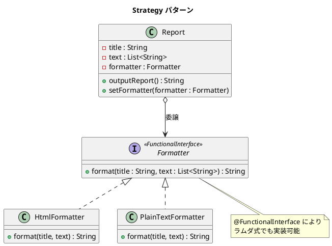

# 第 5 章: Strategy

## はじめに

前章の Template Method パターンでは、継承を使ってアルゴリズムのバリエーションを実現しました。しかし、継承には「静的」という制約があります --- 実行時にフォーマットを切り替えることができません。

**Strategy パターン**は、アルゴリズムをオブジェクトとしてカプセル化し、委譲によって実行時に差し替え可能にするパターンです。Java では `@FunctionalInterface` とラムダ式を使って、軽量に実現できます。

---

## パターンの構造



**登場人物**:

- **Context（Report）**: Strategy を保持し、処理を委譲する
- **Strategy（Formatter）**: アルゴリズムのインターフェースを定義する
- **ConcreteStrategy（HtmlFormatter / PlainTextFormatter）**: 具体的なアルゴリズムを実装する

---

## TDD で作る

### Red: テストを書く

```java
class StrategyTest {

    @Test
    void htmlFormatterOutputsHtml() {
        Formatter formatter = new HtmlFormatter();
        Report report = new Report(formatter);
        String output = report.outputReport();

        assertTrue(output.contains("<html>"));
        assertTrue(output.contains("<title>月次報告</title>"));
        assertTrue(output.contains("</html>"));
    }

    @Test
    void canSwapFormatterAtRuntime() {
        Report report = new Report(new HtmlFormatter());
        assertTrue(report.outputReport().contains("<html>"));

        report.setFormatter(new PlainTextFormatter());
        assertFalse(report.outputReport().contains("<html>"));
    }

    @Test
    void supportsLambdaAsFormatter() {
        Formatter lambdaFormatter = (title, text) -> {
            StringBuilder sb = new StringBuilder();
            sb.append("== ").append(title).append(" ==\n");
            for (String line : text) {
                sb.append("- ").append(line).append("\n");
            }
            return sb.toString();
        };

        Report report = new Report(lambdaFormatter);
        String output = report.outputReport();

        assertTrue(output.contains("== 月次報告 =="));
        assertTrue(output.contains("- 順調"));
    }
}
```

### Green: 実装する

**Strategy インターフェース** --- `@FunctionalInterface` でラムダ対応にします。

```java
@FunctionalInterface
public interface Formatter {
    String format(String title, List<String> text);
}
```

**Context クラス** --- Strategy を受け取り、処理を委譲します。

```java
public class Report {

    private final String title = "月次報告";
    private final List<String> text = List.of("順調", "最高の調子");
    private Formatter formatter;

    public Report(Formatter formatter) {
        this.formatter = formatter;
    }

    public String outputReport() {
        return formatter.format(title, text);
    }

    public void setFormatter(Formatter formatter) {
        this.formatter = formatter;
    }
}
```

**ConcreteStrategy** --- 具体的なフォーマッタを実装します。

```java
public class HtmlFormatter implements Formatter {

    @Override
    public String format(String title, List<String> text) {
        StringBuilder sb = new StringBuilder();
        sb.append("<html>\n");
        sb.append(" <head>\n");
        sb.append(" <title>").append(title).append("</title>\n");
        sb.append(" </head>\n");
        sb.append("<body>\n");
        for (String line : text) {
            sb.append(" <p>").append(line).append("</p>\n");
        }
        sb.append("</body>\n");
        sb.append("</html>\n");
        return sb.toString();
    }
}
```

### Refactor: Template Method との比較

| 観点 | Template Method | Strategy |
|------|----------------|----------|
| 差し替えのタイミング | コンパイル時（クラス定義時） | 実行時 |
| 実現手段 | 継承 | 委譲（インターフェース / ラムダ） |
| 新バリエーション追加 | 新しいサブクラスを作成 | 新しい Formatter を渡すだけ |
| Java らしさ | `abstract class` | `@FunctionalInterface` + ラムダ |

---

## Ruby との比較

| 観点 | Java | Ruby |
|------|------|------|
| **Strategy の表現** | `@FunctionalInterface` + ラムダ式 | ブロック / Proc / Lambda |
| **型安全性** | インターフェースで引数・戻り値の型を保証 | 動的型付け（ダックタイピング） |
| **クラスベースの Strategy** | `implements Formatter` で明示的 | 不要（`call` メソッドがあれば OK） |
| **実行時差し替え** | `setFormatter()` メソッドで明示的 | `formatter=` 属性で直接代入 |

Java のラムダ式は Ruby のブロックほど軽量ではありませんが、`@FunctionalInterface` により型安全にアルゴリズムを差し替えられます。

---

## まとめ

| 観点 | 内容 |
|------|------|
| **意図** | アルゴリズムをオブジェクトとしてカプセル化し、実行時に差し替え可能にする |
| **適用場面** | アルゴリズムのバリエーションが多く、実行時に切り替えたい場合 |
| **メリット** | 継承なしに新しいアルゴリズムを追加できる。OCP を自然に満たす |
| **Java の強み** | `@FunctionalInterface` + ラムダで型安全かつ軽量に実現 |
| **関連パターン** | Template Method（継承版）、Command（操作のオブジェクト化） |
