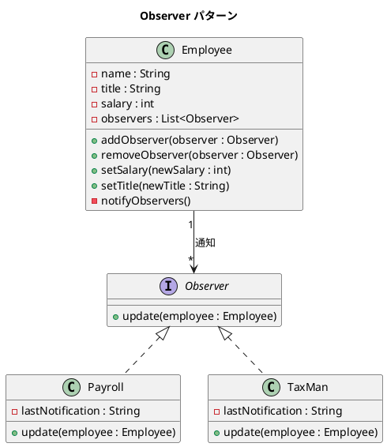

# 第 6 章: Observer

## はじめに

従業員の給与が変更されたとき、給与計算システムと税務システムの両方に通知したいとします。しかし、`Employee` クラスがこれらのシステムを直接呼び出すと、強い結合が生まれます。

**Observer パターン**は、オブジェクトの状態変化を、登録された複数のオブザーバーに自動通知するパターンです。Java では独自の `Observer` インターフェースを定義し、型安全な通知の仕組みを構築します。

---

## パターンの構造



**登場人物**:

- **Subject（Employee）**: オブザーバーのリストを管理し、状態変化時に通知する
- **Observer（Observer）**: 通知を受け取るインターフェース
- **ConcreteObserver（Payroll / TaxMan）**: 通知に応じた具体的な処理を行う

---

## TDD で作る

### Red: テストを書く

```java
class ObserverTest {

    @Test
    void payrollIsNotifiedOnSalaryChange() {
        Employee employee = new Employee("田中太郎", "エンジニア", 300000);
        Payroll payroll = new Payroll();
        employee.addObserver(payroll);

        employee.setSalary(350000);

        assertEquals("田中太郎 の給与が 350000 に変更されました",
                     payroll.getLastNotification());
    }

    @Test
    void removedObserverIsNotNotified() {
        Employee employee = new Employee("田中太郎", "エンジニア", 300000);
        Payroll payroll = new Payroll();
        employee.addObserver(payroll);
        employee.removeObserver(payroll);

        employee.setSalary(350000);

        assertNull(payroll.getLastNotification());
    }
}
```

### Green: 実装する

**Observer インターフェース** --- 型パラメータとして `Employee` を直接指定します。

```java
public interface Observer {
    void update(Employee employee);
}
```

**Subject（Employee）** --- オブザーバーのリストを管理します。

```java
public class Employee {

    private final String name;
    private String title;
    private int salary;
    private final List<Observer> observers = new ArrayList<>();

    public Employee(String name, String title, int salary) {
        this.name = name;
        this.title = title;
        this.salary = salary;
    }

    public void addObserver(Observer observer) { observers.add(observer); }
    public void removeObserver(Observer observer) { observers.remove(observer); }

    public void setSalary(int newSalary) {
        this.salary = newSalary;
        notifyObservers();
    }

    private void notifyObservers() {
        for (Observer observer : observers) {
            observer.update(this);
        }
    }

    // getter 省略
}
```

**ConcreteObserver** --- 通知を受けて具体的な処理を行います。

```java
public class Payroll implements Observer {

    private String lastNotification;

    @Override
    public void update(Employee employee) {
        lastNotification = employee.getName() + " の給与が "
                         + employee.getSalary() + " に変更されました";
    }

    public String getLastNotification() { return lastNotification; }
}
```

### Refactor: 振り返り

- Java の旧来の `java.util.Observable` / `java.util.Observer` は Java 9 で非推奨になりました。独自インターフェースを定義する方が型安全で柔軟です。
- `Observer` インターフェースにジェネリクスを導入すれば（`Observer<T>`）、さらに汎用的な通知の仕組みを構築できます。

---

## Ruby との比較

| 観点 | Java | Ruby |
|------|------|------|
| **Observer の実現** | 独自インターフェースを定義 | `Observable` モジュールを `include` |
| **通知の型安全性** | `update(Employee)` で型を保証 | `update` の引数は動的 |
| **登録/解除** | `addObserver` / `removeObserver` | `add_observer` / `delete_observer` |
| **通知トリガー** | setter 内で `notifyObservers()` を呼ぶ | `changed` + `notify_observers` |

Ruby では `Observable` モジュールを mixin するだけで Subject 機能を得られますが、Java では明示的にリスト管理と通知メソッドを実装します。その分、通知の仕組みを完全にコントロールできます。

---

## まとめ

| 観点 | 内容 |
|------|------|
| **意図** | オブジェクトの状態変化を、登録されたオブザーバーに自動通知する |
| **適用場面** | 1 つのオブジェクトの変化が複数のオブジェクトに影響する場合 |
| **メリット** | Subject と Observer の結合度を低く保てる |
| **Java の強み** | 独自インターフェースにより型安全な通知を実現 |
| **関連パターン** | Mediator（多対多の通知）、Event Bus（非同期通知） |
