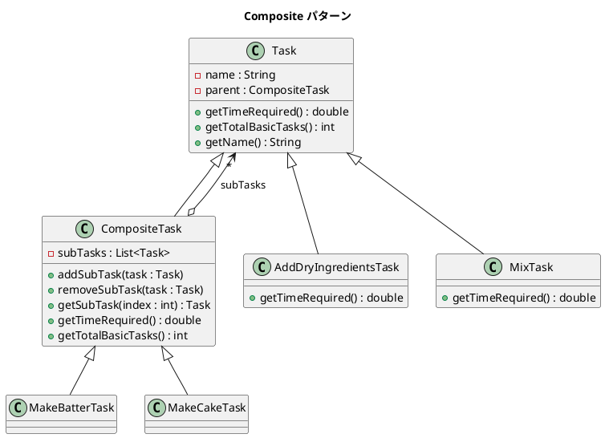

# 第 7 章: Composite

## はじめに

ケーキを作る工程を考えてみましょう。「生地を作る」という工程は、「乾燥材料を加える」「液体材料を加える」「混ぜる」というサブタスクで構成されています。個々のタスクも複合タスクも「所要時間を取得する」という同じ操作を持ちま���。

**Composite パターン**は、個々のオブジェクトとオブジェクトの集合を同一のインターフェースで扱えるようにするパターンです。Java ではジェネリクスと Stream API を活用して、型安全に木構造を操作できます。

---

## パターンの構造



**登場人物**:

- **Component（Task）**: 共通インターフェースを定義する基底クラス
- **Leaf（AddDryIngredientsTask / MixTask 等）**: 末端のタスク
- **Composite（CompositeTask）**: 子タスクを管理し、操作を再帰的に委譲する

---

## TDD で作る

### Red: テストを書く

```java
class CompositeTest {

    @Test
    void leafTaskReturnsItsTimeRequired() {
        Task addDry = new AddDryIngredientsTask();
        assertEquals(1.0, addDry.getTimeRequired());
    }

    @Test
    void makeBatterTaskSumsSubTaskTimes() {
        CompositeTask makeBatter = new MakeBatterTask();
        // AddDryIngredients(1.0) + AddLiquids(1.0) + Mix(3.0) = 5.0
        assertEquals(5.0, makeBatter.getTimeRequired());
    }

    @Test
    void makeCakeTaskSumsAllSubTaskTimes() {
        CompositeTask makeCake = new MakeCakeTask();
        // MakeBatter(5.0) + FillPan(2.0) + Bake(10.0) + Frost(4.0) + LickSpoon(1.0)
        assertEquals(22.0, makeCake.getTimeRequired());
    }

    @Test
    void makeCakeTaskCountsAllBasicTasks() {
        CompositeTask makeCake = new MakeCakeTask();
        assertEquals(7, makeCake.getTotalBasicTasks());
    }
}
```

### Green: 実装する

**Component（Task）** --- 共通の基底クラスです。

```java
public class Task {

    private final String name;
    private CompositeTask parent;

    public Task(String name) { this.name = name; }

    public double getTimeRequired() { return 0.0; }
    public int getTotalBasicTasks() { return 1; }

    public String getName() { return name; }
    public CompositeTask getParent() { return parent; }
    public void setParent(CompositeTask parent) { this.parent = parent; }
}
```

**Composite（CompositeTask）** --- Stream API で子タスクを集約します。

```java
public class CompositeTask extends Task {

    private final List<Task> subTasks = new ArrayList<>();

    public CompositeTask(String name) { super(name); }

    public void addSubTask(Task task) {
        subTasks.add(task);
        task.setParent(this);
    }

    public void removeSubTask(Task task) {
        subTasks.remove(task);
        task.setParent(null);
    }

    @Override
    public double getTimeRequired() {
        return subTasks.stream()
                .mapToDouble(Task::getTimeRequired)
                .sum();
    }

    @Override
    public int getTotalBasicTasks() {
        return subTasks.stream()
                .mapToInt(Task::getTotalBasicTasks)
                .sum();
    }
}
```

**具体的な複合タスク** --- コンストラクタでサブタスクを組み立てます。

```java
public class MakeCakeTask extends CompositeTask {
    public MakeCakeTask() {
        super("ケーキを作る");
        addSubTask(new MakeBatterTask());
        addSubTask(new FillPanTask());
        addSubTask(new BakeTask());
        addSubTask(new FrostTask());
        addSubTask(new LickSpoonTask());
    }
}
```

### Refactor: 振り返り

- `Stream.mapToDouble().sum()` により、再帰的な集約処理が宣言的に書けます。
- `parent` フィールドにより、木構造を双方向に辿ることができます。

---

## Ruby との比較

| 観点 | Java | Ruby |
|------|------|------|
| **型安全性** | `List<Task>` でコレクションの型を保証 | ダックタイピング（配列に何でも入る） |
| **集約処理** | `Stream.mapToDouble().sum()` | `inject(:+)` / `sum` |
| **親子関係** | `setParent()` で明示的に管理 | 同様だが型制約なし |
| **メソッド参照** | `Task::getTimeRequired` | シンボル `:time_required` |

Java ではジェネリクスにより `List<Task>` の型安全性が保証され、誤った型のオブジェクトを追加するとコンパイルエラーになります。

---

## まとめ

| 観点 | 内容 |
|------|------|
| **意図** | 個々のオブジェクトとその集合を同一のインターフェースで扱う |
| **適用場面** | 木構造を持つデータ（ファイルシステム、組織図、タスク階層） |
| **メリット** | クライアントは Leaf と Composite を区別せずに操作できる |
| **Java の強み** | ジェネリクスによる型安全性、Stream API による宣言的な集約 |
| **関連パターン** | Iterator（木構造の走査）、Visitor（操作の外部化） |
