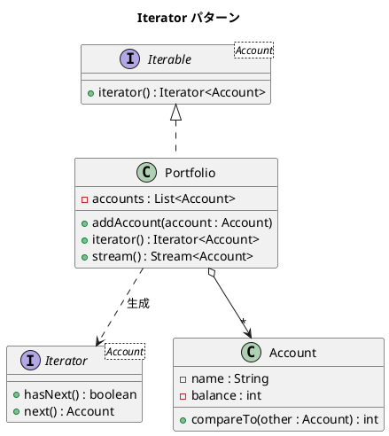

# 第 8 章: Iterator

## はじめに

ポートフォリオ（口座の集合）に含まれる各口座を順番に処理したいとします。内部のデータ構造（`ArrayList` なのか `LinkedList` なのか）を意識せずに、統一的な方法で要素を走査できると便利です。

**Iterator パターン**は、コレクションの内部構造を公開せずに、要素を順番にアクセスする方法を提供するパターンです。Java では `Iterable<T>` / `Iterator<T>` インターフェースが言語に組み込まれており、拡張 for ループや Stream API とシームレスに連携します。

---

## パターンの構造



**登場人物**:

- **Aggregate（Portfolio）**: `Iterable<Account>` を実装し、`Iterator` を返す
- **Iterator**: コレクションの走査を担う（Java 標準の `Iterator<T>`）
- **Element（Account）**: コレクション内の個々の要素

---

## TDD で作る

### Red: テストを書く

```java
class IteratorTest {

    @Test
    void portfolioIsIterable() {
        Portfolio portfolio = new Portfolio();
        portfolio.addAccount(new Account("普通預金", 1000));
        portfolio.addAccount(new Account("定期預金", 5000));

        List<String> names = new ArrayList<>();
        for (Account account : portfolio) {
            names.add(account.getName());
        }

        assertEquals(2, names.size());
        assertEquals("普通預金", names.get(0));
    }

    @Test
    void portfolioSupportsStreamOperations() {
        Portfolio portfolio = new Portfolio();
        portfolio.addAccount(new Account("普通預金", 1000));
        portfolio.addAccount(new Account("定期預金", 5000));
        portfolio.addAccount(new Account("投資信託", 3000));

        int totalBalance = portfolio.stream()
                .mapToInt(Account::getBalance)
                .sum();

        assertEquals(9000, totalBalance);
    }

    @Test
    void accountsAreComparableByBalance() {
        Account low = new Account("普通預金", 1000);
        Account high = new Account("定期預金", 5000);

        assertTrue(low.compareTo(high) < 0);
    }
}
```

### Green: 実装する

**Element（Account）** --- `Comparable<Account>` を実装し、ソート可能にします。

```java
public class Account implements Comparable<Account> {

    private final String name;
    private final int balance;

    public Account(String name, int balance) {
        this.name = name;
        this.balance = balance;
    }

    @Override
    public int compareTo(Account other) {
        return Integer.compare(this.balance, other.balance);
    }

    // getter 省略
}
```

**Aggregate（Portfolio）** --- `Iterable<Account>` を実装します。

```java
public class Portfolio implements Iterable<Account> {

    private final List<Account> accounts = new ArrayList<>();

    public void addAccount(Account account) {
        accounts.add(account);
    }

    @Override
    public Iterator<Account> iterator() {
        return accounts.iterator();
    }

    public Stream<Account> stream() {
        return StreamSupport.stream(spliterator(), false);
    }
}
```

### Refactor: 振り返り

- `Iterable<Account>` を実装するだけで、拡張 for ループ（`for (Account a : portfolio)`）が使えるようになります。
- `stream()` メソッドを追加することで、`filter`、`map`、`reduce` などの Stream API 操作も利用可能です。
- `Comparable<Account>` を実装した `Account` は、`Collections.sort()` でそのままソートできます。

---

## Ruby との比較

| 観点 | Java | Ruby |
|------|------|------|
| **イテレーション機構** | `Iterable<T>` / `Iterator<T>` インターフェース | `Enumerable` モジュールを `include` |
| **拡張 for** | `for (Account a : portfolio)` | `portfolio.each { \|a\| ... }` |
| **ソート** | `Comparable<T>` + `Collections.sort()` | `<=>` 演算子 + `sort` |
| **関数的操作** | Stream API（`filter`, `map`, `reduce`） | `select`, `map`, `inject` |
| **遅延評価** | `Stream` はデフォルトで遅延評価 | `Enumerator::Lazy` で明示的に指定 |

Java の `Iterable` + Stream API は、Ruby の `Enumerable` に相当する豊富な操作を型安全に提供します。

---

## まとめ

| 観点 | 内容 |
|------|------|
| **意図** | コレクションの内部構造を公開せずに要素を順番にアクセスする |
| **適用場面** | カスタムコレクションを標準的な方法で走査したい場合 |
| **メリット** | 内部構造に依存しない統一的な走査インターフェース |
| **Java の強み** | `Iterable<T>` で拡張 for ループ対応、Stream API で関数的操作 |
| **関連パターン** | Composite（木構造の走査）、Visitor（走査中の操作の外部化） |
