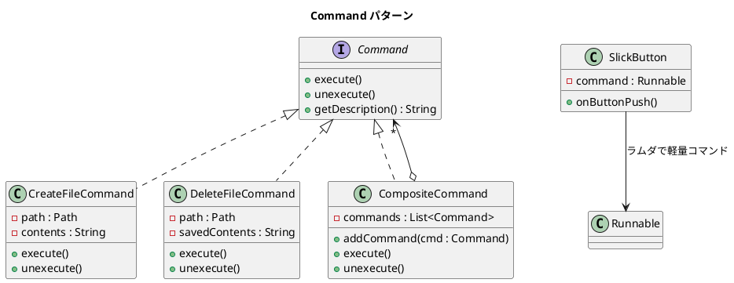

# 第 9 章: Command

## はじめに

ファイルの作成・削除といった操作を、実行（execute）と取り消し（unexecute）のペアとして管理したいとします。操作をオブジェクトとしてカプセル化すれば、実行履歴の管理や一括実行が可能になります。

**Command パターン**は、操作をオブジェクトとしてカプセル化し、実行・取り消し・記録を統一的に扱うパターンです。Java では `Command` インターフェースに加え、`Runnable` やラムダ式で軽量なコマンドも実現できます。

---

## パターンの構造



**登場人物**:

- **Command（Command）**: 操作のインターフェース
- **ConcreteCommand（CreateFileCommand / DeleteFileCommand）**: 具体的な操作
- **MacroCommand（CompositeCommand）**: 複数コマンドを一括実行
- **Invoker（SlickButton）**: コマンドの実行をトリガーする

---

## TDD で作る

### Red: テストを書く

```java
class CommandTest {

    @TempDir
    Path tempDir;

    @Test
    void createFileCommandCreatesFile() throws IOException {
        Path file = tempDir.resolve("test.txt");
        Command cmd = new CreateFileCommand(file, "hello");

        cmd.execute();

        assertTrue(Files.exists(file));
        assertEquals("hello", Files.readString(file));
    }

    @Test
    void createFileCommandUnexecuteDeletesFile() {
        Path file = tempDir.resolve("test.txt");
        Command cmd = new CreateFileCommand(file, "hello");

        cmd.execute();
        cmd.unexecute();

        assertFalse(Files.exists(file));
    }

    @Test
    void slickButtonExecutesLambdaCommand() {
        AtomicReference<String> result = new AtomicReference<>("");
        SlickButton button = new SlickButton(() -> result.set("clicked"));

        button.onButtonPush();

        assertEquals("clicked", result.get());
    }
}
```

### Green: 実装する

**Command インターフェース** --- 実行と取り消しを統一的に扱います。

```java
public interface Command {
    void execute();
    void unexecute();
    String getDescription();
}
```

**ConcreteCommand** --- ファイル操作をカプセル化します。

```java
public class CreateFileCommand implements Command {
    private final Path path;
    private final String contents;

    public CreateFileCommand(Path path, String contents) {
        this.path = path;
        this.contents = contents;
    }

    @Override
    public void execute() {
        try { Files.writeString(path, contents); }
        catch (IOException e) { throw new UncheckedIOException(e); }
    }

    @Override
    public void unexecute() {
        try { Files.deleteIfExists(path); }
        catch (IOException e) { throw new UncheckedIOException(e); }
    }

    @Override
    public String getDescription() { return "Create file: " + path; }
}
```

**ラムダベースの軽量コマンド** --- `Runnable` を活用します。

```java
public class SlickButton {
    private final Runnable command;

    public SlickButton(Runnable command) {
        this.command = command;
    }

    public void onButtonPush() {
        if (command != null) { command.run(); }
    }
}
```

### Refactor: 振り返り

- `CompositeCommand` は Composite パターンとの組み合わせです。複数のコマンドをまとめて実行・取り消しできます。
- `unexecute()` では逆順に取り消すことで、操作の整合性を保っています。
- `SlickButton` は `Runnable` を受け取ることで、undo 不要な軽量コマンドをラムダで表現できます。

---

## Ruby との比較

| 観点 | Java | Ruby |
|------|------|------|
| **コマンドの表現** | `Command` インターフェース + クラス | クラス、または Proc / ブロック |
| **軽量コマンド** | `Runnable` + ラムダ式 | ブロック（`{ \|...\| ... }`） |
| **undo の実現** | `unexecute()` メソッドを明示的に定義 | 同様に `unexecute` メソッド |
| **IO 操作** | `java.nio.file.Files` API | `File.write` / `File.delete` |
| **例外処理** | チェック例外を `UncheckedIOException` でラップ | 例外の種類を意識しない |

Java の Command パターンでは、チェック例外の取り扱いがポイントです。`IOException` を `UncheckedIOException` でラップすることで、`Command` インターフェースをクリーンに保っています。

---

## まとめ

| 観点 | 内容 |
|------|------|
| **意図** | 操作をオブジェクトとしてカプセル化し、実行・取り消し・記録を統一的に扱う |
| **適用場面** | undo/redo、マクロ記録、ジョブキュー |
| **メリット** | 操作の発行者と実行者を分離。履歴管理や一括実行が容易 |
| **Java の強み** | `Runnable` / ラムダで軽量コマンド、`Command` インターフェースで本格的な undo |
| **関連パターン** | Composite（マクロコマンド）、Memento（状態の保存と復元） |
