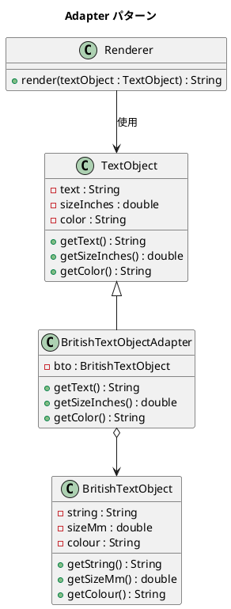

# 第 10 章: Adapter

## はじめに

レンダラーは `TextObject`（テキスト、サイズはインチ、色は color）を受け取りますが、手元にあるのは `BritishTextObject`（string、サイズは mm、colour）です。インターフェースが合いません。

**Adapter パターン**は、既存クラスのインターフェースを、クライアントが期待するインターフェースに変換するパターンです。Java ではクラス継承によるアダプターを明示的に定義し、型安全にインターフェースを変換します。

---

## パターンの構造



**登場人物**:

- **Target（TextObject）**: クライアントが期待するインターフェース
- **Adaptee（BritishTextObject）**: 既存の互換性のないクラス
- **Adapter（BritishTextObjectAdapter）**: Adaptee を Target に変換する
- **Client（Renderer）**: Target インターフェースを通じてオブジェクトを使用する

---

## TDD で作る

### Red: テストを書く

```java
class AdapterTest {

    @Test
    void adapterConvertsBritishTextObjectToTextObject() {
        BritishTextObject bto = new BritishTextObject("Cheerio", 25.4, "grey");
        TextObject adapted = new BritishTextObjectAdapter(bto);

        assertEquals("Cheerio", adapted.getText());
        assertEquals(1.0, adapted.getSizeInches(), 0.001);
        assertEquals("grey", adapted.getColor());
    }

    @Test
    void rendererWorksWithAdaptedObject() {
        BritishTextObject bto = new BritishTextObject("Hello", 50.8, "blue");
        TextObject adapted = new BritishTextObjectAdapter(bto);
        Renderer renderer = new Renderer();

        String output = renderer.render(adapted);

        assertEquals("text:Hello size:2.0 color:blue", output);
    }
}
```

### Green: 実装する

**Target（TextObject）** --- クライアントが期待するインターフェースです。

```java
public class TextObject {
    private final String text;
    private final double sizeInches;
    private final String color;

    public TextObject(String text, double sizeInches, String color) {
        this.text = text;
        this.sizeInches = sizeInches;
        this.color = color;
    }

    public String getText() { return text; }
    public double getSizeInches() { return sizeInches; }
    public String getColor() { return color; }
}
```

**Adapter** --- Adaptee を内部に保持し、メソッドを変換します。

```java
public class BritishTextObjectAdapter extends TextObject {
    private static final double MM_PER_INCH = 25.4;
    private final BritishTextObject bto;

    public BritishTextObjectAdapter(BritishTextObject bto) {
        super(null, 0, null);
        this.bto = bto;
    }

    @Override
    public String getText() { return bto.getString(); }

    @Override
    public double getSizeInches() { return bto.getSizeMm() / MM_PER_INCH; }

    @Override
    public String getColor() { return bto.getColour(); }
}
```

### Refactor: 振り返り

- `super(null, 0, null)` は基底クラスのコンストラクタを満たすためのものです。Target がインターフェースであればこの問題は回避できます。
- mm からインチへの変換ロジックがアダプターに閉じ込められ、クライアント（Renderer）は変換を意識しません。

---

## Ruby との比較

| 観点 | Java | Ruby |
|------|------|------|
| **アダプターの実現** | クラス継承でメソッドをオーバーライド | 特異メソッドでオブジェクト単位に適合 |
| **インターフェース変換** | 明示的なアダプタークラスが必要 | `define_method` で動的にメソッド追加 |
| **型の互換性** | コンパイル時に `TextObject` 型として扱える | ダックタイピングで型変換不要 |
| **単位変換** | アダプタークラス内に隠蔽 | 同様にアダプター内に隠蔽 |

Ruby ではダックタイピングにより、同じメソッド名さえ持っていればアダプターなしで動作する場合もあります。Java では型システムが厳密なため、明示的なアダプタークラスが必要です。

---

## まとめ

| 観点 | 内容 |
|------|------|
| **意図** | 既存クラスのインターフェースを、クライアントが期待する形に変換する |
| **適用場面** | 既存ライブラリやレガシーコードを新しいシステムに統合する場合 |
| **メリット** | 既存コードを修正せずにインターフェースの不一致を解消できる |
| **Java の強み** | 型安全なアダプタークラスにより、コンパイル時に互換性を保証 |
| **関連パターン** | Decorator（機能追加）、Proxy（アクセス制御） |
