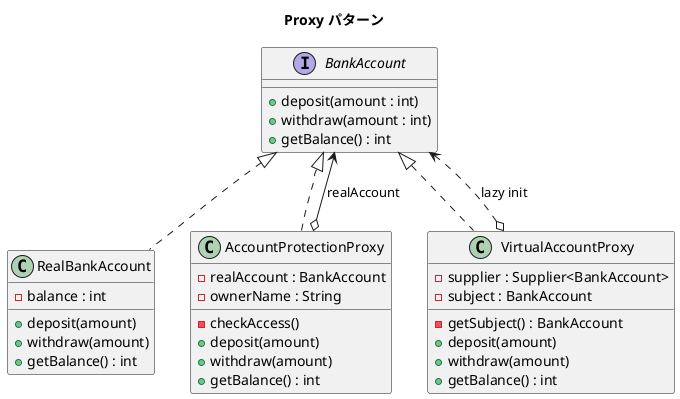

# 第 11 章: Proxy

## はじめに

銀行口座へのアクセスを制御したいとします。口座の所有者以外からのアクセスを防ぐ「保護プロキシ」と、重いオブジェクトの生成を遅延させる「仮想プロキシ」を実現したいとします。

**Proxy パターン**は、あるオブジェクトへのアクセスを制御する代理オブジェクトを提供するパターンです。Java では共通インターフェースを通じて、保護プロキシと仮想プロキシ（`Supplier<T>` による遅延初期化）を型安全に実現できます。

---

## パターンの構造



**登場人物**:

- **Subject（BankAccount）**: 共通インターフェース
- **RealSubject（RealBankAccount）**: 実際の処理を行うオブジェクト
- **Proxy（AccountProtectionProxy）**: アクセスを制御する保護プロキシ
- **Proxy（VirtualAccountProxy）**: 遅延初期化を行う仮想プロキシ

---

## TDD で作る

### Red: テストを書く

```java
class ProxyTest {

    @Test
    void protectionProxyAllowsOwnerAccess() {
        BankAccount real = new RealBankAccount(100);
        String currentUser = System.getProperty("user.name");
        BankAccount proxy = new AccountProtectionProxy(real, currentUser);

        proxy.deposit(50);
        assertEquals(150, proxy.getBalance());
    }

    @Test
    void protectionProxyDeniesNonOwnerAccess() {
        BankAccount real = new RealBankAccount(100);
        BankAccount proxy = new AccountProtectionProxy(real, "not_the_owner");

        assertThrows(IllegalAccessError.class, () -> proxy.deposit(50));
    }

    @Test
    void virtualProxyDefersCreationUntilFirstUse() {
        AtomicBoolean created = new AtomicBoolean(false);
        Supplier<BankAccount> supplier = () -> {
            created.set(true);
            return new RealBankAccount(100);
        };

        VirtualAccountProxy proxy = new VirtualAccountProxy(supplier);
        assertFalse(created.get()); // まだ生成されていない

        proxy.deposit(50);
        assertTrue(created.get()); // 初回アクセスで生成
        assertEquals(150, proxy.getBalance());
    }
}
```

### Green: 実装する

**保護プロキシ** --- 所有者のみアクセスを許可します。

```java
public class AccountProtectionProxy implements BankAccount {
    private final BankAccount realAccount;
    private final String ownerName;

    public AccountProtectionProxy(BankAccount realAccount, String ownerName) {
        this.realAccount = realAccount;
        this.ownerName = ownerName;
    }

    @Override
    public void deposit(int amount) {
        checkAccess();
        realAccount.deposit(amount);
    }

    @Override
    public int getBalance() {
        checkAccess();
        return realAccount.getBalance();
    }

    private void checkAccess() {
        String currentUser = System.getProperty("user.name");
        if (!ownerName.equals(currentUser)) {
            throw new IllegalAccessError(
                "Illegal access: " + currentUser + " cannot access account.");
        }
    }

    // withdraw 省略（同様のパターン）
}
```

**仮想プロキシ** --- `Supplier<T>` で遅延初期化します。

```java
public class VirtualAccountProxy implements BankAccount {
    private final Supplier<BankAccount> supplier;
    private BankAccount subject;

    public VirtualAccountProxy(Supplier<BankAccount> supplier) {
        this.supplier = supplier;
    }

    @Override
    public void deposit(int amount) { getSubject().deposit(amount); }

    @Override
    public int getBalance() { return getSubject().getBalance(); }

    private BankAccount getSubject() {
        if (subject == null) {
            subject = supplier.get();
        }
        return subject;
    }

    // withdraw 省略
}
```

### Refactor: 振り返り

- `Supplier<BankAccount>` を使うことで、生成ロジックをプロキシの外部から注入できます。テスト時にはモック生成を容易に差し込めます。
- 保護プロキシと仮想プロキシは同じ `BankAccount` インターフェースを実装するため、クライアントはプロキシの種類を意識しません。

---

## Ruby との比較

| 観点 | Java | Ruby |
|------|------|------|
| **遅延初期化** | `Supplier<T>` で明示的に表現 | `method_missing` で透過的に委譲 |
| **保護プロキシ** | `checkAccess()` で明示的にガード | 同様にメソッド内でチェック |
| **インターフェース共有** | `implements BankAccount` で型安全 | ダックタイピング（同名メソッドがあれば OK） |
| **動的プロキシ** | `java.lang.reflect.Proxy` で動的生成も可能 | `method_missing` で全メソッドを転送 |

Ruby では `method_missing` を使って、未定義のメソッド呼び出しを自動的に実オブジェクトに転送する透過的なプロキシを簡潔に書けます。Java では明示的にインターフェースの各メソッドを実装する必要がありますが、型安全性が保証されます。

---

## まとめ

| 観点 | 内容 |
|------|------|
| **意図** | オブジェクトへのアクセスを制御する代理オブジェクトを提供する |
| **適用場面** | アクセス制御、遅延初期化、リモートオブジェクト、ログ記録 |
| **メリット** | 実オブジェクトの変更なしに横断的関心事を追加できる |
| **Java の強み** | `Supplier<T>` による型安全な遅延初期化、インターフェースベースの透過性 |
| **関連パターン** | Decorator（機能追加）、Adapter（インターフェース変換） |
