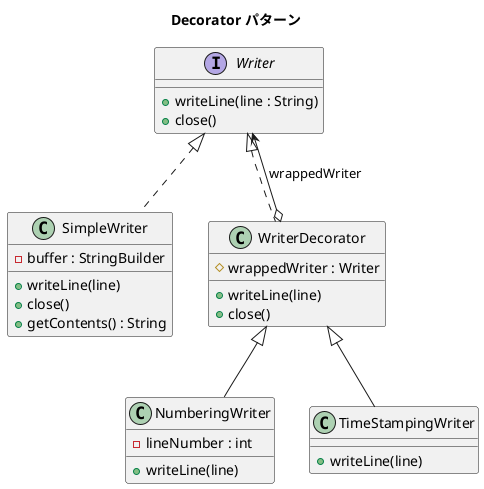

# 第 12 章: Decorator

## はじめに

ファイルに書き込む `Writer` に、行番号やタイムスタンプを付加したいとします。これらの機能を組み合わせて使いたい場合、継承では組み合わせ爆発が起こります。

**Decorator パターン**は、オブジェクトに動的に機能を追加するパターンです。Java では `java.io` パッケージがこのパターンの代表例であり、`BufferedReader(new FileReader(...))` のようにデコレーターを重ねる書き方は Java プログラマーにとってお馴染みです。

---

## パターンの構造



**登場人物**:

- **Component（Writer）**: 共通インターフェース
- **ConcreteComponent（SimpleWriter）**: 基本機能を提供する
- **Decorator（WriterDecorator）**: Component を保持し、デフォルトで委譲する
- **ConcreteDecorator（NumberingWriter / TimeStampingWriter）**: 追加機能を実装する

---

## TDD で作る

### Red: テストを書く

```java
class DecoratorTest {

    @Test
    void simpleWriterWritesLines() {
        SimpleWriter writer = new SimpleWriter();
        writer.writeLine("Hello");
        writer.writeLine("World");
        writer.close();

        assertEquals("Hello\nWorld\n", writer.getContents());
    }

    @Test
    void numberingWriterAddsLineNumbers() {
        SimpleWriter simple = new SimpleWriter();
        Writer writer = new NumberingWriter(simple);

        writer.writeLine("First");
        writer.writeLine("Second");
        writer.close();

        String contents = simple.getContents();
        assertTrue(contents.contains("1: First"));
        assertTrue(contents.contains("2: Second"));
    }

    @Test
    void decoratorsCanBeStacked() {
        SimpleWriter simple = new SimpleWriter();
        Writer writer = new NumberingWriter(new TimeStampingWriter(simple));

        writer.writeLine("Line A");
        writer.writeLine("Line B");
        writer.close();

        String contents = simple.getContents();
        assertTrue(contents.contains("1: "));
        assertTrue(contents.contains("Line A"));
    }
}
```

### Green: 実装する

**Component（Writer）** --- 共通インターフェースです。

```java
public interface Writer {
    void writeLine(String line);
    void close();
}
```

**Decorator 基底クラス** --- デフォルトで全メソッドを委譲します。

```java
public class WriterDecorator implements Writer {
    protected final Writer wrappedWriter;

    public WriterDecorator(Writer wrappedWriter) {
        this.wrappedWriter = wrappedWriter;
    }

    @Override
    public void writeLine(String line) { wrappedWriter.writeLine(line); }

    @Override
    public void close() { wrappedWriter.close(); }
}
```

**ConcreteDecorator** --- 追加機能を実装します。

```java
public class NumberingWriter extends WriterDecorator {
    private int lineNumber = 1;

    public NumberingWriter(Writer wrappedWriter) {
        super(wrappedWriter);
    }

    @Override
    public void writeLine(String line) {
        wrappedWriter.writeLine(lineNumber + ": " + line);
        lineNumber++;
    }
}
```

```java
public class TimeStampingWriter extends WriterDecorator {
    private static final DateTimeFormatter FORMATTER =
            DateTimeFormatter.ofPattern("yyyy-MM-dd HH:mm:ss");

    public TimeStampingWriter(Writer wrappedWriter) {
        super(wrappedWriter);
    }

    @Override
    public void writeLine(String line) {
        String timestamp = LocalDateTime.now().format(FORMATTER);
        wrappedWriter.writeLine(timestamp + ": " + line);
    }
}
```

### Refactor: 振り返り

- デコレーターを重ねる順序が重要です。`new NumberingWriter(new TimeStampingWriter(simple))` では「行番号 + タイムスタンプ + テキスト」、順序を逆にすると「タイムスタンプ + 行番号 + テキスト」になります。
- `WriterDecorator` がデフォルトの委譲を提供するため、各 ConcreteDecorator は変更したいメソッドだけオーバーライドすれば済みます。

---

## Ruby との比較

| 観点 | Java | Ruby |
|------|------|------|
| **デコレーターの実現** | クラス継承 + 委譲パターン | `extend` + Module による mixin |
| **重ね合わせ** | `new A(new B(new C(...)))` | `obj.extend(ModuleA).extend(ModuleB)` |
| **java.io との類似** | `BufferedReader(new FileReader(...))` | IO の wrap は少ない |
| **デコレーター基底** | `WriterDecorator` で委譲を集約 | Module 自体がデコレーター |

Ruby では `extend` を使ってオブジェクト単位にモジュールを mixin することで、デコレーターパターンをより動的に実現できます。Java では `java.io` パッケージが Decorator パターンの教科書的な実装例です。

---

## まとめ

| 観点 | 内容 |
|------|------|
| **意図** | オブジェクトに動的に機能を追加する（継承の代替） |
| **適用場面** | 機能の組み合わせが多く、継承では組み合わせ爆発する場合 |
| **メリット** | 機能を自由に組み合わせ可能。OCP を満たす |
| **Java の強み** | `java.io` パッケージが実例。委譲パターンで型安全に重ね合わせ |
| **関連パターン** | Proxy（アクセス制御）、Adapter（インターフェース変換）、Strategy（アルゴリズム差し替え） |
