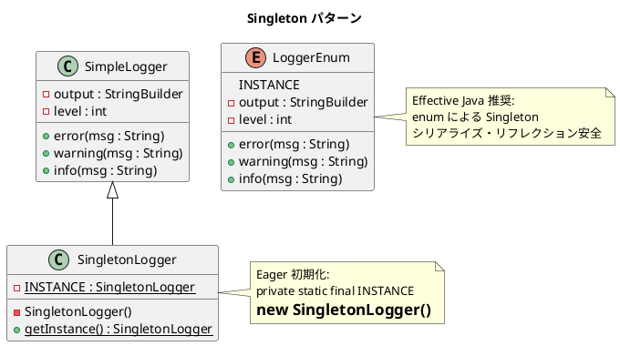

# 第 13 章: Singleton

## はじめに

アプリケーション全体で 1 つだけ存在すべきロガーを作りたいとします。インスタンスが複数生成されると、ログが分散してしまいます。

**Singleton パターン**は、クラスのインスタンスを 1 つに制限し、グローバルなアクセスポイントを提供するパターンです。Java では Effective Java（Joshua Bloch 著）が推奨する **enum Singleton** が最も安全な実装方法です。

---

## パターンの構造



**登場人物**:

- **Singleton（SingletonLogger / LoggerEnum）**: インスタンスを 1 つに制限するクラス
- **SimpleLogger**: Singleton 化する前の通常のクラス

---

## TDD で作る

### Red: テストを書く

```java
class SingletonTest {

    @Test
    void singletonLoggerReturnsSameInstance() {
        SingletonLogger a = SingletonLogger.getInstance();
        SingletonLogger b = SingletonLogger.getInstance();

        assertSame(a, b);
    }

    @Test
    void enumLoggerIsSingleton() {
        LoggerEnum a = LoggerEnum.INSTANCE;
        LoggerEnum b = LoggerEnum.INSTANCE;

        assertSame(a, b);
    }

    @Test
    void enumLoggerLogsMessages() {
        LoggerEnum logger = LoggerEnum.INSTANCE;
        logger.setLevel(SimpleLogger.INFO);
        logger.info("enum test");

        assertTrue(logger.getLoggedContent().contains("[INFO] enum test"));
    }
}
```

### Green: 実装する

**Eager 初期化 Singleton** --- 古典的な private コンストラクタ + static フィールド。

```java
public class SingletonLogger extends SimpleLogger {
    private static final SingletonLogger INSTANCE = new SingletonLogger();

    private SingletonLogger() {}

    public static SingletonLogger getInstance() {
        return INSTANCE;
    }
}
```

**enum Singleton** --- Effective Java 推奨の最も安全な方法。

```java
public enum LoggerEnum {
    INSTANCE;

    private final StringBuilder output = new StringBuilder();
    private int level = SimpleLogger.INFO;

    public void setLevel(int level) { this.level = level; }

    public void error(String msg) {
        if (level >= SimpleLogger.ERROR) {
            output.append("[ERROR] ").append(msg).append("\n");
        }
    }

    public void warning(String msg) {
        if (level >= SimpleLogger.WARNING) {
            output.append("[WARNING] ").append(msg).append("\n");
        }
    }

    public void info(String msg) {
        if (level >= SimpleLogger.INFO) {
            output.append("[INFO] ").append(msg).append("\n");
        }
    }

    public String getLoggedContent() { return output.toString(); }
}
```

### Refactor: 振り返り

- **enum Singleton** はシリアライズ安全です。通常の Singleton はデシリアライズ時に新しいインスタンスが生成される危険がありますが、enum はその心配がありません。
- **リフレクション攻撃**にも耐性があります。`Constructor.newInstance()` で enum のインスタンスを作ることはできません。
- Singleton はグローバル状態を導入するため、テストの独立性に影響します。DI（依存性注入）を検討すべき場面も多いです。

---

## Ruby との比較

| 観点 | Java | Ruby |
|------|------|------|
| **Singleton の実現** | enum / private コンストラクタ + static | `Singleton` モジュールを `include` |
| **スレッド安全性** | enum は JVM が保証。static final も安全 | `Singleton` モジュールがスレッド安全を提供 |
| **シリアライズ安全** | enum のみ完全に安全 | Marshal のフックで対応 |
| **テスト容易性** | Singleton の状態共有が課題 | 同様の課題 |

Ruby では `require 'singleton'` して `include Singleton` するだけで Singleton 化できます。Java では enum を使うか、private コンストラクタと static フィールドで明示的に制約を設けます。

---

## まとめ

| 観点 | 内容 |
|------|------|
| **意図** | クラスのインスタンスを 1 つに制限し、グローバルなアクセスポイントを提供する |
| **適用場面** | ロガー、設定、接続プールなどシステムに 1 つだけ必要なリソース |
| **メリット** | インスタンスの一意性を保証し、グローバルアクセスを提供する |
| **Java の強み** | enum Singleton はシリアライズ・リフレクション安全（Effective Java 推奨） |
| **注意点** | グローバル状態はテストの独立性を損なう。DI を検討すべき |
| **関連パターン** | Abstract Factory（Singleton なファクトリ）、Flyweight（共有オブジェクト） |
