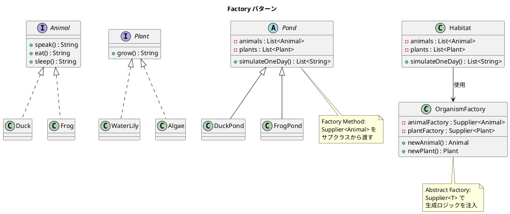

# 第 14 章: Factory

## はじめに

池（Pond）にはカエルと藻、またはアヒルとスイレンが住んでいます。どの動物と植物の組み合わせを生成するかを、池の種類ごとに切り替えたいとします。

**Factory パターン**は、オブジェクトの生成をサブクラスやファクトリオブジェクトに委ねるパターンです。Java では `Supplier<T>` をファクトリとして活用し、メソッド参照（`Duck::new`）で軽量にファクトリを表現できます。

---

## パターンの構造



**登場人物**:

- **Factory Method（Pond / DuckPond / FrogPond）**: サブクラスが生成物の種類を決定する
- **Abstract Factory（OrganismFactory）**: `Supplier<T>` で動物と植物の生成を組み合わせる
- **Product（Animal / Plant）**: 生成されるオブジェクトのインターフェース

---

## TDD で作る

### Red: テストを書く

```java
class FactoryTest {

    @Test
    void duckPondSimulatesOneDay() {
        Pond pond = new DuckPond(2, 1);
        List<String> output = pond.simulateOneDay();

        assertTrue(output.contains("WaterLily is growing."));
        assertTrue(output.contains("Quack!"));
        assertTrue(output.contains("Duck is eating."));
    }

    @Test
    void abstractFactoryCreatesOrganisms() {
        OrganismFactory factory = new OrganismFactory(Tiger::new, Tree::new);
        Animal animal = factory.newAnimal();
        Plant plant = factory.newPlant();

        assertEquals("Roar!", animal.speak());
        assertEquals("Tree is growing.", plant.grow());
    }

    @Test
    void habitatUsesAbstractFactory() {
        OrganismFactory factory = new OrganismFactory(Duck::new, WaterLily::new);
        Habitat habitat = new Habitat(2, 1, factory);
        List<String> output = habitat.simulateOneDay();

        assertTrue(output.contains("Quack!"));
        assertEquals(7, output.size()); // 1 plant + 2 animals * 3 actions
    }
}
```

### Green: 実装する

**Factory Method パターン** --- `Supplier<T>` をコンストラクタで受け取ります。

```java
public abstract class Pond {
    private final List<Animal> animals;
    private final List<Plant> plants;

    protected Pond(int numAnimals, Supplier<Animal> animalFactory,
                   int numPlants, Supplier<Plant> plantFactory) {
        animals = new ArrayList<>();
        for (int i = 0; i < numAnimals; i++) {
            animals.add(animalFactory.get());
        }
        plants = new ArrayList<>();
        for (int i = 0; i < numPlants; i++) {
            plants.add(plantFactory.get());
        }
    }

    public List<String> simulateOneDay() {
        List<String> output = new ArrayList<>();
        for (Plant plant : plants) { output.add(plant.grow()); }
        for (Animal animal : animals) {
            output.add(animal.speak());
            output.add(animal.eat());
            output.add(animal.sleep());
        }
        return output;
    }
}
```

**具象ファクトリ** --- メソッド参照で簡潔に表現します。

```java
public class DuckPond extends Pond {
    public DuckPond(int numAnimals, int numPlants) {
        super(numAnimals, Duck::new, numPlants, WaterLily::new);
    }
}
```

**Abstract Factory** --- `Supplier<T>` で生成ロジックを外部から注入します。

```java
public class OrganismFactory {
    private final Supplier<Animal> animalFactory;
    private final Supplier<Plant> plantFactory;

    public OrganismFactory(Supplier<Animal> animalFactory,
                           Supplier<Plant> plantFactory) {
        this.animalFactory = animalFactory;
        this.plantFactory = plantFactory;
    }

    public Animal newAnimal() { return animalFactory.get(); }
    public Plant newPlant() { return plantFactory.get(); }
}
```

### Refactor: 振り返り

- `Duck::new` のようなメソッド参照により、`Supplier<Animal>` を 1 行で生成できます。Ruby のクラスオブジェクト（`Duck`）を渡す感覚に近いです。
- Factory Method と Abstract Factory の違い: Factory Method はサブクラスが生成物を決定し、Abstract Factory はファクトリオブジェクトが生成物の組み合わせを決定します。

---

## Ruby との比較

| 観点 | Java | Ruby |
|------|------|------|
| **ファクトリの表現** | `Supplier<T>` + メソッド参照 | クラスオブジェクト自体がファクトリ（`Duck.new`） |
| **メソッド参照** | `Duck::new`（Supplier として渡す） | `Duck` をそのまま渡す |
| **Abstract Factory** | `OrganismFactory` クラスで明示的に定義 | Hash やブロックで軽量に表現 |
| **型安全性** | `Supplier<Animal>` で生成物の型を保証 | ダックタイピング |

Ruby ではクラスオブジェクト自体がファクトリとして機能するため、`Supplier<T>` のような wrapper は不要です。Java では `Supplier<T>` とメソッド参照により、同様の軽量さを実現しています。

---

## まとめ

| 観点 | 内容 |
|------|------|
| **意図** | オブジェクトの生成をサブクラスやファクトリオブジェクトに委ねる |
| **適用場面** | 生成するオブジェクトの種類を実行時に決定したい場合 |
| **メリット** | 生成コードとビジネスロジックを分離。新しい種類の追加が容易 |
| **Java の強み** | `Supplier<T>` + メソッド参照で型安全かつ簡潔なファクトリ |
| **関連パターン** | Builder（複雑なオブジェクトの段階的構築）、Singleton（唯一のファクトリ） |
