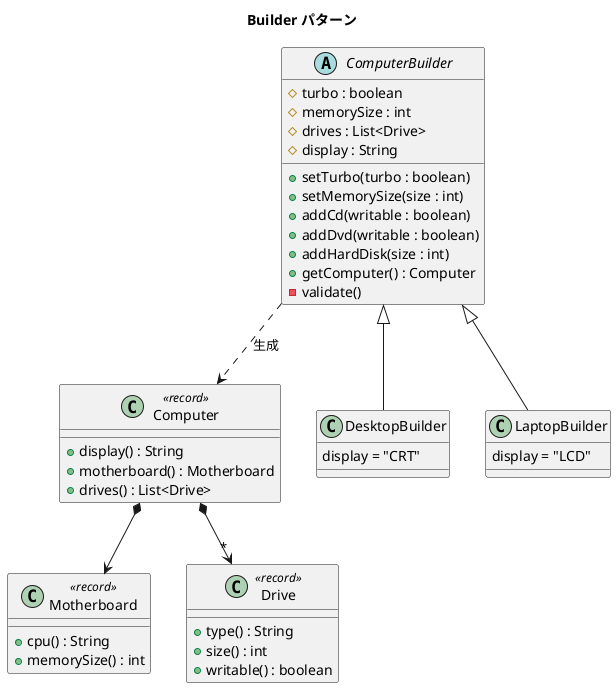

# 第 15 章: Builder

## はじめに

コンピュータを構築するとき、ディスプレイ、CPU、メモリ、ドライブなどのパーツを段階的に組み立てる必要があります。デスクトップとラップトップではデフォルト構成が異なりますが、組み立てのプロセスは同じです。

**Builder パターン**は、複雑なオブジェクトの構築プロセスを段階的に行い、同じ構築手順で異なる表現を生成するパターンです。Java では `record` 型を使ったイミュータブルなプロダクトと、バリデーション付きのビルダーを組み合わせます。

---

## パターンの構造



**登場人物**:

- **Builder（ComputerBuilder）**: 構築プロセスのインターフェースを定義する
- **ConcreteBuilder（DesktopBuilder / LaptopBuilder）**: デフォルト構成を決定する
- **Product（Computer / Motherboard / Drive）**: record 型のイミュータブルなプロダクト

---

## TDD で作る

### Red: テストを書く

```java
class BuilderTest {

    @Test
    void desktopBuilderCreatesComputerWithCrtDisplay() {
        DesktopBuilder builder = new DesktopBuilder();
        builder.addHardDisk(10000);

        Computer computer = builder.getComputer();

        assertEquals("CRT", computer.display());
        assertNotNull(computer.motherboard());
        assertFalse(computer.drives().isEmpty());
    }

    @Test
    void builderSupportsTurboCpu() {
        DesktopBuilder builder = new DesktopBuilder();
        builder.setTurbo(true);
        builder.addHardDisk(10000);

        Computer computer = builder.getComputer();

        assertEquals("TurboCPU", computer.motherboard().cpu());
    }

    @Test
    void builderValidatesMemorySize() {
        DesktopBuilder builder = new DesktopBuilder();
        builder.setMemorySize(100);
        builder.addHardDisk(10000);

        assertThrows(IllegalStateException.class, builder::getComputer);
    }

    @Test
    void builderValidatesMustHaveHardDisk() {
        DesktopBuilder builder = new DesktopBuilder();
        builder.addCd(false);

        assertThrows(IllegalStateException.class, builder::getComputer);
    }
}
```

### Green: 実装する

**Product（record 型）** --- イミュータブルなデータクラスです。

```java
public record Computer(String display, Motherboard motherboard, List<Drive> drives) {}

public record Motherboard(String cpu, int memorySize) {}

public record Drive(String type, int size, boolean writable) {}
```

**Builder** --- 段階的に構築し、バリデーション後にプロダクトを返します。

```java
public abstract class ComputerBuilder {
    protected boolean turbo = false;
    protected int memorySize = 512;
    protected final List<Drive> drives = new ArrayList<>();
    protected String display;

    public void setTurbo(boolean turbo) { this.turbo = turbo; }
    public void setMemorySize(int memorySize) { this.memorySize = memorySize; }

    public void addCd(boolean writable) {
        drives.add(new Drive("cd", 760, writable));
    }

    public void addHardDisk(int size) {
        drives.add(new Drive("hard_disk", size, true));
    }

    public Computer getComputer() {
        validate();
        String cpu = turbo ? "TurboCPU" : "BasicCPU";
        Motherboard motherboard = new Motherboard(cpu, memorySize);
        return new Computer(display, motherboard, List.copyOf(drives));
    }

    private void validate() {
        if (memorySize < 250)
            throw new IllegalStateException("Not enough memory: " + memorySize);
        if (drives.size() > 4)
            throw new IllegalStateException("Too many drives: " + drives.size());
        boolean hasHardDisk = drives.stream()
                .anyMatch(d -> "hard_disk".equals(d.type()));
        if (!hasHardDisk)
            throw new IllegalStateException("Must have at least one hard disk");
    }
}
```

**ConcreteBuilder** --- デフォルト構成を設定します。

```java
public class DesktopBuilder extends ComputerBuilder {
    public DesktopBuilder() { this.display = "CRT"; }
}

public class LaptopBuilder extends ComputerBuilder {
    public LaptopBuilder() { this.display = "LCD"; }
}
```

### Refactor: 振り返り

- `record` 型により、`equals()`、`hashCode()`、`toString()` が自動生成され、イミュータブルなプロダクトを簡潔に定義できます。
- `List.copyOf(drives)` で防御的コピーを行い、プロダクトのイミュータビリティを保証しています。
- `validate()` メソッドにバリデーションロジックを集約し、不正なプロダクトの生成を防いでいます。

---

## Ruby との比較

| 観点 | Java | Ruby |
|------|------|------|
| **プロダクトの表現** | `record` 型（イミュータブル） | 通常のクラス（ミュータブル） |
| **バリデーション** | `validate()` で `IllegalStateException` をスロー | 同様にバリデーションメソッド |
| **Fluent Interface** | メソッドチェーン（`builder.setTurbo(true).addHardDisk(...)` も可能） | `method_missing` で DSL 的に表現 |
| **防御的コピー** | `List.copyOf()` で明示的に | Ruby では通常不要（慣習） |
| **自動生成メソッド** | record が `equals` / `hashCode` / `toString` を自動生成 | 手動実装が必要 |

Ruby では `method_missing` を使って DSL 的なビルダーを簡潔に書けますが、Java の `record` 型はイミュータビリティとメソッドの自動生成で安全性を提供します。

---

## まとめ

| 観点 | 内容 |
|------|------|
| **意図** | 複雑なオブジェクトの構築プロセスを段階的に行い、異なる表現を生成する |
| **適用場面** | 多数のオプションを持つオブジェクトの構築（DB 接続設定、HTTP リクエストなど） |
| **メリット** | 構築手順と表現を分離。バリデーションを一元管理できる |
| **Java の強み** | `record` 型によるイミュータブルなプロダクト、`List.copyOf()` による防御的コピー |
| **関連パターン** | Abstract Factory（ファミリの生成）、Composite（複合オブジェクトの構築） |
