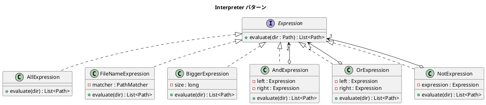

# 第 16 章: Interpreter

## はじめに

ディレクトリ内のファイルを「拡張子が `.txt`」「サイズが 1000 バイト以上」「かつ（AND）」「または（OR）」「でない（NOT）」といった条件で検索したいとします。これらの条件を組み合わせて複雑な検索式を構築できると便利です。

**Interpreter パターン**は、言語の文法を定義し、その文に対するインタプリタ（解釈器）を提供するパターンです。Java では `Path` / `Files` API と関数合成を活用して、ファイル検索の DSL を構築します。

---

## パターンの構造



**登場人物**:

- **AbstractExpression（Expression）**: 式のインターフェース
- **TerminalExpression（AllExpression / FileNameExpression / BiggerExpression）**: 末端の式（直接ファイルを評価）
- **NonterminalExpression（AndExpression / OrExpression / NotExpression）**: 複合式（他の式を組み合わせる）

---

## TDD で作る

### Red: テストを書く

```java
class InterpreterTest {

    @TempDir
    Path tempDir;

    @BeforeEach
    void setUp() throws IOException {
        Files.writeString(tempDir.resolve("small.txt"), "hi");
        Files.writeString(tempDir.resolve("big.txt"), "x".repeat(2000));
        Files.writeString(tempDir.resolve("data.csv"), "a,b,c");
        Files.writeString(tempDir.resolve("image.jpg"), "fake image data here!!");
    }

    @Test
    void fileNameExpressionMatchesPattern() {
        Expression expr = new FileNameExpression("*.txt");
        List<Path> results = expr.evaluate(tempDir);

        assertEquals(2, results.size());
        assertTrue(results.stream().allMatch(p -> p.toString().endsWith(".txt")));
    }

    @Test
    void andExpressionCombinesTwoExpressions() {
        Expression expr = new AndExpression(
                new FileNameExpression("*.txt"),
                new BiggerExpression(1000)
        );
        List<Path> results = expr.evaluate(tempDir);

        assertEquals(1, results.size());
        assertEquals("big.txt", results.get(0).getFileName().toString());
    }

    @Test
    void orExpressionUnitesTwoExpressions() {
        Expression expr = new OrExpression(
                new FileNameExpression("*.txt"),
                new FileNameExpression("*.csv")
        );
        List<Path> results = expr.evaluate(tempDir);

        assertEquals(3, results.size());
    }

    @Test
    void complexExpressionCombinesMultipleOperators() {
        // txt ファイルのうち大きくないものを検索
        Expression expr = new AndExpression(
                new FileNameExpression("*.txt"),
                new NotExpression(new BiggerExpression(1000))
        );
        List<Path> results = expr.evaluate(tempDir);

        assertEquals(1, results.size());
        assertEquals("small.txt", results.get(0).getFileName().toString());
    }
}
```

### Green: 実装する

**AbstractExpression（Expression）** --- 式の共通インターフェースです。

```java
public interface Expression {
    List<Path> evaluate(Path dir);
}
```

**TerminalExpression** --- `Files.walk()` と Stream API でファイルを評価します。

```java
public class FileNameExpression implements Expression {
    private final PathMatcher matcher;

    public FileNameExpression(String pattern) {
        this.matcher = FileSystems.getDefault()
                .getPathMatcher("glob:" + pattern);
    }

    @Override
    public List<Path> evaluate(Path dir) {
        try (Stream<Path> stream = Files.walk(dir)) {
            return stream
                    .filter(Files::isRegularFile)
                    .filter(p -> matcher.matches(p.getFileName()))
                    .toList();
        } catch (IOException e) {
            throw new UncheckedIOException(e);
        }
    }
}
```

**NonterminalExpression** --- 集合演算で式を組み合わせます。

```java
public class AndExpression implements Expression {
    private final Expression left;
    private final Expression right;

    public AndExpression(Expression left, Expression right) {
        this.left = left;
        this.right = right;
    }

    @Override
    public List<Path> evaluate(Path dir) {
        List<Path> leftResult = left.evaluate(dir);
        List<Path> rightResult = right.evaluate(dir);
        List<Path> result = new ArrayList<>(leftResult);
        result.retainAll(rightResult);
        return result;
    }
}
```

**OrExpression** --- 2 つの式のいずれかに一致するファイルを返します。`LinkedHashSet` で重複を排除します。

```java
public class OrExpression implements Expression {
    private final Expression left;
    private final Expression right;

    public OrExpression(Expression left, Expression right) {
        this.left = left;
        this.right = right;
    }

    @Override
    public List<Path> evaluate(Path dir) {
        Set<Path> result = new LinkedHashSet<>(left.evaluate(dir));
        result.addAll(right.evaluate(dir));
        return new ArrayList<>(result);
    }
}
```

**NotExpression** --- 全ファイルから一致するものを除外します。

```java
public class NotExpression implements Expression {
    private final Expression expression;

    public NotExpression(Expression expression) {
        this.expression = expression;
    }

    @Override
    public List<Path> evaluate(Path dir) {
        List<Path> all = new AllExpression().evaluate(dir);
        List<Path> excluded = expression.evaluate(dir);
        List<Path> result = new ArrayList<>(all);
        result.removeAll(excluded);
        return result;
    }
}
```

### Refactor: 振り返り

- `PathMatcher` は Java の `glob` パターンを使ってファイル名をマッチングします。正規表現よりもファイル検索に特化しています。
- `Files.walk()` は `try-with-resources` で使用し、Stream のクローズを保証しています。
- `retainAll()` と `removeAll()` で集合演算を行い、AND / NOT を簡潔に表現しています。
- `OrExpression` では `LinkedHashSet` を使い、順序を保持しつつ重複を排除しています。

---

## Ruby との比較

| 観点 | Java | Ruby |
|------|------|------|
| **ファイル探索** | `Files.walk()` + Stream API | `Find.find` / `Dir.glob` |
| **パターンマッチ** | `PathMatcher`（glob パターン） | `File.fnmatch` |
| **集合演算** | `retainAll()` / `removeAll()` | `&`（積集合）/ `-`（差集合） |
| **例外処理** | チェック例外を `UncheckedIOException` でラップ | 例外の区別が少ない |
| **式の組み合わせ** | Composite パターン（明示的なクラス） | ブロックの関数合成も可能 |

Ruby では `Find.find` や `Dir.glob` で簡潔にファイル検索ができますが、Java の `Path` / `Files` API はプラットフォーム独立なファイル操作を型安全に提供します。

---

## まとめ

| 観点 | 内容 |
|------|------|
| **意図** | 言語の文法を定義し、文に対するインタプリタを提供する |
| **適用場面** | 検索条件、ルールエンジン、設定ファイルの解析 |
| **メリット** | 条件を自由に組み合わせ可能。新しい式の追加が容易 |
| **Java の強み** | `Path` / `Files` API + `PathMatcher` による型安全なファイル操作 |
| **関連パターン** | Composite（式の木構造）、Visitor（式の走査）、Strategy（評価戦略の差し替え） |
