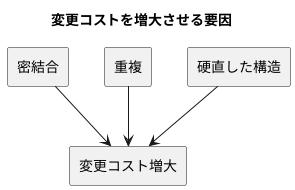
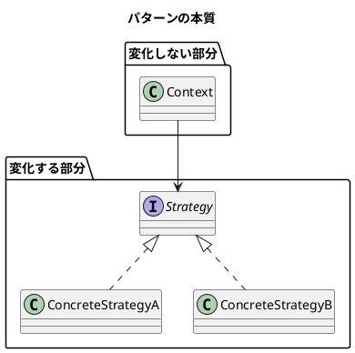

# 第 1 章: デザインパターンとパターン思考

## はじめに

ソフトウェア開発において「変更」は避けられません。要件は変わり、技術は進化し、ユーザーの期待は高まり続けます。**よいソフトウェア** --- 変更を楽に安全にできて役に立つソフトウェア --- を作るためには、変化に対応できる設計が不可欠です。

**デザインパターン**は、この「変化への対応力」を高めるための再利用可能な設計の知恵です。

---

## デザインパターンとは何か

### GoF の歴史

1994 年、Erich Gamma、Richard Helm、Ralph Johnson、John Vlissides の 4 人（通称 **Gang of Four / GoF**）が『Design Patterns: Elements of Reusable Object-Oriented Software』を出版しました。この書籍は 23 のデザインパターンをカタログ化し、オブジェクト指向設計の共通語彙を確立しました。

GoF のパターンは以下の 3 カテゴリに分類されます。

| カテゴリ | 目的 | 本シリーズで扱うパターン |
|---------|------|----------------------|
| **生成（Creational）** | オブジェクトの作り方を柔軟にする | Singleton, Factory Method, Abstract Factory, Builder |
| **構造（Structural）** | オブジェクトの組み合わせ方を整理する | Adapter, Composite, Proxy, Decorator |
| **振る舞い（Behavioral）** | オブジェクト間の責務分担を明確にする | Template Method, Strategy, Observer, Iterator, Command, Interpreter |

### Russ Olsen のアプローチ

本シリーズの源流である Russ Olsen 『Design Patterns in Ruby』は、GoF の 23 パターンから **Ruby で特に有用な 13 パターン**を選び、動的な言語機能を活かした実装を示しました。

本シリーズでは、この 13 パターンを **JavaScript（ES6+）** で再実装します。JavaScript はプロトタイプベースのオブジェクト指向と第一級関数を持つ動的言語であり、Ruby とは異なるアプローチでパターンを表現できます。

---

## パターンが解く問題

### 変更コストの問題

ソフトウェアの寿命が長くなるほど、変更にかかるコストは増大します。

1. **密結合（Tight Coupling）**: あるクラスを変更すると、他の多くのクラスも変更が必要になる
2. **重複（Duplication）**: 同じロジックが複数箇所に散在し、変更漏れが起きる
3. **硬直した構造（Rigidity）**: 新しい振る舞いを追加するために、既存コードの大幅な書き換えが必要になる

### パターンの本質: 変化するものを分離する

すべてのデザインパターンに共通する核心的なアイデアは、**「変化するものを、変化しないものから分離する」**ことです。

---

## JavaScript でパターンを学ぶ意味

JavaScript には、パターンの表現を独特なものにする言語特性があります。

| 特性 | パターンへの影響 |
|------|----------------|
| **第一級関数 / アロー関数** | Strategy, Command が「関数を渡すだけ」で実現できる |
| **プロトタイプ継承** | Template Method をクラス構文で自然に表現できる |
| **Duck Typing** | インターフェース宣言なしで Composite, Adapter が成立する |
| **ES6 Proxy API** | Protection / Virtual Proxy をトラップで透過的に実装できる |
| **Symbol.iterator / Generator** | Iterator パターンが言語レベルでサポートされている |
| **クロージャ** | Singleton, Factory のカプセル化に利用できる |
| **ES モジュール** | モジュールスコープ自体が Singleton として機能する |

---

## 本シリーズの構成

### 第 1 部: パターンとは何か（第 1 - 3 章）

基礎知識と開発環境を整えます。

### 第 2 部: 振る舞いの取り扱い（第 4 - 8 章）

Template Method, Strategy, Observer, Composite, Iterator を扱います。

### 第 3 部: 操作と関係の表現（第 9 - 12 章）

Command, Adapter, Proxy, Decorator を扱います。

### 第 4 部: オブジェクトの作成と解釈（第 13 - 16 章）

Singleton, Factory, Builder, Interpreter を扱います。

---

## まとめ

| 観点 | 内容 |
|------|------|
| **デザインパターンとは** | 繰り返し現れる設計問題に対する、検証済みの再利用可能な解決策 |
| **核心的アイデア** | 変化するものを、変化しないものから分離する |
| **GoF の 3 カテゴリ** | 生成・構造・振る舞い |
| **JavaScript の強み** | 第一級関数、Proxy API、Symbol.iterator でパターンを軽量に表現できる |
| **学び方** | TDD で 1 パターンずつ、Red → Green → Refactor のサイクルで実装する |
