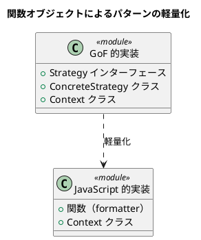

# 第 2 章: パターンを支える基本原則

## はじめに

デザインパターンは「何を作るか」のカタログですが、その背後には **「なぜそう設計するのか」** を説明する原則があります。本章では、13 パターンを貫く設計原則を JavaScript の視点から整理します。

---

## SOLID 原則

### 単一責任の原則（SRP）

> クラスを変更する理由は 1 つだけであるべきだ。

```javascript
// Bad: レポートの内容とフォーマットが混在
class Report {
  getContent() { return ['順調', '最高の調子']; }
  formatAsHtml() { /* HTML 生成 */ }
  formatAsText() { /* テキスト生成 */ }
}

// Good: フォーマットを分離（Strategy パターン）
class Report {
  constructor(formatter) { this.formatter = formatter; }
  output() { return this.formatter(this); }
}
```

### 開放閉鎖の原則（OCP）

> 拡張に対して開いていて、修正に対して閉じているべきだ。

Template Method パターンはこの原則の典型例です。基底クラスのアルゴリズム骨格を変更せずに、サブクラスで新しい出力形式を追加できます。

### リスコフの置換原則（LSP）

> サブタイプは、その基底タイプと置換可能でなければならない。

JavaScript では Duck Typing により、「同じメソッドを持つオブジェクト」は置換可能です。型宣言なしに LSP が成立します。

### インターフェース分離の原則（ISP）

> クライアントが使わないメソッドへの依存を強いるべきではない。

JavaScript にはインターフェース宣言がないため、必要なメソッドだけを持つオブジェクトを渡せます。これは ISP を自然に満たします。

### 依存性逆転の原則（DIP）

> 上位モジュールは下位モジュールに依存すべきではない。どちらも抽象に依存すべきだ。

```javascript
// コンストラクタインジェクションで依存を注入
class Report {
  constructor(formatter) {  // 抽象（関数の型）に依存
    this.formatter = formatter;
  }
}
```

---

## Duck Typing

JavaScript では、オブジェクトが「何であるか」ではなく「何ができるか」が重要です。

```javascript
// アヒルのように歩き、アヒルのように鳴くなら、それはアヒルだ
function makeItSpeak(animal) {
  return animal.speak();  // speak() メソッドがあれば OK
}
```

この特性により、Java のような明示的なインターフェース宣言なしに、Composite, Iterator, Observer などのパターンが成立します。

---

## プロトタイプとクラス構文

### ES6 クラス構文

JavaScript の `class` は**シンタックスシュガー**であり、内部的にはプロトタイプチェーンで動作します。

```javascript
class Animal {
  speak() { throw new Error('abstract'); }
}

class Duck extends Animal {
  speak() { return 'ガーガー'; }
}

// 内部的には: Duck.prototype.__proto__ === Animal.prototype
```

### プロトタイプの理解が重要な理由

- `super` の動作を正しく理解するため
- `instanceof` の判定がプロトタイプチェーンに基づくため
- Proxy パターンで `Reflect` を使う際の動作理解のため

---

## 関数は第一級オブジェクト

JavaScript では関数をオブジェクトとして扱えます。これにより、多くのパターンが軽量になります。



| GoF 的な実装 | JavaScript 的な実装 |
|------------|-------------------|
| Strategy インターフェース + 具象クラス | 関数オブジェクト |
| Command インターフェース + 具象クラス | コールバック関数 |
| Observer インターフェース | `update()` メソッドを持つ任意のオブジェクト |

---

## 変化するものを分離する

本シリーズの全パターンに共通するテーマは、**「変化するものを特定し、それを分離する」**ことです。

| パターン | 変化するもの | 分離の手段 |
|---------|------------|-----------|
| Template Method | アルゴリズムの一部のステップ | サブクラスのオーバーライド |
| Strategy | アルゴリズム全体 | 関数オブジェクトの注入 |
| Observer | 状態変化への反応 | オブザーバーの登録 |
| Composite | 木構造の深さ | 再帰的な同一インターフェース |
| Command | 実行する操作 | コマンドオブジェクト |
| Decorator | 追加される機能 | ラッパーオブジェクト |
| Factory | 生成されるオブジェクトの型 | ファクトリメソッド / ファクトリオブジェクト |

---

## まとめ

| 観点 | 内容 |
|------|------|
| **SOLID 原則** | パターンの背後にある設計原則。JavaScript でも有効 |
| **Duck Typing** | 型宣言なしにポリモーフィズムが成立する JavaScript の強み |
| **プロトタイプ** | `class` 構文の裏側。`super`, `instanceof`, `Reflect` の理解に必要 |
| **第一級関数** | Strategy, Command, Observer を軽量に実現する鍵 |
| **共通テーマ** | 変化するものを分離する |
