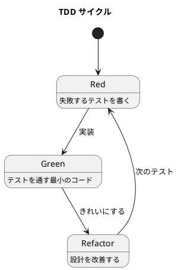

# 第 3 章: 開発環境と TDD 基盤

## はじめに

本シリーズでは、すべてのデザインパターンを **TDD（テスト駆動開発）** で実装します。本章では、Node.js + Jest による開発環境のセットアップと TDD の基本サイクルを解説します。

---

## 開発環境

### Node.js プロジェクトの構成

```
apps/javascript/design-pattern/
  ├── package.json
  ├── jest.config.js
  ├── src/          # 実装コード
  │   ├── template-method.js
  │   ├── strategy.js
  │   └── ...
  └── tests/        # テストコード
      ├── template-method.test.js
      ├── strategy.test.js
      └── ...
```

### package.json

```json
{
  "type": "module",
  "scripts": {
    "test": "node --experimental-vm-modules node_modules/.bin/jest --verbose",
    "test:coverage": "node --experimental-vm-modules node_modules/.bin/jest --coverage"
  },
  "devDependencies": {
    "jest": "^29.7.0",
    "@jest/globals": "^29.7.0"
  }
}
```

**ポイント**:
- `"type": "module"` で ES モジュール（`import` / `export`）を有効化
- `--experimental-vm-modules` で Jest が ESM をサポート

### jest.config.js

```javascript
export default {
  testMatch: ['**/tests/**/*.test.js'],
  transform: {},
  coverageDirectory: 'coverage',
  collectCoverageFrom: ['src/**/*.js'],
};
```

`transform: {}` は「トランスパイルしない」設定です。Node.js のネイティブ ESM をそのまま使います。

---

## TDD の基本サイクル

### Red - Green - Refactor



1. **Red**: 実装したい振る舞いをテストで表現する。テストは失敗する
2. **Green**: テストを通す最小限のコードを書く
3. **Refactor**: テストが通った状態でコードを改善する

### テストの書き方

Jest では `describe` / `it` / `expect` を使います。

```javascript
import { describe, it, expect } from '@jest/globals';
import { HtmlReport } from '../src/template-method.js';

describe('Template Method パターン', () => {
  it('HtmlReport が HTML 形式で出力する', () => {
    const report = new HtmlReport();
    const output = report.outputReport();

    expect(output).toContain('<html>');
    expect(output).toContain('<title>月次報告</title>');
  });
});
```

### テスト命名の規約

テスト名は **「何が」「どうなるか」** を明確に表現します。

- `HtmlReport が HTML 形式で出力する`
- `基底クラス Report の outputLine は例外を投げる`
- `salary 変更で Payroll に通知が届く`

---

## テストの実行

```bash
# 全テスト実行
npm test

# カバレッジ付き
npm run test:coverage

# 特定ファイルのみ
npx jest tests/template-method.test.js
```

---

## ES モジュールの注意点

### import / export

```javascript
// 名前付きエクスポート
export class Report { }
export function htmlFormatter(report) { }

// インポート
import { Report, htmlFormatter } from '../src/strategy.js';
```

### Node.js 組み込みモジュール

```javascript
import { writeFileSync, existsSync } from 'fs';
import { join } from 'path';
import { tmpdir } from 'os';
```

---

## Ruby / Java / Python との比較

| 観点 | Ruby | Java | Python | JavaScript |
|------|------|------|--------|------------|
| テストフレームワーク | Minitest / RSpec | JUnit | pytest | Jest |
| モジュールシステム | `require` | `import` (パッケージ) | `import` | ES Modules (`import`/`export`) |
| 型チェック | なし | コンパイル時 | なし (型ヒント) | なし (TypeScript で可能) |
| パッケージ管理 | Bundler | Maven / Gradle | pip | npm |
| テスト実行 | `rake test` | `mvn test` | `pytest` | `npm test` |

---

## まとめ

| 観点 | 内容 |
|------|------|
| **環境** | Node.js + Jest、ES モジュール |
| **TDD サイクル** | Red → Green → Refactor を数分以内で回す |
| **テスト構成** | `describe` / `it` / `expect` で意図を明確に |
| **ES モジュール** | `"type": "module"` + `--experimental-vm-modules` |
| **次章から** | Template Method パターンを TDD で実装する |
