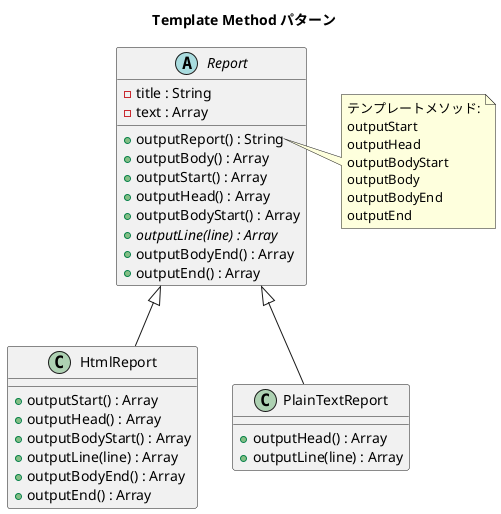

# 第 4 章: Template Method

## はじめに

レポートを HTML とプレーンテキストの 2 つの形式で出力したいとします。出力の「骨格」は同じ（タイトル → 本文 → フッター）ですが、各ステップの具体的な処理は形式ごとに異なります。

**Template Method パターン**は、アルゴリズムの骨格を基底クラスで定義し、具体的なステップをサブクラスに委ねるパターンです。

---

## パターンの構造



**登場人物**:

- **AbstractClass（Report）**: テンプレートメソッド `outputReport` でアルゴリズムの骨格を定義する
- **ConcreteClass（HtmlReport / PlainTextReport）**: 各ステップ（フックメソッド）をオーバーライドする

---

## TDD で作る

### Red: テストを書く

まず、HTML レポートの期待出力をテストで定義します。

```javascript
import { describe, it, expect } from '@jest/globals';
import { Report, HtmlReport, PlainTextReport } from '../src/template-method.js';

describe('Template Method パターン', () => {
  it('HtmlReport が HTML 形式で出力する', () => {
    const report = new HtmlReport();
    const output = report.outputReport();

    expect(output).toContain('<html>');
    expect(output).toContain('<title>月次報告</title>');
    expect(output).toContain('<p>順調</p>');
    expect(output).toContain('<p>最高の調子</p>');
    expect(output).toContain('</html>');
  });

  it('PlainTextReport がプレーンテキスト形式で出力する', () => {
    const report = new PlainTextReport();
    const output = report.outputReport();

    expect(output).toContain('**** 月次報告 ****');
    expect(output).toContain('順調');
    expect(output).not.toContain('<html>');
  });

  it('基底クラス Report の outputLine は例外を投げる', () => {
    const report = new Report();
    expect(() => report.outputReport()).toThrow('サブクラスで outputLine を実装してください');
  });
});
```

### Green: 実装する

**基底クラス Report** --- テンプレートメソッドを定義します。

```javascript
export class Report {
  constructor() {
    this.title = '月次報告';
    this.text = ['順調', '最高の調子'];
  }

  outputReport() {
    const lines = [];
    lines.push(...this.outputStart());
    lines.push(...this.outputHead());
    lines.push(...this.outputBodyStart());
    lines.push(...this.outputBody());
    lines.push(...this.outputBodyEnd());
    lines.push(...this.outputEnd());
    return lines.join('\n');
  }

  outputBody() {
    return this.text.flatMap((line) => this.outputLine(line));
  }

  // フックメソッド（デフォルトは空配列を返す）
  outputStart() { return []; }
  outputHead() { return this.outputLine(this.title); }
  outputBodyStart() { return []; }

  // 抽象メソッド
  outputLine(_line) {
    throw new Error('サブクラスで outputLine を実装してください');
  }

  outputBodyEnd() { return []; }
  outputEnd() { return []; }
}
```

**サブクラス HtmlReport / PlainTextReport** --- 必要なメソッドだけオーバーライドします。

```javascript
export class HtmlReport extends Report {
  outputStart() { return ['<html>']; }
  outputHead() {
    return [' <head>', ` <title>${this.title}</title>`, ' </head>'];
  }
  outputBodyStart() { return ['<body>']; }
  outputLine(line) { return [` <p>${line}</p>`]; }
  outputBodyEnd() { return ['</body>']; }
  outputEnd() { return ['</html>']; }
}

export class PlainTextReport extends Report {
  outputHead() {
    return [`**** ${this.title} ****`, ''];
  }
  outputLine(line) { return [line]; }
}
```

### Refactor: 振り返り

- JavaScript には `abstract` キーワードがないため、`throw new Error()` で抽象メソッドを表現しています。
- フックメソッドは空配列 `[]` を返すデフォルト実装を提供し、サブクラスは必要な部分だけオーバーライドします。
- 各メソッドは文字列の配列を返し、テンプレートメソッドが結合する設計にしました。これにより副作用（`console.log`）を排除し、テスタビリティを確保しています。

---

## Ruby / Java / Python との比較

| 観点 | Ruby | Java | Python | JavaScript |
|------|------|------|--------|------------|
| 抽象メソッド | `raise NotImplementedError` | `abstract` キーワード | `raise NotImplementedError` | `throw new Error()` |
| フックメソッド | 空メソッド `def m; end` | 空メソッド or `default` | 空メソッド `pass` | 空配列を返す `return []` |
| テンプレート呼び出し | `output_report` | `outputReport()` | `output_report()` | `outputReport()` |
| 出力方式 | `puts` (副作用) | `System.out` (副作用) | `print` (副作用) | 配列結合 (純粋関数) |

**JavaScript の特徴**: `class` 構文でメソッドオーバーライドを自然に書けますが、`abstract` キーワードがないため実行時エラーで抽象性を担保します。

---

## まとめ

| 観点 | 内容 |
|------|------|
| **意図** | アルゴリズムの骨格を定義し、一部のステップをサブクラスに委ねる |
| **適用場面** | 複数のバリエーションが同じ手順の骨格を共有する場合 |
| **メリット** | コードの重複を排除し、拡張ポイントを明確にする |
| **注意点** | サブクラスが増えると継承階層が深くなる → 次章の Strategy パターンで解決 |
| **関連パターン** | Strategy（委譲で差し替え）、Factory Method（生成ステップの Template Method） |
