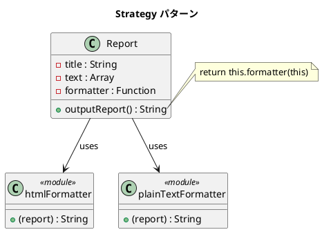

# 第 5 章: Strategy

## はじめに

前章の Template Method は継承でアルゴリズムを切り替えましたが、出力形式が増えるたびにサブクラスが増殖する問題がありました。

**Strategy パターン**は、アルゴリズムをオブジェクト（JavaScript では関数）として切り出し、実行時に差し替え可能にするパターンです。

---

## パターンの構造



**登場人物**:

- **Context（Report）**: Strategy を保持し、処理を委譲する
- **Strategy（formatter 関数）**: アルゴリズムの具体的な実装

---

## TDD で作る

### Red: テストを書く

```javascript
import { describe, it, expect } from '@jest/globals';
import { Report, htmlFormatter, plainTextFormatter } from '../src/strategy.js';

describe('Strategy パターン', () => {
  it('htmlFormatter で HTML 形式のレポートを出力する', () => {
    const report = new Report(htmlFormatter);
    const output = report.outputReport();

    expect(output).toContain('<html>');
    expect(output).toContain('<title>月次報告</title>');
  });

  it('実行時にフォーマッタを差し替えられる', () => {
    const report = new Report(htmlFormatter);
    expect(report.outputReport()).toContain('<html>');

    report.formatter = plainTextFormatter;
    expect(report.outputReport()).toContain('****');
  });

  it('アロー関数をカスタムフォーマッタとして渡せる', () => {
    const csvFormatter = (r) => [r.title, ...r.text].join(',');
    const report = new Report(csvFormatter);
    expect(report.outputReport()).toBe('月次報告,順調,最高の調子');
  });
});
```

### Green: 実装する

```javascript
export class Report {
  constructor(formatter) {
    this.title = '月次報告';
    this.text = ['順調', '最高の調子'];
    this.formatter = formatter;
  }

  outputReport() {
    return this.formatter(this);
  }
}

export function htmlFormatter(report) {
  const lines = [
    '<html>',
    ' <head>',
    ` <title>${report.title}</title>`,
    ' </head>',
    '<body>',
    ...report.text.map((line) => ` <p>${line}</p>`),
    '</body>',
    '</html>',
  ];
  return lines.join('\n');
}

export function plainTextFormatter(report) {
  const lines = [`**** ${report.title} ****`, '', ...report.text];
  return lines.join('\n');
}
```

### Refactor: 振り返り

- JavaScript では関数が第一級オブジェクトなので、Strategy を「クラス」ではなく「関数」として表現できます。これにより、GoF の Strategy パターンよりはるかに軽量になります。
- アロー関数をインラインで渡すこともできるため、1 回限りの Strategy も手軽に作れます。
- `report.formatter = plainTextFormatter` で実行時に差し替えが可能です。

---

## Ruby / Java / Python との比較

| 観点 | Ruby | Java | Python | JavaScript |
|------|------|------|--------|------------|
| Strategy の型 | Proc / lambda | インターフェース + 実装クラス | 関数 / callable | 関数（アロー関数） |
| 注入方法 | ブロック or コンストラクタ | コンストラクタ | コンストラクタ | コンストラクタ or プロパティ |
| インライン定義 | `-> { }` | ラムダ式 `() -> {}` | `lambda:` | `(r) => {}` |
| 実行時差し替え | 可能 | 可能 | 可能 | 可能 |

**JavaScript の特徴**: アロー関数による簡潔な記法が最大の強みです。Strategy インターフェースの定義が不要で、関数シグネチャだけが暗黙の契約になります。

---

## まとめ

| 観点 | 内容 |
|------|------|
| **意図** | アルゴリズムをオブジェクト（関数）として分離し、差し替え可能にする |
| **適用場面** | 同じ処理を複数の方法で実行したい場合 |
| **メリット** | 継承なしにアルゴリズムを切り替えられる。新しい Strategy の追加が容易 |
| **注意点** | Strategy の数が多い場合、選択ロジックが複雑になる |
| **関連パターン** | Template Method（継承で切り替え）、Command（操作のカプセル化） |
