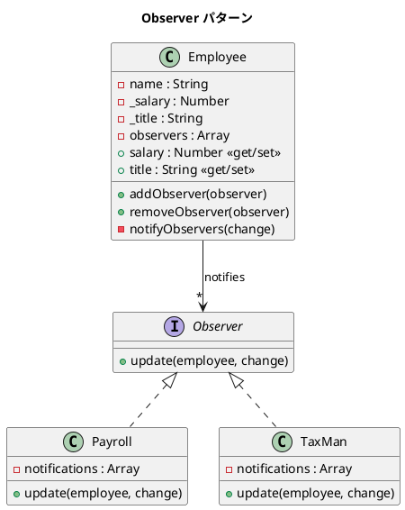

# 第 6 章: Observer

## はじめに

従業員の給与が変更されたとき、給与計算システムと税務システムの両方に通知したいとします。しかし、Employee クラスが Payroll や TaxMan を直接知っていると、密結合が生じます。

**Observer パターン**は、オブジェクトの状態変化を、依存するオブジェクト群に自動通知するパターンです。

---

## パターンの構造



**登場人物**:

- **Subject（Employee）**: 状態を持ち、オブザーバーに通知する
- **Observer（Payroll / TaxMan）**: 通知を受け取り反応する

---

## TDD で作る

### Red: テストを書く

```javascript
import { describe, it, expect } from '@jest/globals';
import { Employee, Payroll, TaxMan } from '../src/observer.js';

describe('Observer パターン', () => {
  it('salary 変更で Payroll に通知が届く', () => {
    const employee = new Employee('田中', 'エンジニア', 500000);
    const payroll = new Payroll();
    employee.addObserver(payroll);

    employee.salary = 600000;

    expect(payroll.notifications).toHaveLength(1);
    expect(payroll.notifications[0]).toContain('500000');
    expect(payroll.notifications[0]).toContain('600000');
  });

  it('オブザーバーを削除すると通知されなくなる', () => {
    const employee = new Employee('高橋', 'デザイナー', 450000);
    const payroll = new Payroll();
    employee.addObserver(payroll);
    employee.removeObserver(payroll);

    employee.salary = 500000;
    expect(payroll.notifications).toHaveLength(0);
  });
});
```

### Green: 実装する

```javascript
export class Employee {
  constructor(name, title, salary) {
    this.name = name;
    this._title = title;
    this._salary = salary;
    this.observers = [];
  }

  addObserver(observer) { this.observers.push(observer); }
  removeObserver(observer) {
    this.observers = this.observers.filter((o) => o !== observer);
  }

  notifyObservers(change) {
    for (const observer of this.observers) {
      observer.update(this, change);
    }
  }

  get salary() { return this._salary; }
  set salary(newSalary) {
    const old = this._salary;
    this._salary = newSalary;
    this.notifyObservers({ property: 'salary', old, new: newSalary });
  }
}
```

### Refactor: 振り返り

- JavaScript の `get` / `set` アクセサを使い、プロパティ代入 `employee.salary = 600000` の裏でオブザーバー通知が走る設計にしました。
- Observer は `update(employee, change)` メソッドを持つ任意のオブジェクトです（Duck Typing）。

---

## Ruby / Java / Python との比較

| 観点 | Ruby | Java | Python | JavaScript |
|------|------|------|--------|------------|
| 通知トリガー | メソッド呼び出し | メソッド呼び出し | property デコレータ | `get`/`set` アクセサ |
| Observer 契約 | Duck Typing | `Observer` インターフェース | Duck Typing | Duck Typing |
| 標準ライブラリ | `Observable` (deprecated) | `java.util.Observer` (deprecated) | なし | `EventTarget` / `EventEmitter` |
| 変更情報 | Hash | イベントオブジェクト | dict | プレーンオブジェクト |

**JavaScript の特徴**: `get`/`set` アクセサにより、プロパティ代入で自動通知を実現できます。Node.js の `EventEmitter` を使う方法もありますが、パターンの本質を学ぶためシンプルに実装しました。

---

## まとめ

| 観点 | 内容 |
|------|------|
| **意図** | オブジェクトの状態変化を依存オブジェクトに自動通知する |
| **適用場面** | 1 つの変化が複数のオブジェクトに影響する場合 |
| **メリット** | Subject と Observer の疎結合。Observer の動的な追加・削除 |
| **注意点** | 通知の順序に依存しないこと。循環通知に注意 |
| **関連パターン** | Mediator（通知の集約）、Strategy（1 対 1 の委譲） |
