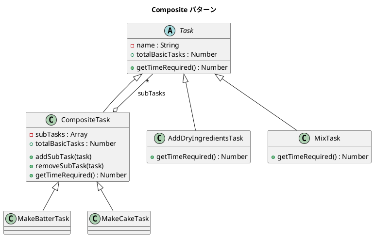

# 第 7 章: Composite

## はじめに

ケーキ作りのタスクを考えます。「生地を作る」は「乾燥材料を加える」「液体を加える」「混ぜる」の 3 つの子タスクから成り、さらに「ケーキを作る」は「生地を作る」「型に流し込む」「焼く」などから成ります。個々のタスクもタスクの集合も、同じ「所要時間を返す」操作で扱いたい。

**Composite パターン**は、個々のオブジェクト（リーフ）とその集合（コンポジット）を同一のインターフェースで扱うパターンです。

---

## パターンの構造



**登場人物**:

- **Component（Task）**: リーフとコンポジットの共通インターフェース
- **Leaf（AddDryIngredientsTask 等）**: 末端の具体タスク
- **Composite（CompositeTask / MakeBatterTask / MakeCakeTask）**: 子タスクを管理する

---

## TDD で作る

### Red: テストを書く

```javascript
import { describe, it, expect } from '@jest/globals';
import { MakeBatterTask, MakeCakeTask } from '../src/composite.js';

describe('Composite パターン', () => {
  it('MakeBatterTask は子タスクの合計時間を返す', () => {
    const batter = new MakeBatterTask();
    expect(batter.getTimeRequired()).toBe(4.5);
  });

  it('MakeCakeTask は全工程の合計時間を返す', () => {
    const cake = new MakeCakeTask();
    expect(cake.getTimeRequired()).toBeCloseTo(40.1);
  });

  it('MakeCakeTask は 7 つの基本タスクを持つ', () => {
    const cake = new MakeCakeTask();
    expect(cake.totalBasicTasks).toBe(7);
  });
});
```

### Green: 実装する

```javascript
export class Task {
  constructor(name) { this.name = name; }
  getTimeRequired() { throw new Error('サブクラスで実装してください'); }
  get totalBasicTasks() { return 1; }
}

export class CompositeTask extends Task {
  constructor(name) {
    super(name);
    this.subTasks = [];
  }
  addSubTask(task) { this.subTasks.push(task); }
  getTimeRequired() {
    return this.subTasks.reduce((sum, t) => sum + t.getTimeRequired(), 0);
  }
  get totalBasicTasks() {
    return this.subTasks.reduce((sum, t) => sum + t.totalBasicTasks, 0);
  }
}
```

### Refactor: 振り返り

- リーフの `totalBasicTasks` は `1` を返し、コンポジットは子タスクの合計を返します。再帰的な同一インターフェースがパターンの核です。
- `reduce` を使った集計は JavaScript らしい書き方です。

---

## Ruby / Java / Python との比較

| 観点 | Ruby | Java | Python | JavaScript |
|------|------|------|--------|------------|
| 共通インターフェース | Duck Typing | `Component` インターフェース | Duck Typing | Duck Typing |
| コレクション操作 | `inject(:+)` | Stream API | `sum()` | `reduce()` |
| ゲッタープロパティ | メソッド | `getXxx()` | `@property` | `get xxx()` |
| 子要素の管理 | Array | `List<Component>` | list | Array |

**JavaScript の特徴**: Duck Typing により、`getTimeRequired()` メソッドを持つオブジェクトであれば何でもツリーに追加できます。

---

## まとめ

| 観点 | 内容 |
|------|------|
| **意図** | 個々のオブジェクトとその集合を同一視して扱う |
| **適用場面** | 木構造（部分-全体）を表現したい場合 |
| **メリット** | クライアントがリーフとコンポジットを区別する必要がない |
| **注意点** | 不適切な操作（リーフへの addSubTask）の防止 |
| **関連パターン** | Iterator（木構造の走査）、Decorator（1 対 1 の合成） |
