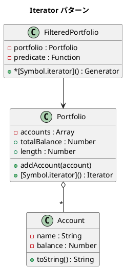

# 第 8 章: Iterator

## はじめに

Portfolio（口座群）の内部構造（配列？連結リスト？）を公開せずに、外部から各口座に順番にアクセスしたい。

**Iterator パターン**は、コレクションの内部表現を公開せずに要素を順番にアクセスする方法を提供するパターンです。JavaScript では `Symbol.iterator` とジェネレータ関数により、言語レベルでサポートされています。

---

## パターンの構造



**登場人物**:

- **Aggregate（Portfolio）**: コレクションを持ち、イテレータを提供する
- **Iterator**: `next()` メソッドで要素を順番に返す
- **Generator（FilteredPortfolio）**: `function*` でフィルタリング付きイテレータを提供する

---

## TDD で作る

### Red: テストを書く

```javascript
import { describe, it, expect } from '@jest/globals';
import { Account, Portfolio, FilteredPortfolio } from '../src/iterator.js';

describe('Iterator パターン', () => {
  it('Portfolio を for-of でイテレートできる', () => {
    const portfolio = new Portfolio();
    portfolio.addAccount(new Account('普通預金', 100000));
    portfolio.addAccount(new Account('定期預金', 500000));

    const names = [];
    for (const account of portfolio) {
      names.push(account.name);
    }
    expect(names).toEqual(['普通預金', '定期預金']);
  });

  it('FilteredPortfolio で条件に合う口座だけイテレートする', () => {
    const portfolio = new Portfolio();
    portfolio.addAccount(new Account('少額', 100));
    portfolio.addAccount(new Account('大口', 1000000));

    const rich = new FilteredPortfolio(portfolio, (a) => a.balance >= 50000);
    const result = [...rich];
    expect(result).toHaveLength(1);
    expect(result[0].name).toBe('大口');
  });
});
```

### Green: 実装する

```javascript
export class Portfolio {
  constructor() { this.accounts = []; }

  addAccount(account) { this.accounts.push(account); }

  [Symbol.iterator]() {
    let index = 0;
    const accounts = this.accounts;
    return {
      next() {
        if (index < accounts.length) {
          return { value: accounts[index++], done: false };
        }
        return { done: true };
      },
    };
  }
}

export class FilteredPortfolio {
  constructor(portfolio, predicate) {
    this.portfolio = portfolio;
    this.predicate = predicate;
  }

  *[Symbol.iterator]() {
    for (const account of this.portfolio) {
      if (this.predicate(account)) {
        yield account;
      }
    }
  }
}
```

### Refactor: 振り返り

- `[Symbol.iterator]()` を実装することで、`for-of`、スプレッド構文 `[...portfolio]`、分割代入がすべて使えます。
- `FilteredPortfolio` はジェネレータ関数 `*[Symbol.iterator]()` で実装しました。`yield` により、必要な要素だけを遅延評価で返します。

---

## Ruby / Java / Python との比較

| 観点 | Ruby | Java | Python | JavaScript |
|------|------|------|--------|------------|
| イテレータプロトコル | `each` + `Enumerable` | `Iterator<T>` | `__iter__` / `__next__` | `Symbol.iterator` / `next()` |
| ジェネレータ | `Enumerator::Yielder` | なし (Stream) | `yield` | `function*` / `yield` |
| for ループ | `for x in collection` | `for (T x : collection)` | `for x in collection` | `for (const x of collection)` |
| 遅延評価 | `Enumerator::Lazy` | Stream API | ジェネレータ | ジェネレータ |

**JavaScript の特徴**: `Symbol.iterator` は言語仕様に組み込まれたイテレータプロトコルです。`for-of`、スプレッド構文、`Array.from()` など多くの言語機能と連携します。

---

## まとめ

| 観点 | 内容 |
|------|------|
| **意図** | コレクションの内部構造を公開せずに要素を順番にアクセスする |
| **適用場面** | コレクションの走査方法を統一したい場合 |
| **メリット** | `for-of` やスプレッド構文と自然に統合できる |
| **注意点** | イテレータは 1 回限りの使い捨て |
| **関連パターン** | Composite（木構造の走査）、Visitor（走査しながら処理を適用） |
